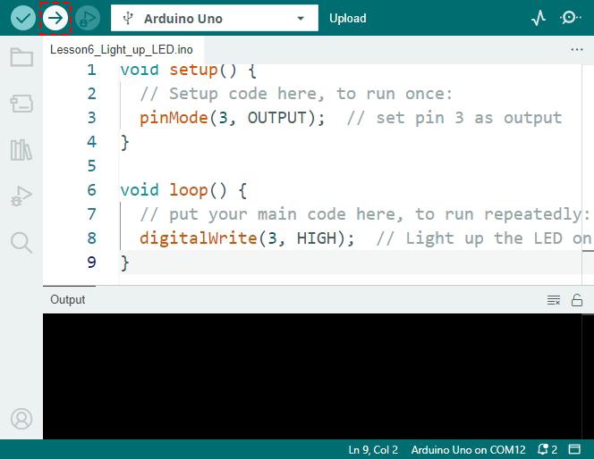

4.1 Let's Make Traffic Lights!
==============================
Welcome to our journey through the lights and codes! In this lesson, we will dive into the fascinating world of electronics and programming with a project that's as practical as it is educational. Together, we'll transform a set of LEDs and resistors on an Arduino board into a miniature version of traffic lights. By the end of this lesson, you'll learn how to control LEDs with code, creating patterns that mimic the operation of real-world traffic signals. So buckle up and get ready to light up your programming skills!

Getting Traffic Lights Ready
------------------------------------------
Hey there! Ready to create your very own traffic light with an Arduino? Here's what we need:

**Components Needed**

* 1 * R3 Board
* 3 * 220 Ohm Resistors
* 1 * Red LED
* 1 * Yellow LED
* 1 * Green LED
* Several Jumper Wires
* 1 * USB Cable
* 1 * Breadboard
* 1 * Multimeter with Test Leads

**Building Step-by-Step**

Let's put everything together, just like building a LEGO set!

.. image:: img/4_traffic_wiring_bb.png
    :width: 600
    :align: center

1. Grab a jumper wire and connect pin 5 on the Arduino to hole 17J on the breadboard. This is where the red light will live.

.. image:: img/4_traffic_wiring_bb_1.png
    :width: 600
    :align: center

2. Pop the red LED into holes 17F and 17E. Make sure the longer leg (that's the anode) goes into 17F.

.. image:: img/4_traffic_wiring_bb_2.png
    :width: 600
    :align: center

3. Place a 220 Ohm resistor with one end in hole 17A and the other end going to the negative side. This keeps the red light safe from too much electricity.

.. image:: img/4_traffic_wiring_bb_3.png
    :width: 600
    :align: center

4. Use another wire to connect pin 4 on the Arduino to hole 10J for the yellow light.

.. image:: img/4_traffic_wiring_bb_4.png
    :width: 600
    :align: center

5. Get the yellow LED in place with its longer leg in 10F and the shorter one in 10E.

.. image:: img/4_traffic_wiring_bb_5.png
    :width: 600
    :align: center

6. Attach another 220 Ohm resistor from hole 10A to the negative side, just like we did with red.

.. image:: img/4_traffic_wiring_bb_6.png
    :width: 600
    :align: center

7. Connect digital pin 3 to hole 3J with a jumper wire. Green light is getting ready!

.. image:: img/4_traffic_wiring_bb_7.png
    :width: 600
    :align: center

8. Place the green LED, anode to 3F, cathode to 3E. Green means go!

.. image:: img/4_traffic_wiring_bb_8.png
    :width: 600
    :align: center

9. Connect the green LED to ground with its own 220 Ohm resistor from hole 3A to the negative terminal.

.. image:: img/4_traffic_wiring_bb_9.png
    :width: 600
    :align: center

10. Oops! We almost forgot to ground the circuit. Connect the breadboard's negative side to a GND pin on the R3 Board with a black wire. Now, it's all set!

.. image:: img/4_traffic_wiring_bb.png
    :width: 600
    :align: center

.. note::

    There are three GND pins on the R3 Board. You can use any of them; they all work the same way.

And just like that, you've got a complete traffic light setup! Each colored light is controlled by its own switch on the R3, ready to tell cars when to stop, wait, or go. Isn't it awesome to build something that works like real traffic lights? Great job!

Bringing LEDs to Life
-----------------------------

Alright, it's showtime for three LEDs! Instead of just diving into the Arduino's Blink example like before, we're going to start from scratch and create a brand new sketch. Let’s jump right in!

**1. Creating and Saving a Sketch**

1. Fire up the Arduino IDE. Go to the “File” menu and hit “New Sketch” to start fresh. You can close any other sketch windows that might be open.

    .. image:: img/4_traffic_ide_new.png
        :align: center

2. Arrange the Arduino IDE window side by side with this online tutorial, so you can see both at once. Things might look a bit small, but it beats flipping back and forth between windows.

    .. image:: img/4_traffic_ide_tutorials.png

3. Time to save your sketch. Hit “Save” from the “File” menu or press ``Ctrl + S``. 

    .. image:: img/4_traffic_ide_save.png

4. You can save your sketch in the default location or another place. Name your sketch something meaningful, like ``Lesson4_Light_up_LEDs_V1``, and click “Save”.

    * Naming your sketch after its function for easy later retrieval.
    * Arduino sketch filenames can't have spaces.
    * When saving significant changes, consider saving as a new version (e.g., V1) for backup.
    
    .. image:: img/4_traffic_ide_name.png

5. Your new sketch consists of two main parts, ``void setup()`` and ``void loop()``, which are functions used in all Arduino sketches.

    * ``void setup()`` runs once when the program starts, setting up initial conditions.
    * ``void loop()`` runs repeatedly, executing continuous actions.
    * Place commands for each function within its curly brackets ``{}``.
    * Any line starting with ``//`` is a comment. These are for your notes and won't affect the code execution.

    .. code-block:: Arduino

        void setup() {
        // put your setup code here, to run once:

        }

        void loop() {
        // put your main code here, to run repeatedly:

        }

**2. Picking the Board and Port**

1. Connect your R3 board to the computer with a USB cable. You'll see the power light come on the Arduino.

    .. raw:: html

        <video width="600" loop autoplay muted>
            <source src="_static/video/connect_board.mp4" type="video/mp4">
            Your browser does not support the video tag.
        </video>

2. Let the IDE know we're using an **Arduino Uno**. Head to **Tools** -> **Board** -> **Arduino AVR Boards** -> **Arduino Uno**.

    .. image:: img/4_traffic_ide_board.png
        :width: 600
        :align: center

3. Next, in the Arduino IDE, choose the port that your Arduino is connected to.

    .. note::

        * Once a port is selected, the Arduino IDE should default to it every time the Arduino is plugged in via USB.
        * If a different Arduino Board is connected, you might need to choose a new port. 
        * Always check the port first if there's a connection issue.

    .. image:: img/4_traffic_ide_port.png
        :width: 600
        :align: center

**3. Writing the Code**

1. In our project, we use digital pins 3, 4, and 5 on the board to control LEDs. Each pin can be an output (sending out 5 volts) or an input (reading incoming voltage). For our LEDs, we set pins 3, 4, and 5 to output using the ``pinMode(pin, mode)`` function.
    
    Let's dive into the ``pinMode()`` syntax.

        * ``pinMode(pin, mode)``: Sets a specific pin to ``INPUT`` or ``OUTPUT``. 

        **Syntax**
            pinMode(pin, mode)

        **Parameters**
            - ``pin``: the number of the pin you want to set the mode for.
            - ``mode``: ``INPUT``, ``OUTPUT``, or ``INPUT_PULLUP``.

2. Now, it's time to add our first line of code in the ``void setup()`` function.
        
    .. note::

        - Arduino coding is case-sensitive. Make sure to write the functions exactly as they are.
        - Notice the command ends with a semicolon. In the Arduino IDE, every command must end with one.

    .. code-block:: Arduino
        :emphasize-lines: 3

        void setup() {
            // Setup code here, to run once:
            pinMode(3,OUTPUT);
        }

**4. Verifying the Code**

Before activating our traffic lights, we'll verify the code. This checks if the Arduino IDE can understand and compile your commands into machine language.

1. To verify your code, click the **checkmark** button in the upper-left corner of the window.

    .. image:: img/4_traffic_ide_verify.png
        :width: 600
        :align: center

2. If your code is machine-readable, a message at the bottom will indicate the code has been successfully compiled. This area also shows how much storage space your program uses.

    .. image:: img/4_traffic_ide_verify_done.png
        :width: 600
        :align: center

3. If there's an error in your code, you'll see an orange error message. The IDE often highlights where the issue might be, typically near the highlighted line. For example, a missing semicolon error will highlight the line right after the mistake.

    .. image:: img/4_traffic_ide_verify_error.png
        :width: 600
        :align: center

4. When you hit errors, it's time for debugging - finding and fixing mistakes in your code. Check for common issues like:

    - Is the ``M`` in ``pinMode`` uppercase?
    - Did you use all uppercase letters when typing ``OUTPUT``?
    - Do you have both an opening and closing parenthesis in your ``pinMode`` function?
    - Did you end your ``pinMode`` function with a semicolon?
    - Is all your spelling correct? If you find errors, correct them and verify your code again. Keep debugging until your sketch is error-free.

The Arduino IDE stops compiling at the first error, so you might have to verify multiple times for multiple errors. Regularly verifying your code is good practice.

Debugging is a big part of programming. Professional programmers often spend a lot more time debugging than writing new code. Errors are normal, so don’t get discouraged. Becoming a good problem solver is key to being a great programmer.

**5. Continuing to Write the Sketch**

1. Besides pin 3, your circuit uses two other pins on the R3 board to control LEDs — pins 4 and 5. Add two more commands below the first ``pinMode()`` command to set pins 4 and 5 as output pins.

    .. code-block:: Arduino
        :emphasize-lines: 4,5

        void setup() {
            // Setup code here, to run once:
            pinMode(3, OUTPUT);
            pinMode(4, OUTPUT);
            pinMode(5, OUTPUT);
        }

2. Code comments are helpful for reminding yourself of what a line or section of code does. Change the code comment in the ``void setup()`` function to something more descriptive. For example:

    .. code-block:: Arduino
        :emphasize-lines: 2

        void setup() {
            // Configure LED pins for output:
            pinMode(3, OUTPUT);
            pinMode(4, OUTPUT);
            pinMode(5, OUTPUT);
        }

        void loop() {
        // put your main code here, to run repeatedly:

        }

3. Verify your code again to check for errors.

4. Now you're ready to start on the ``void loop()`` function. This is where the main action of your sketch or program happens. To light up the LEDs connected to the R3 board, we'll need to provide voltage to the circuit using ``digitalWrite()``.

    * ``digitalWrite(pin, value)``: Sends a ``HIGH`` (5V) or ``LOW`` (0V) signal to a digital pin, changing the operating state of the component.

    **Syntax**
        digitalWrite(pin, value)

    **Parameters**
        - ``pin``: the Arduino pin number.
        - ``value``: HIGH or LOW.

5. Below the comment in the ``void loop()`` function, write a command to turn ON the green LED connected to pin 3. Don’t forget to end the command with a semicolon. Verify and debug your code if necessary.

    .. code-block:: Arduino
        :emphasize-lines: 10

        void setup() {
            // Configure LED pins for output:
            pinMode(3, OUTPUT);
            pinMode(4, OUTPUT);
            pinMode(5, OUTPUT);
        }

        void loop() {
            // put your main code here, to run repeatedly:
            digitalWrite(3, HIGH);
        }

6. After the ``digitalWrite()`` command, add a code comment explaining what this line does. For instance:

    .. code-block:: Arduino
        :emphasize-lines: 10

        void setup() {
            // Configure LED pins for output:
            pinMode(3, OUTPUT);
            pinMode(4, OUTPUT);
            pinMode(5, OUTPUT);
        }

        void loop() {
            // put your main code here, to run repeatedly:
            digitalWrite(3, HIGH);  // Light up the green LED on pin 3
        }

7. Add ``digitalWrite()`` commands to turn ON the yellow and red LEDs connected to pins 4 and 5. End each line with a comment. Your code should look something like this:

    .. note::

        - Copying and pasting is a useful tool for writing similar lines of code. Copy a clean line or section of code, paste it in the correct spot, and adjust what needs to be changed.
        - Use ``Ctrl+T`` to format your code neatly in one click, making it more readable and friendly.

    .. code-block:: Arduino
        :emphasize-lines: 11,12

        void setup() {
            // Configure LED pins for output:
            pinMode(3, OUTPUT);
            pinMode(4, OUTPUT);
            pinMode(5, OUTPUT);
        }
        
        void loop() {
            // put your main code here, to run repeatedly:
            digitalWrite(3, HIGH);  // Light up the green LED on pin 3
            digitalWrite(4, HIGH);  // Light up the yellow LED on pin 4
            digitalWrite(5, HIGH);  // Light up the red LED on pin 5
        }

**6. Uploading the Code**

With your code error-free and verified, it's time to upload it to the R3 board and see your traffic light come to life.

1. In the IDE, click the “Upload” button. The computer will compile the code and then transfer it to the R3 board. During the transfer, you should see some lights blinking on the board, indicating communication with the computer.

2. A message of “Done Uploading” means your code has no issues and you've selected the correct board and port.

.. image:: img/4_traffic_ide_upload_done.png
    :width: 600
    :align: center

3. Once the transfer is complete, the code will run, and you should see all three LEDs on the breadboard light up.

**7. Measuring the Voltage Across Three LEDs**

Let's use a multimeter to measure the voltage at three pins and understand what the ``HIGH`` state in the code actually means.

1. Adjust the multimeter to the 20 volts DC setting.

.. image:: img/multimeter_dc_20v.png
    :width: 300
    :align: center

2. Start by measuring the voltage at Pin 3. Touch the red test lead of the multimeter to Pin 3 and the black test lead to GND.

.. image:: img/4_traffic_wiring_measure_high.png
    :width: 600
    :align: center

3. Record the measured voltage in the table for Pin 3 under the row labeled "HIGH". Use the same approach to measure and record the voltages for Pins 4 and 5.

.. list-table::
   :widths: 25 25 25 25
   :header-rows: 1

   * - State
     - Pin 3 Voltage
     - Pin 4 Voltage
     - Pin 5 Voltage 
   * - HIGH
     - *≈4.58 volts*
     - *≈4.58 volts*
     - *≈4.58 volts*
   * - LOW
     - 
     - 
     -

4. After measuring, remember to turn the multimeter off by setting it to the "OFF" position.

Our measurements reveal that the voltage at all three pins is close to 5V. This indicates that setting a pin to HIGH in the code means the output voltage at that pin is close to 5V.

The R3's pin voltage is 5V, so setting it to HIGH reaches near 5V. However, some boards operate at 3.3V, meaning their HIGH state would be close to 3.3V.

Make LEDs Blink
------------------------------
Now that your LEDs are on, it's time for them to blink.

1. Open the sketch you saved earlier, ``Lesson4_Light_Up_LEDs``. Hit “Save As...” from the “File” menu, and rename it to ``Lesson4_Blink_LEDs``. Click "Save".

    .. image:: img/4_traffic_ide_blink.png
       :width: 600
       :align: center

2. In the ``void loop()`` function of your sketch, copy the three ``digitalWrite()`` commands and paste them after the originals. To make the LEDs blink, you previously turned them ON; now set their state to ``LOW`` to turn them OFF.

    .. note::
       * Copy and paste can be a coder's best friend. Replicate a clean section of code to a new position and adjust its parameters for quick and clean execution.
       * Remember to update comments to better match the action performed.

    .. code-block:: Arduino
       :emphasize-lines: 13,14,15

       void setup() {
            // Configure LED pins for output:
            pinMode(3, OUTPUT);
            pinMode(4, OUTPUT);
            pinMode(5, OUTPUT);
       }

       void loop() {
            // put your main code here, to run repeatedly:
            digitalWrite(3, HIGH);  // Light up the green LED on pin 3
            digitalWrite(4, HIGH);  // Light up the yellow LED on pin 4
            digitalWrite(5, HIGH);  // Light up the red LED on pin 5      
            digitalWrite(3, LOW);  // Switch off the green LED on pin 3
            digitalWrite(4, LOW);  // Switch off the yellow LED on pin 4
            digitalWrite(5, LOW);  // Switch off the red LED on pin 5
       }

3. Press the “Upload” button to transfer the sketch to the R3 board. After the transfer, you might notice the LEDs don't blink, or they blink so fast it's imperceptible.

4. To visually observe the blinking, you can use the ``delay()`` command to make the R3 board wait for any duration you specify, in milliseconds.

    * ``delay(ms)``: Pauses the program for the amount of time (in milliseconds) specified as parameter. (There are 1000 milliseconds in a second.)

    **Syntax**
        delay(ms)

    **Parameters**
        - ``ms``: the number of milliseconds to pause. Allowed data types: unsigned long.

5. Now, include the ``delay(time)`` command after each set of ON and OFF commands, setting the delay time to 3000 milliseconds (3 seconds). You may adjust this duration to make the LEDs blink faster or slower.

    .. note::

        During this delay, the R3 board can't perform any tasks or execute any other commands until the delay ends.
        
    .. code-block:: Arduino
       :emphasize-lines: 13,17

       void setup() {
           // Configure LED pins for output:
           pinMode(3, OUTPUT);
           pinMode(4, OUTPUT);
           pinMode(5, OUTPUT);
       }
       
       void loop() {
            // put your main code here, to run repeatedly:
            digitalWrite(3, HIGH);  // Light up the green LED on pin 3
            digitalWrite(4, HIGH);  // Light up the yellow LED on pin 4
            digitalWrite(5, HIGH);  // Light up the red LED on pin 5
            delay(3000); // Wait for 3 seconds      
            digitalWrite(3, LOW);  // Switch off the green LED on pin 3
            digitalWrite(4, LOW);  // Switch off the yellow LED on pin 4
            digitalWrite(5, LOW);  // Switch off the red LED on pin 5
            delay(3000); // Wait for 3 seconds
        }

6. Upload your sketch to the R3 board. After completion, your LEDs should blink at a 3 seconds interval.

7. Confirm everything is working as expected, then save your sketch.

8. Let's use a multimeter to measure the voltage at three pins and understand what the ``LOW`` state in the code actually means. Adjust the multimeter to the 20 volts DC setting.

.. image:: img/multimeter_dc_20v.png
    :width: 300
    :align: center

9. Start by measuring the voltage at Pin 3. Touch the red test lead of the multimeter to Pin 3 and the black test lead to GND.

.. image:: img/4_traffic_wiring_measure_high.png
    :width: 600
    :align: center

10. With all three LEDs turned off, record the measured voltage for Pin 3 in the "LOW" row of your table. Repeat the measurement process for Pins 4 and 5, recording their voltages in the table as well.

.. list-table::
   :widths: 25 25 25 25
   :header-rows: 1

   * - State
     - Pin 3 Voltage
     - Pin 4 Voltage
     - Pin 5 Voltage 
   * - HIGH
     - *≈4.58 volts*
     - *≈4.58 volts*
     - *≈4.58 volts*
   * - LOW
     - *0.00 volts*
     - *0.00 volts*
     - *0.00 volts*
 
Through our measurements, we found that when the LEDs are off, the voltage at Pins 3, 4, and 5 drops to 0V. This demonstrates that in our code, setting a pin to "LOW" effectively reduces the output voltage at that pin to 0V, turning off the connected LED. This principle allows us to control the on and off states of LEDs with precise timing, mimicking the operation of a traffic light.

Writing Pseudo-code for a Traffic Light
-------------------------------------------

It's time to give your LEDs a purpose. In this activity, you will program them to act as a traffic light, controlling the flow of traffic at a busy intersection.

Traffic lights require precise control to switch between three colors in a strict sequence, making it an ideal project for diving into Arduino programming. To perfect our traffic light, we must clearly instruct the Arduino on its tasks.

Communication between humans involves listening, speaking, reading, writing, gesturing, or making facial expressions. Communicating with microcontrollers (like the one on your Arduino board) involves writing code.

We can't simply tell the Arduino to "make a traffic light" in natural language. However, we can use natural language to write a "pseudo-code" to aid in the actual Arduino code development.

.. note::
    
    There are no right or wrong answers in pseudo-code writing. The more detailed your pseudo-code, the easier it will be to translate it into a functional program.

Think about what needs to happen for your circuit to act like a traffic light. In the space provided in your log, write down the pseudo-code describing how your traffic light will function. Use plain English.

Here are some guiding questions for your pseudo-code:

* Should two or more lights be on at the same time?
* What's the order of the lights?
* What happens to the other lights when one is on?
* What happens after the third light turns off?
* How long should each light stay on?

Here are a couple of pseudo-code examples:

.. code-block::

    1) Set all LED pins to output.
    2) Start main loop.
    a) Turn off all lights.
    b) Turn on green light for 10 seconds.
    c) Turn off all lights.
    d) Turn on yellow light for 3 seconds.
    e) Turn off all lights.
    f) Turn on red light for 10 seconds.
    3) Return to the start of the loop.

.. code-block::

    Setup:
        Define all LED pins as output
    Main Loop:
        Turn on green light
        Turn off red and yellow lights
        Wait 10 seconds
        Turn on yellow light
        Turn off red and green lights
        Wait 3 seconds
        Turn on red light
        Turn off green and yellow lights
        Wait 10 seconds

Pseudo-code doesn’t have a strict format, allowing you to clarify your thoughts and organize them logically. This logical order is called an algorithm.
You use algorithms every day, perhaps without realizing it. Think of an algorithm like a recipe; in programming, the ingredients are keywords and commands, and the cooking steps are the algorithm.
An algorithm is a set of steps or instructions. When an algorithm is translated from pseudo-code into Arduino programming language, it precisely instructs the Arduino board on what to do and when.

.. note::
    
    Using sticky notes or index cards can be helpful when writing pseudo-code. Place each step of your algorithm on a separate note. This way, you can easily rearrange, insert, or remove steps from your algorithm.

Transform Pseudo-code into an Arduino Sketch
---------------------------------------------

Now, it's time to refine the code you've written and incorporate additional ``digitalWrite()`` and ``delay()`` commands as needed. Here's a guide to shaping your code: Your ``void loop()`` function should encapsulate separate segments for the green, yellow, and red LEDs, each punctuated by a unique delay. Not all delays need to be of equal duration. Update your code comments for clarity on what each line achieves.

1. Open the sketch you saved earlier, ``Lesson4_Blink_LEDs``. Hit “Save As...” from the “File” menu, and rename it to ``Lesson4_Traffic_Light``. Click "Save".

    .. image:: img/4_traffic_ide_traffic.png
       :width: 600
       :align: center

2. Your sketch should resemble the following:

.. code-block:: Arduino

       void setup() {
           // Configure LED pins for output:
           pinMode(3, OUTPUT);
           pinMode(4, OUTPUT);
           pinMode(5, OUTPUT);
       }
       
       void loop() {
            // put your main code here, to run repeatedly:
            digitalWrite(3, HIGH);  // Light up the green LED on pin 3
            digitalWrite(4, LOW);   // Switch off the yellow LED on pin 4
            digitalWrite(5, LOW);   // Switch off the the red LED on pin 5
            delay(10000);           // Wait for 10 seconds      
            digitalWrite(3, LOW);   // Switch off the green LED on pin 3
            digitalWrite(4, HIGH);  // Light up the yellow LED on pin 4
            digitalWrite(5, LOW);   // Switch off the red LED on pin 5
            delay(3000);            // Wait for 3 seconds
            digitalWrite(3, LOW);   // Switch off the green LED on pin 3
            digitalWrite(4, LOW);   // Switch off the yellow LED on pin 4
            digitalWrite(5, HIGH);  // Light up the red LED on pin 5
            delay(10000);           // Wait for 10 seconds
    }

3. After coding, verify your sketch and debug if necessary.

4. Upload your revised code to the R3 board. Once the sketch is fully transferred, it executes.

5. Observe the behavior of your traffic light. Does it function as expected? If not, revisit your sketch to make adjustments. Continue refining and uploading your sketch until the traffic light behaves as described in your pseudo-code.

**Summary**

In this lesson, we ventured into the intersection of programming and electronics, turning LEDs and resistors into a miniature traffic light with an Arduino. We started with assembling the circuit, learning to control LEDs through programming, from lighting them up to making them blink in sequence like real traffic lights.

This lesson took us through creating and debugging Arduino sketches, we also explored measuring voltage to connect the dots between code and its physical effects in the circuit.

By the end of the lesson, we had not only built a functional traffic light but also deepened our understanding of how software can manipulate hardware to perform specific tasks. It was a concise journey through the basics of electronics and programming, highlighting the creativity and problem-solving skills essential in technology.
