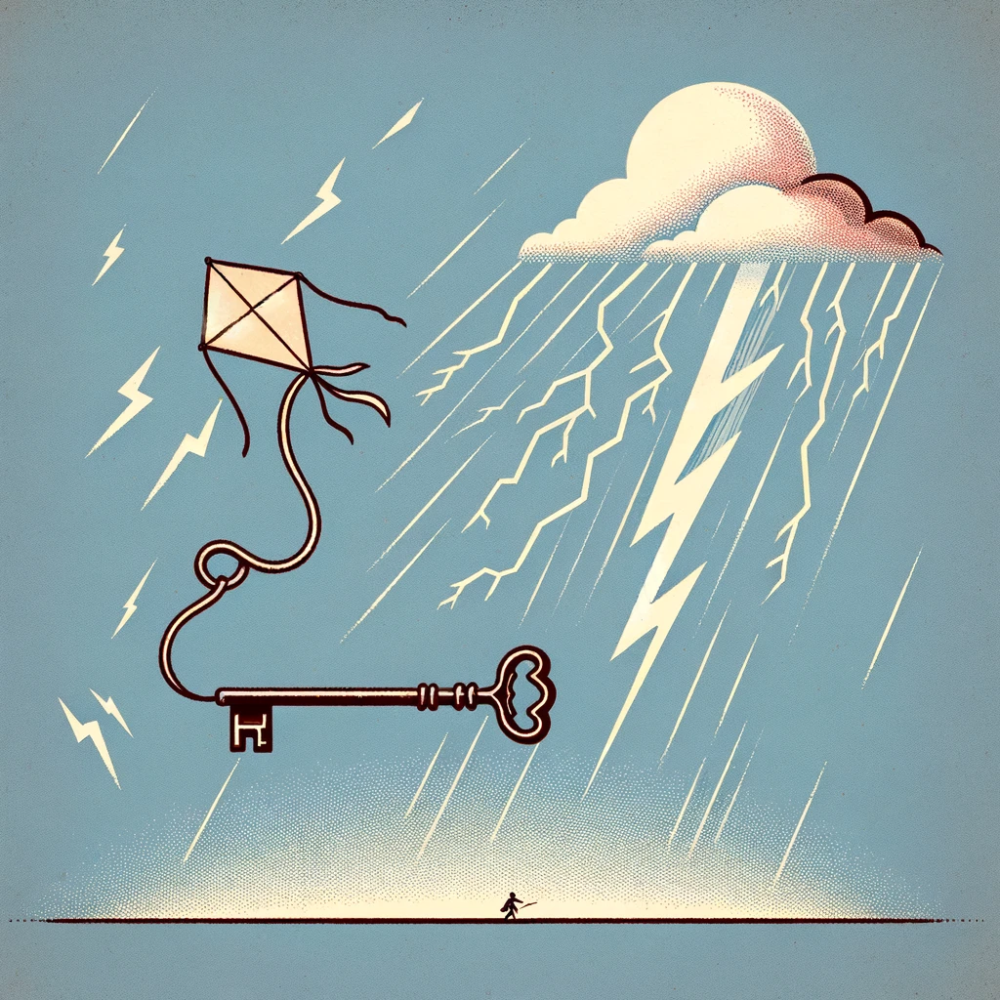
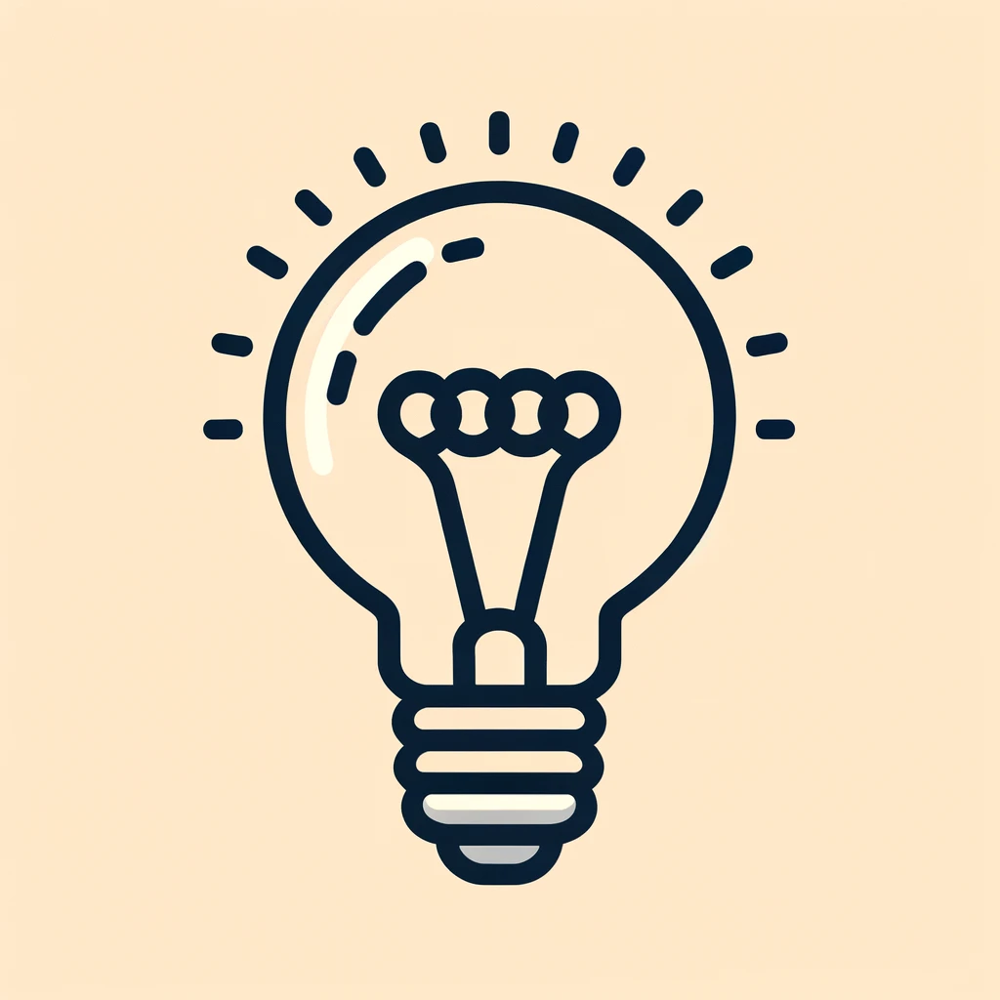
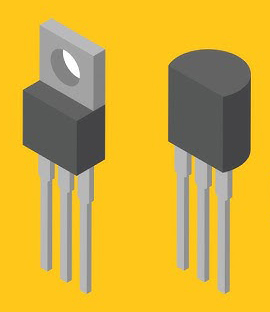
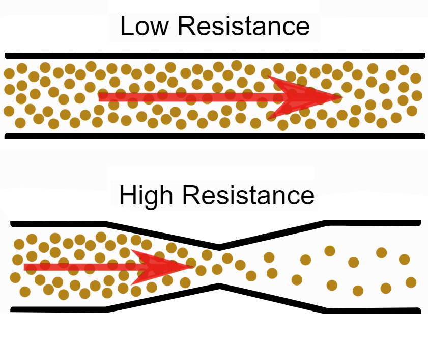

.. note:: 

    Ciao, benvenuto nella SunFounder Raspberry Pi & Arduino & ESP32 Enthusiasts Community su Facebook! Approfondisci il mondo di Raspberry Pi, Arduino ed ESP32 con altri appassionati.

    **Perché unirti a noi?**

    - **Supporto esperto**: Risolvi problemi post-vendita e sfide tecniche con l'aiuto della nostra comunità e del nostro team.
    - **Impara e condividi**: Scambia suggerimenti e tutorial per migliorare le tue competenze.
    - **Anteprime esclusive**: Accedi in anteprima a nuovi annunci di prodotti.
    - **Sconti speciali**: Goditi sconti esclusivi sui nostri prodotti più recenti.
    - **Promozioni festive e omaggi**: Partecipa a omaggi e promozioni speciali.

    👉 Pronto a esplorare e creare con noi? Clicca [|link_sf_facebook|] e unisciti oggi stesso!

4. La Legge di Ohm: Un Viaggio Essenziale nei Circuiti Elettrici
====================================================================

Ogni dispositivo elettronico funziona secondo principi regolati da circuiti e schede elettriche. Per garantire che questi dispositivi funzionino correttamente, gli ingegneri elettrici devono comprendere profondamente il flusso dell'elettricità. Uno dei concetti fondamentali in questo ambito è la Legge di Ohm, che fornisce una relazione fondamentale tra tensione, corrente e resistenza nei circuiti elettrici. Questa lezione approfondisce la Legge di Ohm, esplorando le sue implicazioni e applicazioni.

Questa lezione esplora i principi fondamentali alla base di ogni dispositivo elettronico che utilizziamo oggi. Comprendere questi principi, in particolare la Legge di Ohm, è essenziale per gli ingegneri elettrici al fine di controllare e prevedere il comportamento dei circuiti.

La Scintilla dell'Elettricità
---------------------------------

La storia dell'elettricità inizia con i primi esperimenti e intuizioni profonde. Benjamin Franklin, con il suo famoso esperimento del kite, pur non scoprendo l'elettricità, accese la curiosità e favorì ulteriori esplorazioni sulle cariche elettriche e il loro potere.

I suoi esperimenti posero le basi per comprendere che l'elettricità coinvolge il movimento di cariche positive e negative, analogamente ai fenomeni naturali come i fulmini. Ispirato da Franklin, lo scienziato francese Thomas-François Dalibard dimostrò esempi pratici di come le correnti elettriche potessero manifestarsi naturalmente.

Questa epoca vide anche la rivalità e i successi collettivi di Nikola Tesla e Thomas Edison, le cui imprese contribuirono a plasmare la nostra infrastruttura elettrica moderna. Lo sviluppo della corrente alternata (AC) da parte di Tesla e l'introduzione della lampadina da parte di Edison esemplificano i rapidi progressi dell'ingegneria elettrica.

I progressi continuarono con l'invenzione del transistor nel 1947, un componente fondamentale per tutta l'elettronica moderna. Questo piccolo ma potente dispositivo ha permesso la creazione di microchip e interruttori elettronici, cruciali nel mondo tecnologico di oggi.

    

Georg Ohm e la Sua Legge
-----------------------------

Nel mezzo di questi passi tecnologici, il fisico tedesco Georg Ohm intraprese esperimenti che avrebbero definito i principi fondamentali dei circuiti elettrici. In un'epoca in cui l'elettricità era ancora un campo scientifico nuovo, Ohm esplorò il comportamento delle correnti elettriche in diverse condizioni usando strumenti semplici ma efficaci, come fili, batterie e resistori fatti in casa.

Gli esperimenti meticolosi di Ohm rivelarono una relazione proporzionale costante tra tensione, corrente e resistenza, racchiusa nella formula V=IR—ora celebrata come la Legge di Ohm. Questa scoperta non solo fornì una descrizione matematica dell'elettricità, ma facilitò anche la progettazione prevedibile e il funzionamento dei dispositivi elettrici.

.. code-block::

    Voltage = Current x Resistance
    Or
    V = I • R

La perseveranza di Ohm di fronte allo scetticismo sottolinea l'importanza delle sue scoperte, che hanno gettato le basi per futuri progressi tecnologici e inaugurato una nuova era nell'ingegneria elettrica.

Comprendere Corrente, Tensione e Resistenza
------------------------------------------------

Per comprendere appieno e applicare la Legge di Ohm, è essenziale afferrare i concetti di base di corrente, tensione e resistenza. Questi componenti sono elementi indispensabili di qualsiasi circuito, analoghi agli elementi di un fiume in movimento.

- **Corrente (I)**: Il flusso di elettroni attraverso un conduttore, misurato in ampere (amp).
- **Tensione (V)**: La forza o pressione elettrica che spinge gli elettroni attraverso un conduttore.
- **Resistenza (R)**: Fornisce opposizione al flusso di elettroni, misurata in ohm (Ω), e tipicamente rappresentata dalla lettera greca omega.

Un'analogia con un tubo da giardino aiuta a chiarire questi concetti:

- **Corrente** è paragonabile al flusso d'acqua, indicando la velocità con cui gli elettroni si muovono attraverso un conduttore.
- **Tensione** è come il controllo del rubinetto, che regola la forza che spinge l'acqua.
- **Resistenza** è simile a eventuali nodi o pieghe nel tubo, che ostacolano il percorso dell'acqua e rallentano il flusso.

Questa spiegazione ci aiuta a collegare le conoscenze teoriche della Legge di Ohm con il comportamento dei circuiti reali, ponendo le basi per ulteriori apprendimento e applicazione.

Esplorare la Legge di Ohm con Esperimenti Pratici
-----------------------------------------------------

Ora, applichiamo la Legge di Ohm in modo pratico utilizzando un semplice circuito LED per osservare gli effetti del cambiamento di resistenza e tensione.

**Configurazione dell'Esperimento**

1. Inizierai con un circuito di base che include un LED e un resistore da 220 ohm.
   
   .. image:: img/2_uno_gnd.png
     :width: 600
     :align: center

2. Sostituisci il resistore da 220 ohm con altri resistori di valori diversi come elencato di seguito. Registra i cambiamenti di luminosità del LED con ciascuna sostituzione per osservare come la resistenza influenzi la corrente e, di conseguenza, l'intensità luminosa.

   .. list-table::
      :widths: 25 100
      :header-rows: 1

      * - Resistore
        - Osservazioni
      * - 100Ω
        - 
      * - 1KΩ
        - 
      * - 10KΩ
        - 
      * - 1MΩ
        - 

  
  Noterai che solo con il resistore da 100Ω il LED è più luminoso rispetto al precedente resistore da 220Ω. Con resistenze maggiori, la luminosità del LED diminuisce fino a spegnersi completamente a 1MΩ. Perché accade questo?

  Secondo la Legge di Ohm (I = V/R), man mano che la resistenza aumenta mentre la tensione rimane costante, la corrente attraverso il LED diminuisce, riducendo così la luminosità del LED. A 1MΩ, la corrente è troppo bassa per accendere il LED.

3. Dopo aver osservato gli effetti del cambiamento di resistenza, mantieni il resistore a 220 ohm e cambia l'alimentazione del circuito da 5V a 3,3V. Registra eventuali cambiamenti nella luminosità del LED.

  Noterai che il LED è leggermente meno luminoso a 3,3V rispetto a 5V. Perché accade questo?

  Utilizzando la Legge di Ohm e conoscendo la resistenza e la nuova tensione, la corrente dovrebbe essere I = V/R. Con una diminuzione della tensione, mentre la resistenza rimane la stessa, la corrente diminuisce, abbassando la luminosità del LED.

**Riassunto**

Conducendo questi esperimenti, hai osservato direttamente come la Legge di Ohm sia fondamentale per comprendere e progettare circuiti elettrici. Questa applicazione pratica aiuta a cementare i concetti teorici discussi in precedenza e dimostra le implicazioni reali di tensione, corrente e resistenza nell'ingegneria elettrica.

