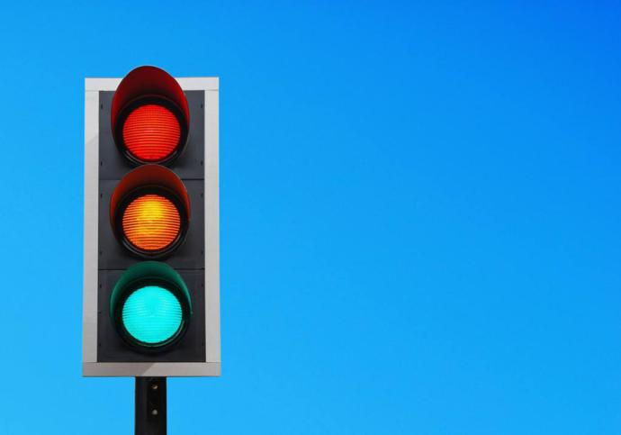
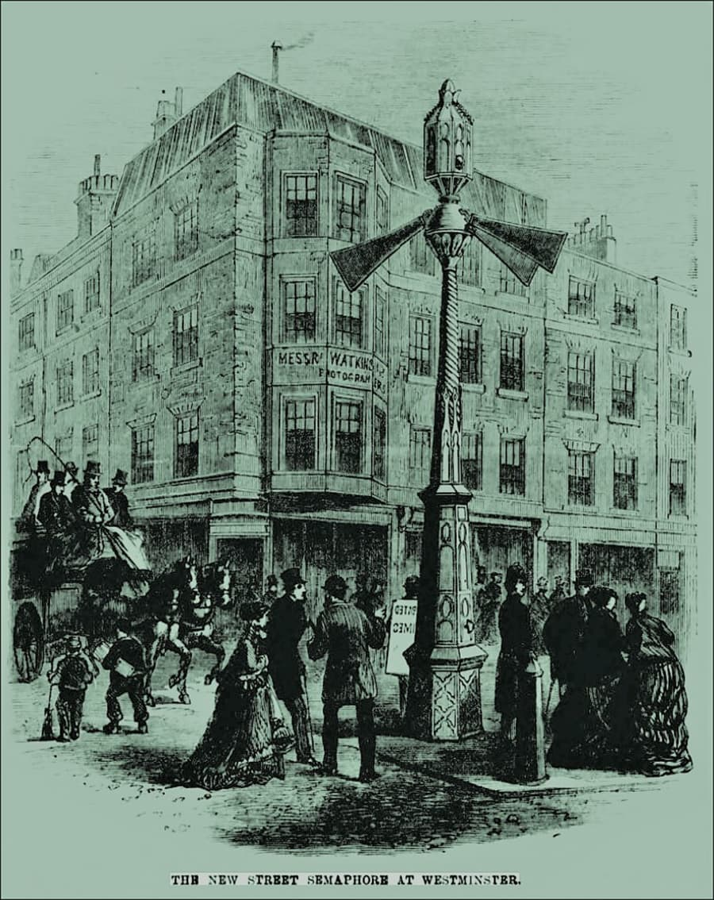
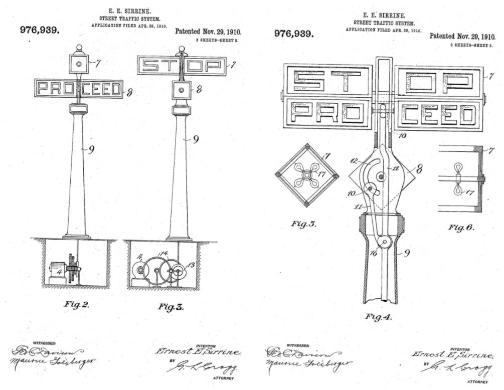
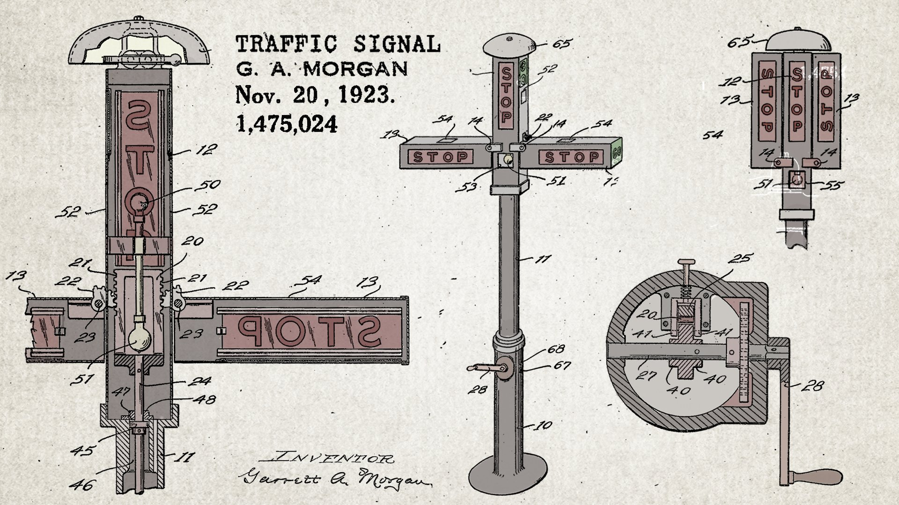

4. Traffic Light
====================================

In this chapter, you'll dive into the Arduino programming environment and its interaction with the Arduino board. After constructing an LED light circuit, you'll code to control the LEDs and simulate traffic light operations. With the traffic light program running, you'll perform electrical measurements on the circuit using a multimeter.

Traffic lights, situated at road intersections and pedestrian crossings, are signaling devices that control the flow of traffic.

**Learning Objectives**

* Construct and experiment with a traffic light circuit.
* Write pseudocode describing how traffic lights work.
* Translate pseudocode into computer code to program the traffic light.
* Debug code with errors.

**History of Traffic Lights**

In 1868, John Peake Knight, a British railway manager, invented the first road traffic signal light. Unlike modern traffic signals, this device was manually operated by a policeman to change the signals.

    
* Illustrated Times | 16 January 1869

It used gas lamps to illuminate the signs. Unfortunately, a gas leak caused an explosion a few weeks after installation, seriously injuring the officer. For decades, this device was deemed too dangerous, but the promising idea wasn't forgotten, leading to various adaptations by later inventors.

In 1910, Ernest Sirrine, an American, designed the first automatic traffic signal with “Stop” and “Proceed” signs alternating.

* From: US Patent : 976939

Two years later, Lester Farnsworth Wire's design replaced the signs with red and green lights, bringing us closer to the modern traffic signal. Many inventors built on this concept, including the addition of a yellow “caution” light to prevent accidents from sudden changes from green to red. In 1923, Garrett Morgan, a renowned African American inventor from Cleveland, Ohio, created a traffic signal improving timing for smoother traffic flow.

From: US Patent : 1475024

In 1968, the Vienna Convention on Road Signs and Signals established an internationally recognized road sign system, including traffic lights. The Convention standardized traffic light colors and their meanings, stipulating that when lights are stacked vertically, the red light must be at the top; if horizontally, the red light must be placed on the side nearest the approaching vehicles. This has become the most common traffic light configuration seen today.

.. toctree::
    :maxdepth: 4

    4.1_traffic_light_auto 
    4.2_traffic_light_button

