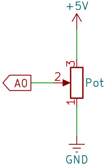

5.1 Measuring the Potentiometer
================================

In this activity, you will use a multimeter to explore how a potentiometer functions as a variable resistor.

**Required Components**

* 1 * Potentiometer
* 1 * Breadboard
* Several Jumper Wires
* 1 * Multimeter with Test Leads

**Introduction to Potentiometers**

A potentiometer, often called a pot, serves as a variable resistor, meaning it can adjust its resistance from nearly zero to its maximum limit. Most potentiometers are marked with their range. The one included in your kit is designated as a 103 (10K) potentiometer, which equates to 10 kilo-ohms or 10,000 ohms.

.. image:: img/5_dimmer_pot.png
    :width: 200
    :align: center

Inside the potentiometer is a strip of resistive material with a slider that moves along it. Each end of the resistive material is connected to a terminal or pin, shown below as pins A and B. The resistance between pins A and B is fixed and represents the maximum resistance the potentiometer can offer. For the ones in your kit, the maximum resistance is 10 kilo-ohms.

.. image:: img/5_dimmer_pot_2.png
    :width: 500
    :align: center

* **A**: Connect to power
* **B**: Connect to ground
* **C**: Connect to analog pin
* **D**: Slider
* **E**: Resistive strip

The Pin C connects to the slider. The resistance through the slider, or Pin C, depends on the slider's position along the resistive material.

.. image:: img/5_dimmer_pot_3.png
    :width: 500
    :align: center

In schematic diagrams, the symbol for a potentiometer typically looks like a resistor with an arrow through the middle.

.. image:: img/5_dimmer_pot_4.png
    :width: 200
    :align: center

Now let's explore how the potentiometer adjusts resistance, thereby influencing the voltage and current in a circuit through the following two activities.

**Measuring Resistance**

No circuit construction is necessary for measuring resistance, but for ease, we can stabilize it on a breadboard and then insert two wires for measurement.

1. Connect a potentiometer to the breadboard. Insert its three pins into holes 30G, 29F, 29G.

.. note::
    The potentiometer has a label "P 103", indicating its resistance range. Please insert the potentiometer into the breadboard as shown, with the labeled side facing you.

.. image:: img/5_dimmer_test_pot.png
    :width: 500
    :align: center

2. Connect one wire at 29J for the red multimeter lead and another at 28J for the black lead.

.. image:: img/5_dimmer_test_wore.png
    :width: 500
    :align: center

3. Set the multimeter to measure resistance in the 20 kilo-ohm (20K) range.

.. image:: img/multimeter_20k.png
    :width: 300
    :align: center

4. Rotate the potentiometer to the "1" position indicated in the diagram.

.. image:: img/5_pot_direction.png
    :width: 300
    :align: center
    
5. Record the measured resistance values in the table under section 5.1 Multimeter in your handbook.

.. note::
    The values in the table are my measurements; your results may vary. Fill them out according to your actual findings.

.. list-table::
   :widths: 20 20 20
   :header-rows: 1

   * - Measurement Point
     - Resistance (kilohm)
     - Voltage (volts)

   * - 1
     - *1.52*
     -
   * - 2
     -
     -

   * - 3
     -
     -

6. Rotate the potentiometer clockwise to positions 2 and 3 to measure the resistance at each point, and record the results in the table.

.. list-table::
   :widths: 20 20 20
   :header-rows: 1

   * - Measurement Point
     - Resistance (kilohm)
     - Voltage (volts)

   * - 1
     - *1.52*
     -
   * - 2
     - *5.48*
     -

   * - 3
     - *9.01*
     -

**Measuring Voltage**

Voltage measurement requires integrating the potentiometer into a circuit. Since the potentiometer outputs an analog value, we connect it to the R3 board's analog pin A0 to measure the voltage.

1. Connect the middle pin of the potentiometer to the R3 board's analog pin A0. Connect one end of a jumper wire to 29J and the other end to the R3 board's A0 pin.

.. image:: img/5_dimmer_test_a0.png
    :width: 500
    :align: center

2. Ground the potentiometer by connecting one end of a jumper wire to hole 28J and the other end to the GND pin.

.. image:: img/5_dimmer_test_gnd.png
    :width: 500
    :align: center

3. Finally, connect the potentiometer to 5V by inserting a jumper wire between hole 30J on the breadboard and the 5V pin on the R3 board.

.. image:: img/5_dimmer_test_5v.png
    :width: 500
    :align: center

4. Set the multimeter to measure voltage in the DC 20V range.

.. image:: img/multimeter_dc_20v.png
    :width: 300
    :align: center

5. Connect the R3 board to the computer using a USB cable.

6. Now rotate the potentiometer to position 1.

.. image:: img/5_pot_direction.png
    :width: 300
    :align: center

7. Use the multimeter to measure the voltage at A0 (equivalent to measuring the voltage between the middle and right pins of the potentiometer).

.. image:: img/5_dimmer_test_voltage.png
    :width: 600
    :align: center

8. Record the measured voltage.

.. note::

    The values in the table are from my measurements; yours might differ. Fill in according to your actual results.

.. list-table::
   :widths: 20 20 20
   :header-rows: 1

   * - Measurement Point
     - Resistance (kilohm)
     - Voltage (volts)

   * - 1
     - *1.52*
     - *≈0.81*

   * - 2
     - *5.48*
     - 

   * - 3
     - *9.01*
     - 

9. Rotate the potentiometer to positions 2 and 3, measure at each position, and record the results in the table.

.. list-table::
   :widths: 20 20 20
   :header-rows: 1

   * - Measurement Point
     - Resistance (kilohm)
     - Voltage (volts)

   * - 1
     - *1.52*
     - *≈0.81*

   * - 2
     - *5.48*
     - *≈2.43*

   * - 3
     - *9.01*
     - *≈4.22*

10. After measuring, remember to turn the multimeter off by setting it to the "OFF" position.

**Question**:

Based on the measurement results, how do resistance and voltage change when the potentiometer is rotated clockwise? And how do they change when rotated counterclockwise?

**Summary**

The experiments measuring resistance and voltage demonstrate that the potentiometer is integrated into the circuit in a series configuration. Below is the corresponding schematic diagram:

You can think of the potentiometer as comprising two resistors connected in series within the circuit. The movement of the slider on the potentiometer adjusts the resistance values of these two resistors:

* Clockwise Rotation: As you rotate the potentiometer clockwise towards position 3, the resistance between the middle pin and pin 1 increases, causing an increase in voltage across these points.
* Counterclockwise Rotation: Conversely, rotating counterclockwise towards position 1 decreases the resistance between the middle pin and pin 1, leading to a decrease in voltage.

In our upcoming lesson, we will utilize these voltage changes to generate an analog reading, providing a real-time indication of the potentiometer's position.
