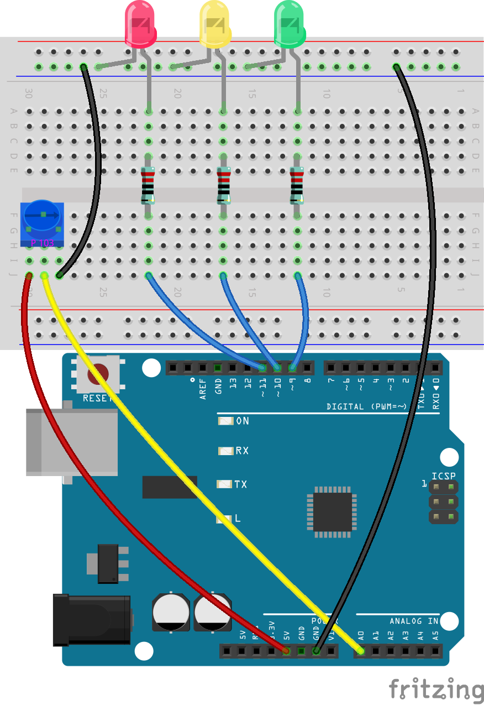
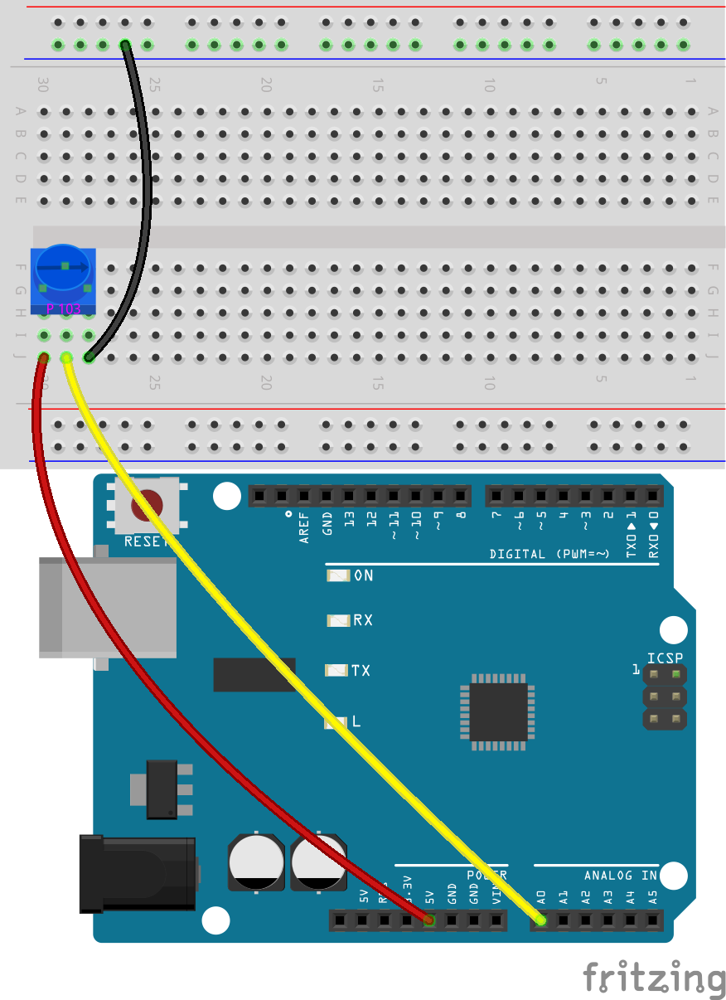
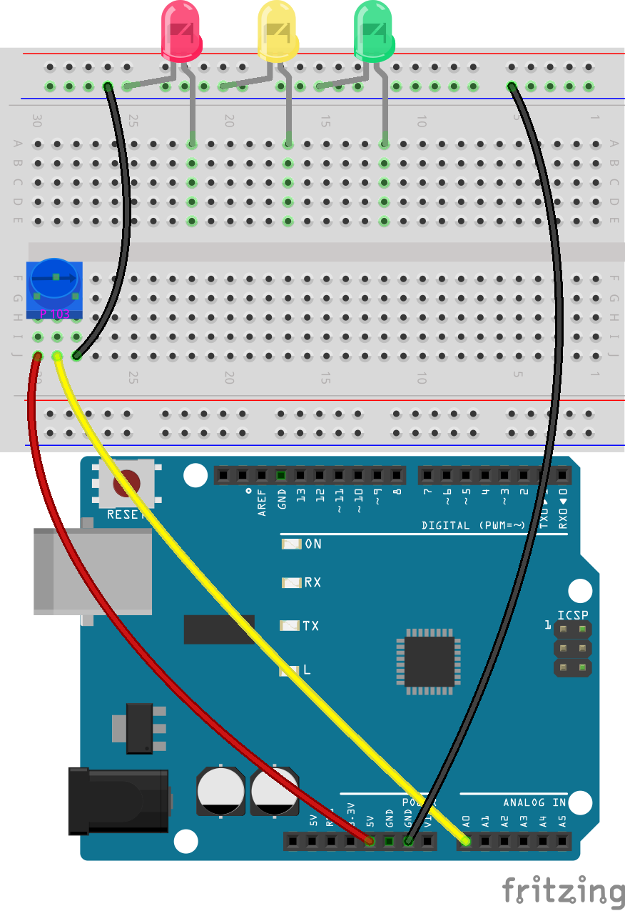
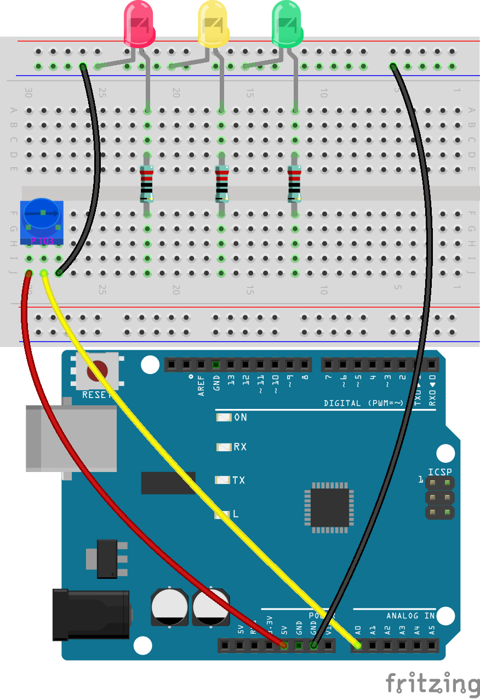
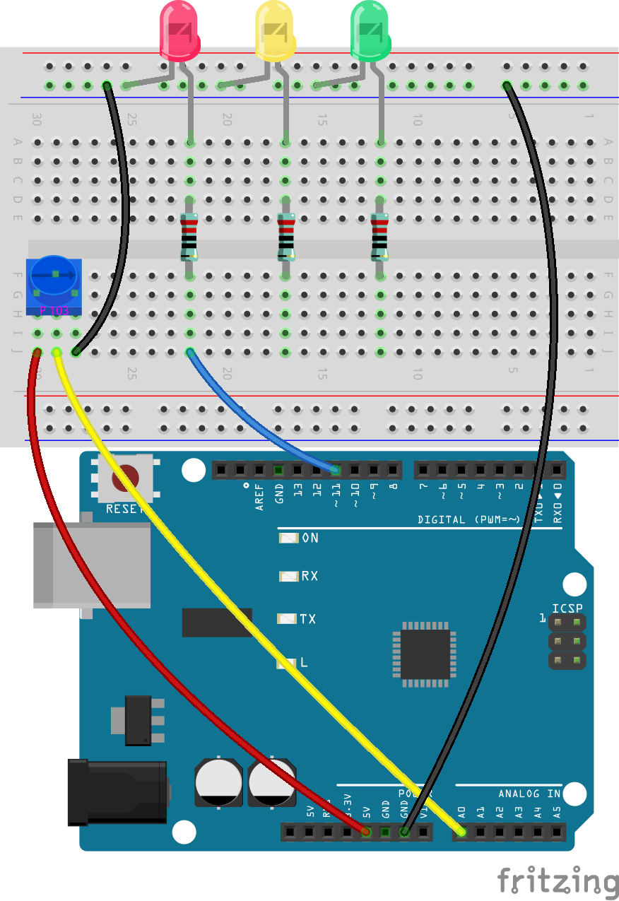
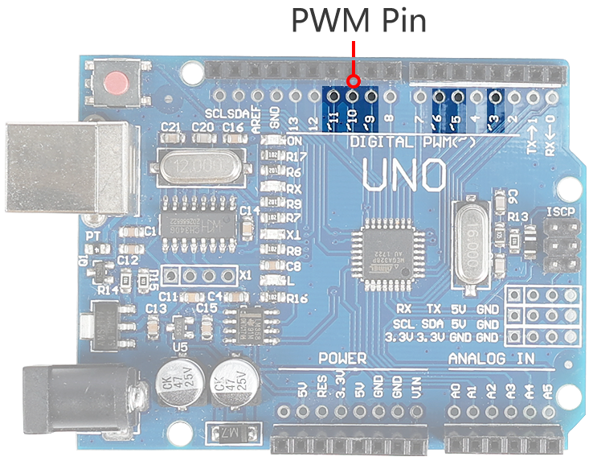

5.2 Dynamic LED Control with Potentiometer
=============================================

In this activity, you will build and program a circuit that uses a potentiometer to control the brightness of a set of LEDs.

Building the Circuit
--------------------------

Follow the schematic diagram, wiring diagram, or the steps below to construct your circuit.

**Components Needed**

* 1 * R3 Board
* 1 * Potentiometer
* 3 * LEDs
* 3 * 220 Ohm Resistors
* Several Jumper Wires
* 1 * USB Cable
* 1 * Breadboard
* 1 * Multimeter with Test Leads

.. note::
    The color bands for a 220 Ohm resistor are: Red, Red, Black, Black, Brown

**Building Steps**

1. Start with the circuit from the previous lesson that included a potentiometer. Disconnect the black GND wire and insert it into the negative terminal of the breadboard.

2. Connect the GND pin of the R3 board to the negative terminal of the breadboard using a long jumper wire.

3. Take out three LEDs of any color. Insert their anodes (longer pins) into holes 22A, 17A, and 12A respectively, and their cathodes (shorter pins) into the negative terminal of the breadboard.

4. Place a 220 ohms resistor between holes 22D and 22F.

5. Similarly, insert a 220 ohms resistor between 17D and 17F, and another between 12D and 12F.

6. Connect the hole 22J on the breadboard to pin 11 on the R3 board with a wire.

7. Connect the hole 17J on the breadboard to pin 10 on the R3 board with a wire.

8. Connect the hole 12J on the breadboard to pin 9 on the R3 board with a wire. Your circuit is now complete.

Sketch Creation — Fading LEDs
---------------------------------

In this activity, you will use a potentiometer as an input device to program the circuit's LEDs to fade in and out, gradually introducing some coding concepts:

* Variable declaration — Declaring the type and name of a variable
* Variable assignment — Assigning a value to a variable
* ``analogRead()`` — Reading an analog value from the circuit
* ``analogWrite()`` — Sending an analog value into the circuit

Here's what the pseudocode might look like:

.. code-block::

    Create variables to store input and output information.
    Set three Arduino pins as output.
    Begin main loop:
        Store the potentiometer value in a variable.
        Determine the output value for the LEDs based on the potentiometer variable.
        Set the LED brightness according to the output variable.
    End main loop.

**Pin Initialization**

1. Open the Arduino IDE, go to the “File” menu, and select “New Sketch” to start a fresh project. Close any other sketch windows that might be open.

    .. image:: img/4_traffic_ide_new.png
        :align: center

2. Save your new sketch by clicking “Save” from the “File” menu or by pressing ``Ctrl + S``. Save it in the default Arduino Sketchbook location under the name ``Lesson5_Fade_LED``. Click "Save".

3. The LEDs in your circuit are connected to digital pins on the R3 board. In Lesson 3, you learned that digital pins can serve as either inputs or outputs. As the LEDs in your circuit are output devices, digital pins 9, 10, and 11 need to be set as OUTPUTs.

.. note::

    The potentiometer is an analog input device connected to the analog pin A0. All analog pins on Arduino are input pins, which means they do not need to be declared as INPUT like digital pins.
    
.. code-block:: Arduino
    :emphasize-lines: 2,3,4

    void setup() {
        pinMode(9, OUTPUT);
        pinMode(10, OUTPUT);
        pinMode(11, OUTPUT);
    }

4. Add comments to your pin declarations to make your code easier to understand. Remember, to add a comment in Arduino, type ``//``, and everything following it on the line will be ignored by the compiler:

.. code-block:: Arduino

    void setup() {
        pinMode(9, OUTPUT);  // Set pin 9 as output
        pinMode(10, OUTPUT); // Set pin 10 as output
        pinMode(11, OUTPUT); // Set pin 11 as output
    }

5. Review your code to ensure there are no syntax errors.

**Variable Declaration**

To control the fading of LEDs using a potentiometer, you need a **variable** to store the value from the potentiometer.

Let's dive into the concept of variables in programming. A variable acts like a container in your program, allowing you to store and later retrieve information.

.. image:: img/5_variable_define.png
    :width: 400
    :align: center

Before using a variable, it must be declared, which is known as variable declaration.

To declare a variable, you must define its type and name. It is not necessary to assign a value to the variable at the moment of declaration—you can assign it later in your sketch. Here is how you can declare a variable:

.. code-block:: Arduino

    int var;

Here, ``int`` is the data type used for integers, capable of storing values from -32768 to 32767. Variables can store various types of data, including ``float``, ``byte``, ``boolean``, ``char``, and ``string``.

Variable names can be anything you choose, such as ``i``, ``apple``, ``Bruce``, ``R2D2``, or ``Sectumsempra``. However, there are rules for naming:

* Names can include letters, digits, and underscores, but not spaces or special characters like !, #, %, etc.

  .. image:: img/5_variable_name1.png
    :width: 400
    :align: center

* Names must start with a letter or an underscore (_). They cannot begin with a number.

  .. image:: img/5_variable_name2.png
    :width: 400
    :align: center

* Names are case sensitive. ``myCat`` and ``mycat`` would be considered different variables.

* Avoid using keywords that the Arduino IDE recognizes and highlights, like ``int``, which it colors to indicate special significance. If the name turns a color like orange or blue, it's a keyword and should be avoided as a variable name.

The scope of a variable determines where it can be used in your sketch, based on where it is declared. 

* A variable declared outside all functions (i.e., outside any braces) is a global variable and can be used anywhere in your sketch. 
* A variable declared within a function (within a set of braces) is a local variable and can only be used within that function.

.. code-block:: Arduino
    :emphasize-lines: 1,4,9

    int global_variable = 0; // This is a global variable

    void setup() {
        int variable = 0; // This is a local variable
    }

    void loop() {
        int variable = 0; // This is another local variable
    }

.. note::

    Local variables can only be used within the functions where they are declared, meaning you can declare variables with the same name in different functions without issue. However, avoid using the same name for local and global variables to prevent confusion.

Typically, an Arduino sketch should follow a consistent pattern: declare global variables first, then define the ``void setup()`` function, and finally, the ``void loop()`` function.

6. Go to the very start of your sketch, before the ``void setup()`` function. Here you will declare your variables to store values from the potentiometer. Type the following at the beginning of your sketch:

.. code-block:: Arduino
    :emphasize-lines: 1

    int readValue = 0;

    void setup() {
        pinMode(9, OUTPUT);   // Set pin 9 as output
        pinMode(10, OUTPUT);  // Set pin 10 as output
        pinMode(11, OUTPUT);  // Set pin 11 as output
    }

    void loop() {
        // Main code to run repeatedly
    }

You have just declared an integer variable named ``readValue`` and set it to zero. This variable will be used later in your sketch to store the potentiometer's output.

7. Before the ``void setup()`` function, create a second integer variable named ``writeValue`` and set it to zero. The ``writeValue`` variable will store the value that controls the brightness of the LEDs.

.. code-block:: Arduino
    :emphasize-lines: 2

    int readValue = 0;
    int writeValue = 0;

    void setup() {
        pinMode(9, OUTPUT);   // Set pin 9 as output
        pinMode(10, OUTPUT);  // Set pin 10 as output
        pinMode(11, OUTPUT);  // Set pin 11 as output
    }

    void loop() {
        // Main code to run repeatedly
    }

**Reading Analog Values**

You're now ready to enter the main loop of the program. The first thing you'll do in the ``void loop()`` function is determine the value of the potentiometer.

The potentiometer is connected to a 5-volt power pin, allowing the voltage at pin A0 to range from 0 to 5 volts. This voltage is then converted by the R3 board's microprocessor into an analog value ranging from 0 to 1023, thanks to the microprocessor's 10-bit resolution.

Once converted, these analog values can be utilized within your program.

To fetch the analog value from the potentiometer, use the ``analogRead(pin)`` command. This command reads the voltage entering an analog pin and maps it to a value between 0 and 1023:

- If there is no voltage, the analog value is 0.
- If the voltage is a full 5 volts, the analog value will be 1023.

Here is how to use it:

    * ``analogRead()``: Reads the value from the specified analog pin. 

    **Syntax**
        analogRead(pin)

    **Parameters**
    
        - ``pin``: the name of the analog input pin to read from.

8. Place the following command inside the void ``loop()`` function to store the analog value from the potentiometer into the ``readValue`` variable declared at the top of your sketch:

.. code-block:: Arduino
    :emphasize-lines: 11

    int readValue = 0;
    int writeValue = 0;

    void setup() {
        pinMode(9, OUTPUT);   // Set pin 9 as output
        pinMode(10, OUTPUT);  // Set pin 10 as output
        pinMode(11, OUTPUT);  // Set pin 11 as output
    }

    void loop() {
        readValue = analogRead(A0);        // Read value from potentiometer
    }

Make sure to save and verify your code to correct any errors.

**Writing Analog Values**

The digital pins on the R3 board cannot output true analog values; they can only be set to ON or OFF. However, you can simulate analog output using a process called Pulse Width Modulation (PWM), which is why pins 9, 10, and 11 on the R3 board, marked with a tilde (~), are used.

9. The issue arises because the input range from the potentiometer is 0 to 1023, but the range for output to the LEDs is 0 to 255. To bridge this gap, you can scale down the potentiometer value by dividing it by 4:

.. note::

    Although the division result might not always be an integer, only the integer part is stored because the variables are declared as integers (int).

.. code-block:: Arduino
    :emphasize-lines: 12

    int readValue = 0;
    int writeValue = 0;

    void setup() {
        pinMode(9, OUTPUT);   // Set pin 9 as output
        pinMode(10, OUTPUT);  // Set pin 10 as output
        pinMode(11, OUTPUT);  // Set pin 11 as output
    }

    void loop() {
        readValue = analogRead(A0);        // Read value from potentiometer
        writeValue = readValue / 4;        // Scale readValue to fit LED brightness range
    }

10. To set the brightness of an LED, use the ``analogWrite(pin, value)`` command. This command allows you to control the brightness of an LED by varying the duty cycle of the PWM signal sent to the pin:

    * ``analogWrite()``: Writes an analog value (PWM wave) to a pin. Can be used to light a LED at varying brightnesses or drive a motor at various speeds. 

    **Syntax**
        analogWrite(pin, value)

    **Parameters**
        - ``pin``: the Arduino pin to write to. Allowed data types: int.
        - ``value``: the duty cycle: between 0 (always off) and 255 (always on). Allowed data types: int.

11. Add an ``analogWrite()`` command for each LED in the ``void loop()`` function and comment each line for clarity:

.. code-block:: Arduino
    :emphasize-lines: 13,14,15

    int readValue = 0;
    int writeValue = 0;

    void setup() {
        pinMode(9, OUTPUT);   // Set pin 9 as output
        pinMode(10, OUTPUT);  // Set pin 10 as output
        pinMode(11, OUTPUT);  // Set pin 11 as output
    }

    void loop() {
        readValue = analogRead(A0);        // Read value from potentiometer
        writeValue = readValue / 4;        // Scale readValue to fit LED brightness range
        analogWrite(9, writeValue);        // Apply brightness to LED on pin 9
        analogWrite(10, writeValue);       // Apply brightness to LED on pin 10
        analogWrite(11, writeValue);       // Apply brightness to LED on pin 11
    }

12. Once the code is uploaded to the R3 board, turning the potentiometer will change the brightness of the LEDs. According to our setup, turning the potentiometer clockwise should increase the brightness, while turning it counterclockwise should decrease it.

.. note::

    Debugging often requires checking both the code and the circuit for errors. If the code compiles correctly or seems correct but the LEDs do not change as expected, the issue may lie within the circuitry. Check all connections and components on the breadboard for good contact.

13. Finally, remember to save your code and tidy up your workspace.

**Summary**

In this lesson, we explored how to work with analog signals in Arduino projects. We learned how to read analog values from a potentiometer, how to process these values in the Arduino sketch, and how to control the brightness of LEDs using Pulse Width Modulation (PWM). We also delved into the use of variables to store and manipulate data within our sketches. By integrating these elements, we demonstrated the dynamic control of electronic components, bridging the gap between simple digital outputs and more nuanced control of hardware through analog input readings.

**Question**:

If you connect the three LEDs to different pins, such as 3, 4, and 5, and rotate the potentiometer, will the brightness of the LEDs still change? Why or why not?
