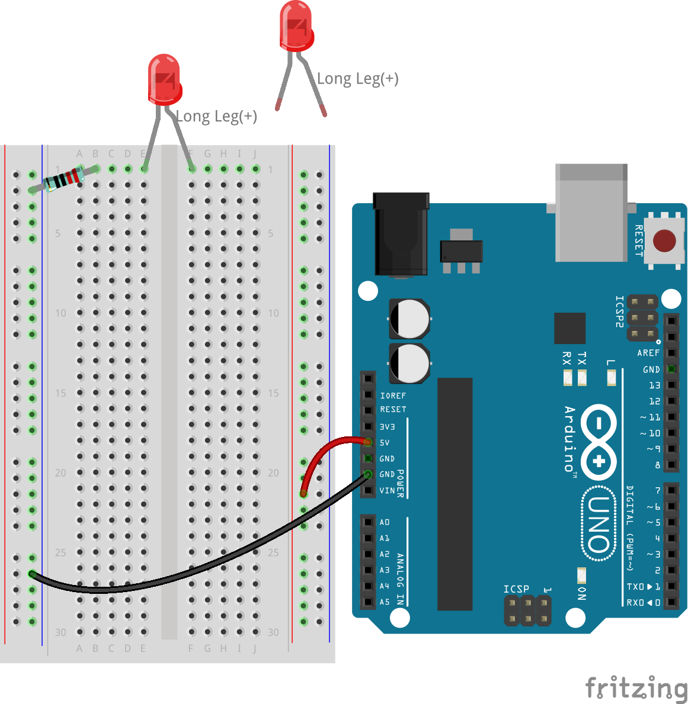

.. note::

    Hallo und herzlich willkommen in der SunFounder Raspberry Pi & Arduino & ESP32 Enthusiasten-Community auf Facebook! Tauche gemeinsam mit anderen Enthusiasten tiefer in die Welt von Raspberry Pi, Arduino und ESP32 ein.

    **Warum beitreten?**

    - **Expertenunterstützung**: Löse nach dem Kauf auftretende Probleme und technische Herausforderungen mit Hilfe unserer Community und unseres Teams.
    - **Lernen & Teilen**: Tausche Tipps und Anleitungen aus, um deine Fähigkeiten zu erweitern.
    - **Exklusive Vorschauen**: Erhalte frühzeitigen Zugang zu neuen Produktankündigungen und exklusiven Einblicken.
    - **Spezielle Rabatte**: Profitiere von exklusiven Rabatten auf unsere neuesten Produkte.
    - **Festliche Aktionen und Verlosungen**: Nimm an Verlosungen und Feiertagsaktionen teil.

    👉 Bereit, gemeinsam mit uns zu entdecken und zu erschaffen? Klicke auf [|link_sf_facebook|] und tritt noch heute bei!

5. Reihenschaltung vs. Parallelschaltung
=================================================

In dieser Lektion wirst du sowohl Reihen- als auch Parallelschaltungen aufbauen und analysieren, lernen, wie man die Spannung in verschiedenen Schaltungsanordnungen misst und versteht, wie sie sich verhält. Mit einem Multimeter misst du die Spannung und den Widerstand der von dir gebauten Schaltungen und gewinnst so praktische Einblicke in die Dynamik von Schaltkreisen.

In dieser spannenden Lektion wirst du:

* Schaltpläne mit realen Schaltungen verbinden.
* Ein Multimeter zur Messung von Widerstand und Spannung verwenden.
* Reihen- und Parallelschaltungen mit einem Steckbrett aufbauen.
* Das Verhalten der Spannung in Reihen- und Parallelschaltungen vergleichen.

Diese Ziele werden dir helfen, die Lücke zwischen theoretischem Wissen und praktischer Anwendung zu schließen und dein Verständnis für Elektronik durch praktische Erfahrungen zu bereichern.

Reihenschaltung vs. Parallelschaltung
------------------------------------------

In unseren bisherigen Lektionen haben wir erfolgreich einen einfachen Stromkreis mit einem Arduino Uno R3, einem Widerstand und einer LED aufgebaut. Der Strom in diesem Aufbau fließt in einer Reihenschaltung: Vom Pin 13 des Arduino-Boards durch die LED, durch den Widerstand und zurück zum GND-Pin. Dies ist ein einfaches Beispiel für eine Reihenschaltung.

Wenn wir jedoch tiefer in die Welt der Elektronik eintauchen, stoßen wir auf komplexere Schaltungen, die aus in Reihe oder parallel angeordneten Komponenten bestehen. Um diese Anordnungen und ihre Auswirkungen auf Strom und Spannung zu verstehen, müssen wir uns mit Schaltplänen, auch bekannt als Schaltbilder, vertraut machen.

**Verdrahtungsdiagramme vs. Schaltpläne**

Wir haben bisher Verdrahtungsdiagramme verwendet – bildliche Darstellungen, die den physischen Aufbau der Schaltungskomponenten nachahmen. Diese Diagramme sind intuitiv und eignen sich gut für Montagezwecke:

.. image:: img/2_uno_gnd.png
    :width: 600
    :align: center

Um jedoch die Funktionalität und das Design einer Schaltung zu verstehen, sind Schaltpläne unverzichtbar. Schaltpläne reduzieren Schaltungen auf das Wesentliche und verwenden standardisierte Symbole, um jede Komponente darzustellen. Sie zeigen die elektrischen Beziehungen zwischen den Komponenten, ohne die Komplexität des physischen Aufbaus.

Hier sind die Symbole für eine LED, einen Widerstand und eine Batterie, die du häufig in Schaltplänen findest:

.. image:: img/5_led_resistor_symbol.png
  :align: center

Ein Schaltplan, der auf unserer vorherigen Verdrahtung basiert, würde so aussehen, wobei das gesamte Arduino Uno R3 als Batterie fungiert, die die Schaltung speist. Aus diesem Schaltbild kannst du den Stromfluss und die Richtung des Stroms klar erkennen, was die Komplexität der physischen Verbindungen vereinfacht.

.. image:: img/5_serial_circuit_1led.png
  :align: center

**Reihen- vs. Parallelschaltungen**

In einer Reihenschaltung sind die Komponenten hintereinander geschaltet, sodass der Strom nur einen Weg hat, dem er folgen kann. Wenn eine Komponente ausfällt, wird der gesamte Stromkreis unterbrochen – ähnlich wie bei einer alten Lichterkette, bei der eine durchgebrannte Glühbirne die gesamte Kette verdunkelt.

.. image:: img/5_serial_circuit_2led.png
  :align: center

Eine Parallelschaltung hingegen teilt den Strom in mehrere Wege auf. Jede Komponente arbeitet unabhängig, sodass die anderen weiter funktionieren, wenn ein Weg unterbrochen wird. Denke an dein Zuhause: Wenn du das Licht ausschaltest, kann der Fernseher trotzdem noch eingeschaltet bleiben.

.. image:: img/5_parallel_circuit.png
  :align: center

Einblicke in Reihenschaltungen
----------------------------------

Aufbauend auf unserem Verständnis der Unterschiede zwischen Reihen- und Parallelschaltungen konzentriert sich diese Aktivität darauf, eine Reihenschaltung mit mehreren LEDs zu konstruieren. Denke daran, dass in einer Reihenschaltung der elektrische Strom durch einen einzigen Pfad fließt. Lass uns die einzigartigen Eigenschaften von Reihenschaltungen durch diese praktische Übung erkunden.

**Benötigte Komponenten**

.. list-table:: 
   :widths: 25 25 25 25
   :header-rows: 0

   * - 1 * Arduino Uno R3
     - 3 * Rote LEDs
     - 3 * 220Ω Widerstände
     - Jumperkabel
   * - |list_uno_r3| 
     - |list_red_led| 
     - |list_220ohm| 
     - |list_wire| 
   * - 1 * USB-Kabel
     - 1 * Steckbrett
     - 1 * Multimeter
     -   
   * - |list_usb_cable| 
     - |list_breadboard| 
     - |list_meter|
     - 

**Den Schaltkreis aufbauen**

1. Passe den vorherigen LED-Stromkreis an, indem du das Jumperkabel zwischen 1J und der positiven Seite des Steckbretts auf der rechten Seite entfernst. Nimm dann eine weitere rote LED und stecke ihre Kathode (das kürzere Bein) in 1J und die Anode in die positive Seite des Steckbretts, sodass du eine weitere LED seriell in den Stromkreis einbinden kannst.

Jetzt hast du eine Reihenschaltung mit zwei LEDs. Verfolge den Stromfluss durch die Schaltung:

* Der Strom fließt von 5V des Arduino Uno R3 durch ein langes Jumperkabel zum positiven Anschluss des Steckbretts.
* Dann fließt der Strom durch die erste LED, die aufgrund des Stromflusses aufleuchtet.
* Anschließend fließt der Strom durch die Metallklammern des Steckbretts zur zweiten LED, die ebenfalls aufleuchtet.
* Nachdem er die zweite LED passiert hat, fließt er durch den 220Ω-Widerstand, wo der Strom reduziert wird. Ohne diesen Widerstand wäre der Strom durch die LEDs zu hoch und könnte sie durchbrennen.
* Der Strom fließt dann zurück zum Ground-Pin des Arduino Uno R3 und schließt damit den Stromkreis.

**Frage:** 

Was passiert in dieser Reihenschaltung, wenn du eine LED entfernst? Warum passiert das?

**Spannung messen**

1. Stelle das Multimeter auf die Gleichspannungseinstellung 20 Volt ein.

.. image:: img/multimeter_dc_20v.png
    :width: 300
    :align: center

2. Verwende das Multimeter, um die Spannung über dem Widerstand zu messen.

    .. note::
        
        Das Messen der Spannung eines Bauteils in einem Stromkreis bedeutet, die Spannung über diesem zu überprüfen. Im Wesentlichen repräsentiert die Spannung den Energieunterschied zwischen zwei Punkten. Wenn du also die Spannung eines Bauteils misst, erfasst du den Energieunterschied von einer Seite zur anderen.

.. image:: img/5_serial_circuit_voltage_resistor.png
    :width: 600
    :align: center

3. Notiere die Spannung über dem Widerstand, Spannungseinheit: Volt (V).

.. note::

    * Meine Messung betrug 1,13V, du solltest deine eigenen Messungen eintragen.

    * Aufgrund von Verdrahtungsproblemen und Instabilität deiner Hand kann die Spannung schwanken. Du musst deine Hand ruhig halten und mehrmals beobachten, um einen relativ stabilen Spannungswert zu erhalten.

.. list-table::
   :widths: 25 25 25 25 25
   :header-rows: 1

   * - Schaltung
     - Widerstandsspannung
     - LED1-Spannung
     - LED2-Spannung
     - Gesamte Spannung 
   * - 2 LEDs
     - *≈1,13 Volt*
     - 
     - 
     - 

4. Messe nun die Spannung über der LED 1 in der Schaltung.

5. Notiere die Spannung über der LED 1 in der Tabelle.

.. list-table::
   :widths: 25 25 25 25 25
   :header-rows: 1

   * - Schaltung
     - Widerstandsspannung
     - LED1-Spannung
     - LED2-Spannung
     - Gesamte Spannung 
   * - 2 LEDs
     - *≈1,13 Volt*
     - *≈1,92 Volt*
     - 
     - 

6. Messe die Spannung über der LED 2 in der Schaltung.

.. image:: img/5_serial_circuit_voltage_led2.png
    :width: 600
    :align: center

7. Notiere die Spannung über der LED 2 in der Tabelle.

.. list-table::
   :widths: 25 25 25 25 25
   :header-rows: 1

   * - Schaltung
     - Widerstandsspannung
     - LED1-Spannung
     - LED2-Spannung
     - Gesamte Spannung 
   * - 2 LEDs
     - *≈1,13 Volt*
     - *≈1,92 Volt*
     - *≈1,92 Volt*
     - 

8. Messe nun die Gesamtspannung im Stromkreis.

.. image:: img/5_serial_circuit_voltage.png
    :width: 600
    :align: center

9. Trage die gemessene Spannung in die Spalte "Gesamte Spannung" der Tabelle ein.

.. list-table::
   :widths: 25 25 25 25 25
   :header-rows: 1

   * - Schaltung
     - Widerstandsspannung
     - LED1-Spannung
     - LED2-Spannung
     - Gesamte Spannung 
   * - 2 LEDs
     - *≈1,13 Volt*
     - *≈1,92 Volt*
     - *≈1,92 Volt*
     - *≈4,97 Volt*

Durch unsere Messungen wirst du entdecken:

.. code-block::

  4,97 Volt ≈ 1,13 Volt + 1,92 Volt + 1,92 Volt

  Gesamte Spannung = Widerstandsspannung + LED 1 Spannung + LED 2 Spannung

Du kannst auch berechnen, ob deine Messergebnisse mit dieser Gleichung übereinstimmen.

.. note::
    
    Aufgrund der Verdrahtungsstabilität oder geringfügiger Fertigungstoleranzen bei den LEDs und dem Widerstand könnte die Summe der Widerstandsspannung und der Spannungen der beiden LEDs nicht genau der gemessenen Gesamtspannung entsprechen. Dies ist jedoch in Ordnung, solange es sich in einem angemessenen Bereich bewegt.

Dies ist eine charakteristische Eigenschaft einer Reihenschaltung, bei der die Gesamtspannung im Stromkreis der Summe der Spannungen der einzelnen Komponenten entspricht.

**Strommessung**

Nachdem wir die Spannungsmerkmale von Reihenschaltungen verstanden haben, wollen wir nun den Strom im Stromkreis mit einem Multimeter untersuchen.

1. Stelle das Multimeter auf den Bereich von 20 Milliampere ein. Der Strom wird 20 mA nicht überschreiten, daher wurde diese Einstellung gewählt. Falls du unsicher bist, wird empfohlen, mit der 200-mA-Einstellung zu beginnen.

.. image:: img/multimeter_20a.png
  :width: 300
  :align: center

2. Um den Strom zu messen, muss das Multimeter in den Stromkreis integriert werden. Halte die Anode der LED in Loch 1F und verschiebe die Kathode (das kürzere Bein) von Loch 1E auf Loch 3E.

.. image:: img/5_serial_circuit_led1_current.png
    :width: 600
    :align: center

3. Messe den Strom durch LED 1 im Stromkreis.

.. image:: img/5_serial_circuit_led1_current1.png
    :width: 600
    :align: center

4. Notiere den gemessenen Strom in der Tabelle.

.. list-table::
   :widths: 25 25 25
   :header-rows: 1

   * - Schaltung
     - LED1 Strom
     - LED2 Strom
   * - 2 LEDs
     - *≈4,43 Milliampere*
     - 

5. Setze die Kathode der ersten LED wieder in ihre ursprüngliche Position und verschiebe die Kathode der zweiten LED (das kürzere Bein) von Loch 1J auf Loch 2J.

.. image:: img/5_serial_circuit_led2_current.png
    :width: 600
    :align: center

6. Messe den Strom durch LED 2 im Stromkreis.

.. image:: img/5_serial_circuit_led2_current1.png
    :width: 600
    :align: center

7. Notiere den gemessenen Strom in der Tabelle.

.. list-table::
   :widths: 25 25 25
   :header-rows: 1

   * - Schaltung
     - LED1 Strom
     - LED2 Strom
   * - 2 LEDs
     - *≈4,43 Milliampere*
     - *≈4,43 Milliampere*

Unsere Messungen haben ein grundlegendes Prinzip von Reihenschaltungen illustriert: Der Strom, der durch jede Komponente fließt, ist identisch. Dieser gleichmäßige Fluss unterstreicht die Verbundenheit der Komponenten in einer Reihenschaltung, bei der eine Unterbrechung des Stroms in einem Teil den gesamten Stromkreis beeinflusst.

Die Untersuchung von Spannung, Strom und Widerstand bereichert nicht nur unser Verständnis von Reihenschaltungen, sondern legt auch den Grundstein für komplexere elektrotechnische Konzepte. Durch diese praktischen Experimente schließen wir die Lücke zwischen Theorie und Anwendung, was den Lernprozess sowohl spannend als auch lehrreich macht.

**Frage**

Wenn eine weitere LED zu dieser Schaltung hinzugefügt wird, sodass drei LEDs vorhanden sind, wie ändert sich die Helligkeit der LEDs? Warum? Wie verändern sich die Spannungen über die drei LEDs?

Einführung in Parallelschaltungen
---------------------------------------

**Benötigte Komponenten**

* 1 * Arduino Uno R3
* 3 * Rote LEDs
* 3 * 220Ω Widerstände
* Mehrere Jumperkabel
* 1 * USB-Kabel
* 1 * Steckbrett
* 1 * Multimeter mit Testleitungen

**Den Schaltkreis aufbauen**

.. image:: img/5_parallel_circuit_bb.png
    :width: 600
    :align: center
  
1. Verbinde einen 220Ω-Widerstand mit dem Steckbrett. Ein Ende sollte im negativen Anschluss und das andere in Loch 1B sein.

.. image:: img/2_connect_resistor.png
    :width: 300
    :align: center

2. Füge eine rote LED zum Steckbrett hinzu. Die Anode der LED (das lange Bein) sollte in Loch 1F sein. Die Kathode (das kurze Bein) sollte in Loch 1E sein.

.. image:: img/2_connect_led.png
    :width: 300
    :align: center

3. Verwende ein kurzes Jumperkabel, um die LED mit der Stromquelle zu verbinden. Ein Ende des Jumperkabels sollte in Loch 1J und das andere Ende im positiven Anschluss sein.

.. image:: img/2_connect_wire.png
    :width: 300
    :align: center

4. Verbinde das lange Jumperkabel, das mit dem positiven Anschluss des Steckbretts verbunden ist, mit dem 5V-Pin des Arduino Uno R3. Die LED sollte aufleuchten und anbleiben. Der 5V-Pin liefert eine konstante Gleichspannung von 5 Volt an die Schaltung. Dies unterscheidet sich von Pin 13, der über die Arduino IDE-Software programmiert werden kann, um ein- und auszuschalten.

.. image:: img/5_parallel_circuit_5v.png
    :width: 600
    :align: center

5. Verbinde den negativen Anschluss des Steckbretts mit einem der GND-Pins des Arduino Uno R3. Die GND-Pins sind mit "GND" markiert.

6. Nimm einen weiteren 220Ω-Widerstand und verbinde ein Ende mit dem negativen Anschluss und das andere Ende mit Loch 6B.

.. image:: img/5_parallel_circuit_resistor.png
    :width: 600
    :align: center

7. Nimm eine weitere rote LED. Die Anode der LED (das lange Bein) sollte in Loch 6F sein. Die Kathode (das kurze Bein) sollte in Loch 6E sein.

.. image:: img/5_parallel_circuit_led.png
    :width: 600
    :align: center

8. Platziere schließlich ein Ende eines kurzen Jumperkabels in Loch 6J und das andere Ende im positiven Anschluss. Damit ist der Parallelstromkreis abgeschlossen.

.. image:: img/5_parallel_circuit_bb.png
    :width: 600
    :align: center

Jetzt hat dieser Schaltkreis zwei LEDs in einer Parallelschaltung. Es gibt zwei Wege, durch die der Strom fließen kann:

* Im ersten Weg: Der Strom tritt durch das Jumperkabel in die erste LED ein, fließt durch den strombegrenzenden Widerstand und dann zur negativen Seite des Steckbretts.
* Im zweiten Weg: Der Strom tritt durch das Jumperkabel in die zweite LED ein, fließt durch den strombegrenzenden Widerstand und dann zur negativen Seite des Steckbretts.
* An der negativen Seite kommen die beiden Wege wieder zusammen und fließen dann durch das schwarze Stromkabel, um den Ground-Pin des Arduino Uno R3 zu erreichen.

**Frage:**

Was passiert in dieser Parallelschaltung, wenn eine LED entfernt wird? Warum passiert das? 

.. image:: img/5_parallel_circuit_remove.png
    :width: 600
    :align: center

**Spannungsmessungsschritte**

1. Stelle das Multimeter auf den Gleichspannungsbereich von 20 Volt ein.

.. image:: img/multimeter_dc_20v.png
    :width: 300
    :align: center

2. Denke daran, dass in einer Parallelschaltung jeder Zweig die gesamte Spannung der Stromquelle erhält. In deinem Aufbau sollten beide Zweige etwa 5 Volt anzeigen. Beginne mit der Messung der Spannung entlang des ersten Weges.

.. list-table::
   :widths: 25 25 25
   :header-rows: 1

   * - Schaltung
     - Spannung Weg 1
     - Spannung Weg 2
   * - 2 LEDs
     - *≈5,00 Volt*
     - 

3. Überprüfe als Nächstes den Spannungsabfall im zweiten Weg. Er sollte ebenfalls nahe bei 5 Volt liegen.

.. image:: img/5_parallel_circuit_voltage2.png
    :width: 600
    :align: center

.. list-table::
   :widths: 25 25 25
   :header-rows: 1

   * - Schaltung
     - Spannung Weg 1
     - Spannung Weg 2
   * - 2 LEDs
     - *≈5,00 Volt*
     - *≈5,00 Volt*

Unsere Spannungsmessungen in einer Parallelschaltung zeigen deutlich, dass jeder Zweig einen gleichen Anteil der Gesamtspannung von der Quelle erhält, in diesem Fall etwa 5 Volt. Diese Gleichmäßigkeit über verschiedene Wege hinweg bestätigt das grundlegende Prinzip von Parallelschaltungen, bei denen die Spannung in jedem Zweig konstant bleibt, trotz möglicher kleiner Abweichungen aufgrund von Fertigungstoleranzen bei Komponenten wie LEDs und Widerständen.

**Strommessung**

Aus unseren bisherigen Messungen wissen wir, dass jeder Zweig in einer Parallelschaltung die volle Spannung von der Quelle erhält. Aber was ist mit dem Strom? Lass uns das jetzt messen.

1. Stelle das Multimeter auf den Bereich von 200 Milliampere ein.

.. image:: img/multimeter_200ma.png
    :width: 300
    :align: center

2. Zur Strommessung muss das Multimeter in den Stromkreis integriert werden. Lasse ein Ende des Widerstands am negativen Anschluss des Steckbretts und verschiebe das andere Ende in Loch 3B.

.. note::
    
    Dieser Schritt führt dazu, dass LED 1 ausgeht, während LED 2 weiter leuchtet. Dies demonstriert eine Eigenschaft von Parallelschaltungen: Die Unterbrechung eines Pfads beeinträchtigt nicht die anderen Pfade.

.. image:: img/5_parallel_circuit_led1_current.png
    :width: 600
    :align: center

3. Lege die roten und schwarzen Messleitungen des Multimeters zwischen die LED und den Widerstand, und du wirst sehen, dass LED1 wieder aufleuchtet.

.. image:: img/5_parallel_circuit_led1_current1.png
    :width: 600
    :align: center

4. Notiere den gemessenen Strom in der Tabelle.

.. list-table::
   :widths: 25 25 25 25
   :header-rows: 1

   * - Schaltung
     - LED1 Strom
     - LED2 Strom
     - Gesamtstrom
   * - 2 LEDs
     - *≈12,6 Milliampere*
     -
     - 

5. Setze den ersten Widerstand wieder in seine ursprüngliche Position und lasse ein Ende des zweiten Widerstands am negativen Anschluss des Steckbretts, während du das andere Ende in Loch 9B verschiebst.

.. image:: img/5_parallel_circuit_led2_current.png
    :width: 600
    :align: center

6. Miss jetzt den Strom durch LED 2 im Stromkreis.

.. image:: img/5_parallel_circuit_led2_current1.png
    :width: 600
    :align: center

7. Notiere den gemessenen Strom in der Tabelle.

.. list-table::
   :widths: 25 25 25 25
   :header-rows: 1

   * - Circuit
     - LED1 Current
     - LED2 Current
     - Total Current
   * - 2 LEDs
     - *≈12.6 milliamps*
     - *≈12.6 milliamps*
     - 

8. Nachdem du den Strom in beiden Pfaden gemessen hast, wie groß ist der Gesamtstrom, wenn die Pfade zusammenlaufen? Verschiebe jetzt das Jumperkabel vom negativen Anschluss des Steckbretts zu Loch 25C.

.. image:: img/5_parallel_circuit_total_current.png
    :width: 600
    :align: center

9. Messe nun den Gesamtstrom des Stromkreises.

.. image:: img/5_parallel_circuit_total_current1.png
    :width: 600
    :align: center

10. Trage die gemessenen Ergebnisse in die Tabelle ein.

.. list-table::
   :widths: 25 25 25 25
   :header-rows: 1

   * - Circuit
     - LED1 Current
     - LED2 Current
     - Total Current
   * - 2 LEDs
     - *≈12.6 milliamps*
     - *≈12.6 milliamps*
     - *≈25.3 milliamps*

Unsere Untersuchung von Parallelschaltungen hat einen wesentlichen Aspekt beleuchtet: Der Gesamtstrom entspricht der Summe der Ströme der einzelnen Zweige, was den grundlegenden Prinzipien elektrischer Schaltungen entspricht. Diese praktische Aktivität stärkt nicht nur unser Verständnis von Parallelschaltungen, sondern hebt auch das unterschiedliche Verhalten im Vergleich zu Reihenschaltungen hervor. Sie bietet ein klares Bild davon, wie Komponenten in Parallelschaltungen die elektrische Last teilen. Während wir unsere Reise in die Welt der Elektronik fortsetzen, legen diese Erkenntnisse den Grundstein für weiterführende Untersuchungen zur Schaltungsplanung und Funktionalität.

**Frage**:

1. Wenn eine weitere LED zu diesem Schaltkreis hinzugefügt wird, was passiert mit der Helligkeit der LEDs? Warum? Notiere deine Antwort in deinem Handbuch.

.. image:: img/5_parallel_circuit_3led.png
    :width: 600
    :align: center

Zusammenfassung von Reihen- und Parallelschaltungen
------------------------------------------------------

**Reihenschaltungen**

* **Vorteile**: Da der Strom im gesamten Stromkreis derselbe ist, lässt sich der Strom leicht steuern. Wenn eine Komponente ausfällt, stoppt der gesamte Stromfluss. Die Verdrahtung ist einfacher, was die Kosten für den Bau großer Schaltungen reduziert.
* **Nachteile**: Wenn ein Teil der Schaltung beschädigt ist, funktioniert die gesamte Schaltung nicht mehr. Da der Strom im Stromkreis konstant ist, können keine Komponenten verwendet werden, die unterschiedliche Ströme benötigen.

**Parallelschaltungen**

* **Vorteile**: Wenn ein Weg in der Schaltung unterbrochen wird, beeinträchtigt dies nicht die anderen Zweige der Schaltung. Ein Gerät in einem Zweig kann unabhängig von anderen Geräten funktionieren. Es können jederzeit problemlos weitere Zweige zur Schaltung hinzugefügt werden.
* **Nachteile**: Je mehr Geräte zur Schaltung hinzugefügt werden, desto mehr Strom wird benötigt. Dies kann gefährlich werden, da sich der Stromkreis erwärmt, was möglicherweise zu einem Brand führt. Sicherungen oder Leistungsschalter werden verwendet, um die Schaltung zu unterbrechen, wenn der Strom zu hoch ist, um Überhitzung zu vermeiden. Die Verdrahtung ist komplexer, was die Kosten für den Bau großer Schaltungen erhöht.

**Regeln für Reihen- und Parallelschaltungen**

Hier sind die Regeln für Reihen- und Parallelschaltungen, die du weiterhin mit einem Multimeter überprüfen kannst:

.. .. list-table::
..    :widths: 10 25 25 25
..    :header-rows: 1

..    * - Schaltung
..      - Spannung
..      - Strom
..      - Widerstand  
..    * - Reihen
..      - Die Gesamtspannung des Stromkreises entspricht der Summe der Spannungen, die jede Komponente verbraucht (Gesamtspannung = V1 + V2 + V3 + ...).
..      - Der Strom an jedem Punkt des Stromkreises ist gleich (Gesamtstrom = I1 = I2 = I3 = ...).
..      - Der Gesamtwiderstand eines Stromkreises entspricht der Summe der Widerstände jeder Komponente (Gesamtwiderstand = R1 + R2 + R3 + ...).
..    * - Parallel
..      - Die Spannung, die jede Last verwendet, entspricht der Gesamtspannung des Stromkreises (Gesamtspannung = V1 = V2 = V3 = ...).
..      - Der Gesamtstrom des Stromkreises entspricht der Summe der Ströme, die jede Komponente verwendet (Gesamtstrom = I1 + I2 + I3 + ...).
..      - Der Kehrwert des Gesamtwiderstands entspricht der Summe der Kehrwerte der Widerstände jeder Komponente (1/ Gesamtwiderstand = 1/R1 + 1/R2 + 1/R3 + ...)   

**Reihe**

  - Die Gesamtspannung des Stromkreises entspricht der Summe der Spannungen, die jede Komponente verbraucht (Gesamtspannung = V1 + V2 + V3 + ...).
  - Der Strom an jedem Punkt des Stromkreises ist gleich (Gesamtstrom = I1 = I2 = I3 = ...).
  - Der Gesamtwiderstand eines Stromkreises entspricht der Summe der Widerstände jeder Komponente (Gesamtwiderstand = R1 + R2 + R3 + ...).

**Parallel**

  - Die Spannung, die jede Last verwendet, entspricht der Gesamtspannung des Stromkreises (Gesamtspannung = V1 = V2 = V3 = ...).
  - Der Gesamtstrom des Stromkreises entspricht der Summe der Ströme, die jede Komponente verwendet (Gesamtstrom = I1 + I2 + I3 + ...).
  - Der Kehrwert des Gesamtwiderstands entspricht der Summe der Kehrwerte der Widerstände jeder Komponente (1/ Gesamtwiderstand = 1/R1 + 1/R2 + 1/R3 + ...).

