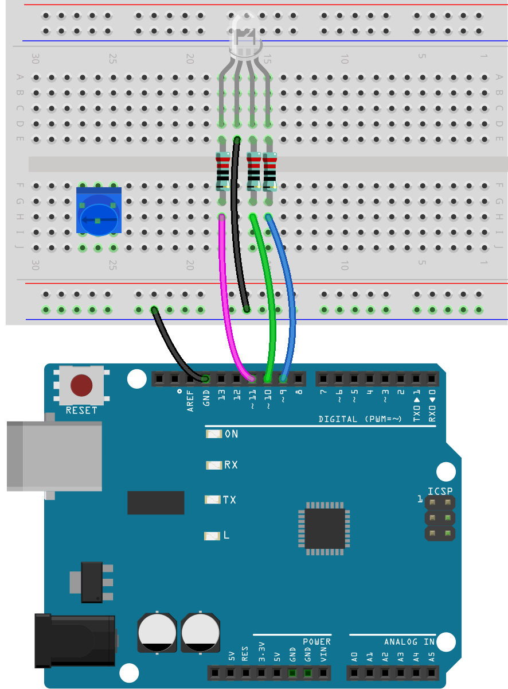
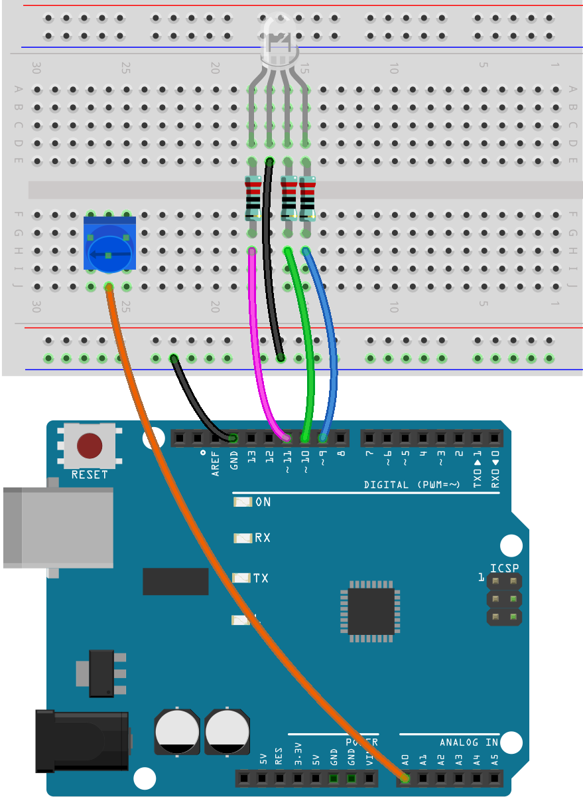
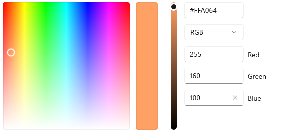
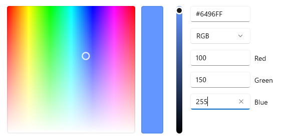

光的冷暖
======================

冷暖色(Cool & Warm colour) 指色彩心理上的冷热感觉。
红、橙、黄、棕等色往往给人热烈、兴奋、热情、温和的感觉，所以将其称为暖色。
绿、蓝、紫等色往往给人镇静、凉爽、开阔，通透的感觉，所以将其称为冷色。
橙色与蓝色是色彩冷暖的两个极端。

在家庭和休闲场所，人们会更乐于接受淡黄色、米白色的照明灯光，这给人给人舒适的感觉，就像沐浴在日落或烛光之中。

.. image:: img/6_mix_color_warm_room.png

而在图书馆，教室，办公室，以及医院等场合，人们则更乐于接受偏蓝色的照明灯光，这给人清爽、精神集中的感觉，适合工作和学习。

光的冷暖是一种非常直观的感受，它影响着我们对环境的心理感受和视觉舒适度。
设计师和照明工程师会根据空间的功能和所需的氛围，精心选择合适的色温，从而创造出既美观又实用的照明环境。
通过科学地应用光的冷暖，我们可以提高生活和工作的质量，营造出更健康、更舒适的生活环境。

在这个活动中，我们将扮演照明工程师，制作一个可以切换色温的灯光系统。

**需要的元件**

TODO-IMAGE
1项目板
TODO-IMAGE
1 RGB LED
TODO-IMAGE
1 跳线
TODO-IMAGE
1 带测试线的万用表
TODO-IMAGE
3 个 220 欧姆的电阻
TODO-IMAGE
1 个 电位器

.. note::
    220 欧姆电阻的色环是： 红色，红色，黑色，黑色，棕色

**原理示意图+wiring**

【】

.. image:: img/6_mix_color_pot_bb_3.png

**构筑电路**

这个电路在章节6.1的电路的基础上增加了一个电位器。

**Step 1**

将一个电位器插入面包板。它的三个引脚应当分列于不同的三行。

**Step 2**

将电位器中间引脚连接到A0

**Step 3**

将电位器两侧引脚分别连接到GND和5V

.. image:: img/6_mix_color_pot_bb_3.png

创建代码 —— 调节色温
---------------------------------

1) 如果有必要，在 Arduino IDE 中打开你的 Lesson6_mix_color_plus 草图。

2) 用新的名称保存草图。从 "文件 "菜单中选择 "另存为..."，草图位置应该默认为 Arduino Sketchbook。
将文件命名为 "Lesson6_mix_color_tone"。点击 "保存"。

3) 打开画板工具，从中找到你认为最暖和最冷的颜色。

*将你找到的冷色和暖色的RGB值记录在handbook上。*

灯光的冷暖是个较为主观的感受，但是无可厚非的是暖色调应当偏于橙红,冷色调应当偏于蓝色。
以下是一组冷暖色的参考值。

* Light Orange (R:255 ,G:160 ,B:100)

* Light Blue (R:100 ,G:150 ,B:255)

4) 在setup()之前声明六个变量，将这两个颜色的RGB值储存下来。请填写你自己找到的颜色。

.. code-block:: Arduino
    :emphasize-lines: 1-4,6-9

    // Define RGB values for a warm color tone
    int warm_r = 255; // Red component of the warm color, maximum intensity
    int warm_g = 160; // Green component of the warm color, medium intensity
    int warm_b = 100; // Blue component of the warm color, lower intensity

    // Define RGB values for a cool color tone
    int cool_r = 100; // Red component of the cool color, lower intensity
    int cool_g = 150; // Green component of the cool color, medium intensity
    int cool_b = 255; // Blue component of the cool color, maximum intensity

    void setup() {
        pinMode(9, OUTPUT);             // Declare the RGB LED pin1 as output
        pinMode(10, OUTPUT);            // Declare the RGB LED pin2 as output
        pinMode(11, OUTPUT);            // Declare the RGB LED pin2 as output
        Serial.begin(9600);
    }

5) 通过对RGB的对比，我们可以得知，冷色与暖色之间主要是三原色光强度的比例不同。
在电位器旋转时，让灯光从暖色切换到冷色，只要降低红色关的强度，增加蓝色光的强度，并对绿色光强度进行微调就可以了。
在前面的项目中，我们已经学过如何让LED的发光强度随着电位器的旋转而变化。

但是，这个项目中，电位器的转动会让RGB三个引脚的强度在一些较为特别的范围内转变，
因此，简单的除法并不能完成任务，我们需要使用一个新的函数 ``map()`` 。

map()
^^^^^^^^^^^^^^^^^^^^^^^

在Arduino编程中，map()函数是一个非常实用的功能，它允许你将一个数值范围映射（或转换）到另一个数值范围。

map()函数的基本语法如下：

**long map(long x, long in_min, long in_max, long out_min, long out_max)**

    * x：要映射的值。
    * in_min：x的当前范围的最小值。
    * in_max：x的当前范围的最大值。
    * out_min：映射后的范围的最小值。
    * out_max：映射后的范围的最大值。

map()函数根据比例将一个范围内的数值转换到另一个范围内。
它首先计算x值相对于其原始范围（in_min到in_max）的位置，
然后使用相同的比例将这个位置转换到新的范围（out_min到out_max）中。

在这里我们使用map函数让RGB LED的三个引脚的光强度随着电位器的旋转，光的色调从最暖转到最冷。
更具体的说，以我提供的参考值为例，随着电位器的旋转,
RGB LED的R数值将从255逐渐转变到100，而B数值逐渐从100转到255，G数值从160逐渐转为150（即便G值转变不明显）。

6) 将旋钮的最大值和最小值作为变量。

.. code-block:: Arduino
    :emphasize-lines: 11,12

    // Define RGB values for a warm color tone
    int warm_r = 255; // Red component of the warm color, maximum intensity
    int warm_g = 160; // Green component of the warm color, medium intensity
    int warm_b = 100; // Blue component of the warm color, lower intensity

    // Define RGB values for a cool color tone
    int cool_r = 100; // Red component of the cool color, lower intensity
    int cool_g = 150; // Green component of the cool color, medium intensity
    int cool_b = 255; // Blue component of the cool color, maximum intensity

    int pot_max = 1024;
    int pot_min = 0;

7) 读取电位器的值。

.. code-block:: Arduino

    void loop(){
        readValue = analogRead(A0);     // store the value from the potentiometer
    }

8) 在loop函数中，创建三个变量，用于储存电位器数值在RGB冷暖色区间映射后的值。

.. code-block:: Arduino

    void loop(){
        readValue = analogRead(A0);     // store the value from the potentiometer
        int value_r;
        int value_g;
        int value_b;
    }

9) 调用map()函数，为它们赋值，这三个数值会变成新的rgb值。

.. code-block:: Arduino

    void loop(){
        int readValue = analogRead(A0);     // store the value from the potentiometer
        int value_r = map(readValue,pot_min,pot_max,warm_r,cool_r);
        int value_g = map(readValue,pot_min,pot_max,warm_g,cool_g);
        int value_b = map(readValue,pot_min,pot_max,warm_b,cool_b);
    }

10) 调用 lightUp() ，将最新的rgb值点亮出来。你现在的代码应当类似如下：

.. code-block:: Arduino

    // Define RGB values for a warm color tone
    int warm_r = 255; // Red component of the warm color, maximum intensity
    int warm_g = 160; // Green component of the warm color, medium intensity
    int warm_b = 100; // Blue component of the warm color, lower intensity

    // Define RGB values for a cool color tone
    int cool_r = 100; // Red component of the cool color, lower intensity
    int cool_g = 150; // Green component of the cool color, medium intensity
    int cool_b = 255; // Blue component of the cool color, maximum intensity

    int pot_max = 1024;
    int pot_min = 0;

    void setup() {
        pinMode(9, OUTPUT);             // Declare the RGB LED pin1 as output
        pinMode(10, OUTPUT);            // Declare the RGB LED pin2 as output
        pinMode(11, OUTPUT);            // Declare the RGB LED pin2 as output
        Serial.begin(9600);
    }

    void loop(){
        int readValue = analogRead(A0);     // store the value from the potentiometer
        int value_r = map(readValue,pot_min,pot_max,warm_r,cool_r);
        int value_g = map(readValue,pot_min,pot_max,warm_g,cool_g);
        int value_b = map(readValue,pot_min,pot_max,warm_b,cool_b);
        lightUp(value_r, value_g, value_b);               // Call the lightUp function to control the RGB LED
        delay(500);
    }

    void lightUp(int value1, int value2, int value3) {
        Serial.print("pin value:");
        Serial.print(value1);
        Serial.print(" , ");
        Serial.print(value2);
        Serial.print(" , ");
        Serial.println(value3);  

        analogWrite(9, value1);
        analogWrite(10, value2);
        analogWrite(11, value3);
    }

11) 点击“上传”按钮，将草图上传到你的 Arduino 板。

在实验的过程中，你可能会发现该灯光的冷暖色并没有在屏幕中看到的那么明显，
比如期待的暖光最终却呈现出了白色。

.. note::

    此时你可以用万用表测量RGB的三个引脚的电压。你可能会发现R3板的程序确实如你所愿的为三个引脚提供了正确强度的电信号，但所显示的色彩却与你期望中略有偏差。

这是正常的，这是因为RGB LED的色彩混合没有屏幕显示那么精细导致的。

这种情况下，你可以通过减少warm color中G和B值的强度，来让RGB LED呈现出更符合的颜色。
例如：

.. code-block:: Arduino
    :emphasize-lines: 3,4

    // Define RGB values for a warm color tone
    int warm_r = 255; // Red component of the warm color, maximum intensity
    int warm_g = 50; // Green component of the warm color, medium intensity
    int warm_b = 40; // Blue component of the warm color, lower intensity

    // Define RGB values for a cool color tone
    int cool_r = 100; // Red component of the cool color, lower intensity
    int cool_g = 150; // Green component of the cool color, medium intensity
    int cool_b = 255; // Blue component of the cool color, maximum intensity

*现在请多做几次尝试，找到更合适的冷暖色的RGB值，记录在handbook上。*

12) 点击 “保存” 来保存你的草图。