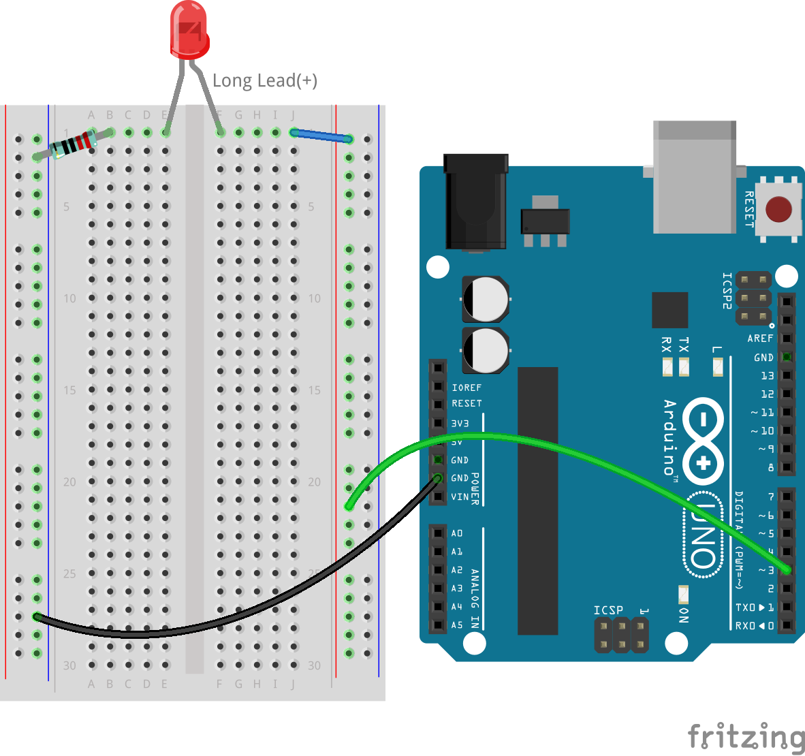
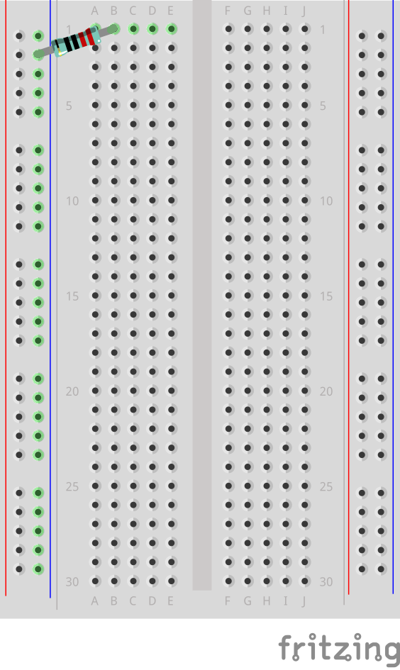
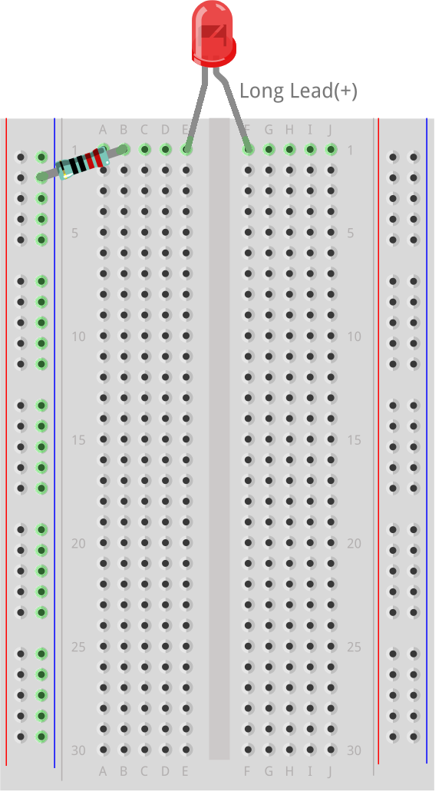
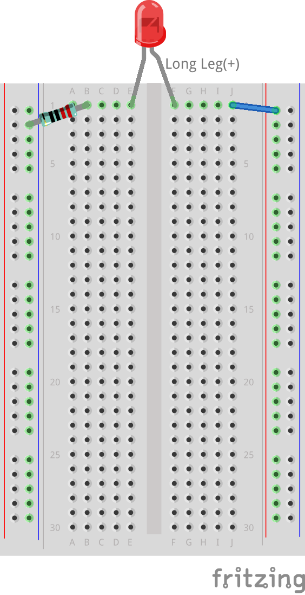
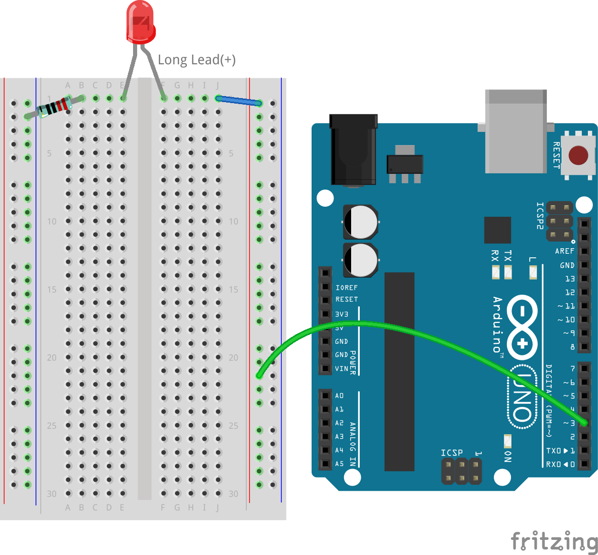
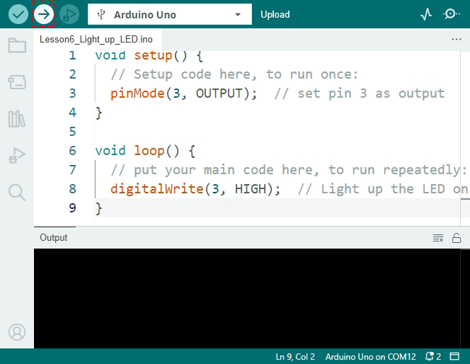
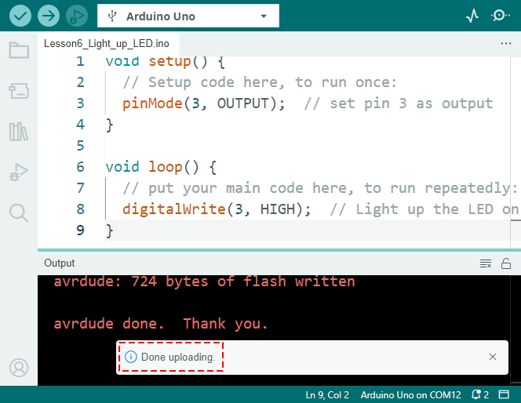
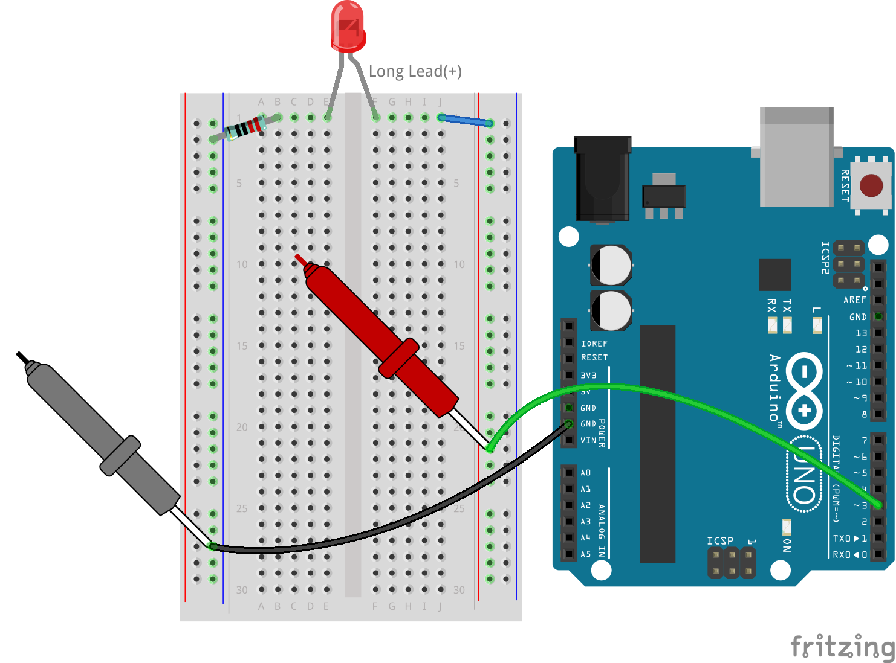

.. note::

    こんにちは、SunFounder Raspberry Pi & Arduino & ESP32 Enthusiasts Community on Facebookへようこそ！Raspberry Pi、Arduino、ESP32に興味を持つ仲間たちと一緒に深く探求しましょう。

    **参加する理由**

    - **専門サポート**: コミュニティやチームの助けを借りて、販売後の問題や技術的な課題を解決できます。
    - **学びと共有**: スキルを向上させるためのヒントやチュートリアルを交換できます。
    - **限定プレビュー**: 新製品の発表やプレビューに早期アクセスできます。
    - **特別割引**: 最新の製品に対する独占割引を楽しめます。
    - **フェスティバルプロモーションとギブアウェイ**: ギブアウェイやホリデープロモーションに参加できます。

    👉 私たちと一緒に探索と創造を始める準備はできましたか？[|link_sf_facebook|]をクリックして今日参加しましょう！

6. LEDを点滅させる
======================
このレッスンでは、Arduino Uno R3のデジタルピンを操作して、手動操作なしでLEDをプログラムでオン・オフする方法を学びます。これは、家庭用および産業用電子機器の基本的なスキルです。

.. raw:: html

    <video muted controls style = "max-width:90%">
        <source src="_static/video/6_blink_led.mp4" type="video/mp4">
        Your browser does not support the video tag.
    </video>

このレッスンでは、次のことを学びます：

* Arduino IDEを使用してスケッチを作成し保存する。
* ``pinMode()`` と ``digitalWrite()`` 関数を使って回路要素を制御する。
* スケッチをArduino Uno R3にアップロードし、そのリアルタイムの効果を理解する。
* スケッチに ``delay()`` を実装して回路の動作を管理する。

このレッスンの終わりには、LEDを点灯させるだけでなく、設定した間隔で点滅させる回路を構築できるようになり、ソフトウェアがハードウェアとどのように連携するかの基本的な理解が得られます。

回路の構築
--------------------------------

**必要な部品**

.. list-table:: 
   :widths: 25 25 25 25
   :header-rows: 0

   * - 1 * Arduino Uno R3
     - 1 * 赤色LED
     - 1 * 220Ω抵抗
     - ジャンパーワイヤー
   * - |list_uno_r3| 
     - |list_red_led| 
     - |list_220ohm| 
     - |list_wire| 
   * - 1 * USBケーブル
     - 1 * ブレッドボード
     - 1 * マルチメーター
     -   
   * - |list_usb_cable| 
     - |list_breadboard| 
     - |list_meter|
     - 

**ステップバイステップの構築**

:ref:`2_first_circuit` で構築した回路を取り、ワイヤーを5Vからピン3に切り替えます。以下の画像を参照してください。

以前の回路を解体した場合は、次の手順に従って再構築できます：

1. 220Ωの抵抗をブレッドボードに接続します。片方のワイヤーを負の端子に、もう片方のワイヤーを1Bの穴に挿入します。

2. 赤色LEDをブレッドボードに追加します。LEDのアノード（長い脚）は1Fの穴に、カソード（短い脚）は1Eの穴に挿入します。脚の長さでアノードとカソードを区別するのが難しい場合、カソード側には平らな縁があり、アノード側には丸い縁があります。

3. 短いジャンパーワイヤーを使ってLEDと電源を接続します。ジャンパーワイヤーの片方の端を1Jの穴に、もう片方の端を正の端子に接続します。

4. ブレッドボードの正の端子をArduino Uno R3のピン3に接続します。

5. ブレッドボードの負の端子をArduino Uno R3のグランドピンの1つに接続します。グランドピンは「GND」と表示されています。

LEDを点灯させる
-----------------------------

さて、LEDを点灯させる時間です！以前のようにArduinoのBlinkの例に飛び込むのではなく、最初から新しいスケッチを作成しましょう。さあ、始めましょう！

**1. スケッチの作成と保存**

1. Arduino IDEを起動します。「ファイル」メニューから「新規スケッチ」を選択し、新しいスケッチを開始します。開いている他のスケッチウィンドウは閉じてください。

    .. image:: img/6_blink_ide_new.png
        :align: center

2. Arduino IDEのウィンドウをこのオンラインチュートリアルと並べて表示し、両方を同時に見られるようにします。少し小さく見えるかもしれませんが、ウィンドウを行き来するより便利です。

    .. image:: img/6_blink_ide_tutorials.png

3. スケッチを保存する時が来ました。「ファイル」メニューから「保存」を選択するか、 ``Ctrl + S`` を押します。

    .. image:: img/6_blink_ide_save.png

4. スケッチをデフォルトの場所または他の場所に保存できます。スケッチに ``Lesson6_Light_up_LED`` のような意味のある名前を付けて、「保存」をクリックします。

    * スケッチの名前は後で簡単に見つけられるように、その機能を反映したものにします。
    * Arduinoのスケッチファイル名にはスペースを含めることはできません。
    * 重要な変更を保存する際は、新しいバージョンとして保存（例：V1）してバックアップを取ることを検討してください。

    .. image:: img/6_blink_ide_name.png

5. 新しいスケッチは、すべてのArduinoスケッチで使用される ``void setup()`` と ``void loop()`` の2つの主要な部分で構成されています。

    * ``void setup()`` はプログラムが開始されたときに一度だけ実行され、初期設定を行います。
    * ``void loop()`` は繰り返し実行され、連続的なアクションを実行します。
    * 各関数の中括弧 ``{}`` 内にコマンドを記述します。
    * ``//`` で始まる行はコメントです。これらはメモ用で、コードの実行には影響しません。

    .. code-block:: Arduino

        void setup() {
        // 初期設定コードをここに記述します（1回だけ実行）:

        }

        void loop() {
        // メインコードをここに記述します（繰り返し実行）:

        }

**2. ボードとポートの選択**

1. USBケーブルを使ってArduino Uno R3をコンピュータに接続します。Arduinoの電源ランプが点灯します。

    .. image:: img/1_connect_uno_pc.jpg
        :width: 600
        :align: center

2. IDEに **Arduino Uno** を使用していることを知らせます。 **ツール**  -> **ボード** -> **Arduino AVR Boards** -> **Arduino Uno** を選択します。

    .. image:: img/6_blink_ide_board.png
        :width: 600
        :align: center

3. 次に、Arduino IDEでArduinoが接続されているポートを選択します。

    .. note::

        * ポートが選択されると、Arduino IDEはUSB経由でArduinoが接続されるたびにデフォルトでそのポートを使用します。
        * 異なるArduinoボードが接続されている場合、新しいポートを選択する必要があるかもしれません。
        * 接続に問題がある場合は、まずポートを確認してください。

    .. image:: img/6_blink_ide_port.png
        :width: 600
        :align: center

**3. コードの記述**

1. このプロジェクトでは、ボードのデジタルピン3を使用してLEDを制御します。各ピンは出力として5ボルトを送信するか、入力として電圧を読み取るかのいずれかの機能を持ちます。LEDを設定するために、 ``pinMode(pin, mode)`` 関数を使用してピンを出力として設定します。

``pinMode()`` の構文を見てみましょう。

    * ``pinMode(pin, mode)``: 特定のピンを ``INPUT`` または ``OUTPUT`` に設定します。

    **パラメータ**
        - ``pin``: モードを設定したいピンの番号。
        - ``mode``: ``INPUT``, ``OUTPUT``, または ``INPUT_PULLUP`` 。

    **戻り値**
        なし

2. では、 ``void setup()`` 関数に最初の行のコードを追加しましょう。

    .. note::

        - Arduinoのコーディングは大文字小文字を区別します。関数は正確に記述してください。
        - コマンドの末尾にはセミコロンを付ける必要があります。Arduino IDEでは、すべてのコマンドの末尾にセミコロンが必要です。
        - コードコメントは、その行やセクションが何をするのかを思い出すのに役立ちます。

    .. code-block:: Arduino
        :emphasize-lines: 3

        void setup() {
            // 初期設定コードをここに記述します（1回だけ実行）:
            pinMode(3,OUTPUT); // ピン3を出力に設定
        }
    
        void loop() {
        // メインコードをここに記述します（繰り返し実行）:

        }

**4. コードの検証**

トラフィックライトを動作させる前に、コードを検証します。これにより、Arduino IDEがコマンドを理解し、機械語にコンパイルできるかどうかを確認します。

1. コードを検証するには、ウィンドウの左上隅にある **チェックマーク** ボタンをクリックします。

    .. image:: img/6_blink_ide_verify.png
        :width: 600
        :align: center

2. コードが機械語に変換可能であれば、画面下部にコードが正常にコンパイルされたことを示すメッセージが表示されます。このエリアにはプログラムが使用するストレージ容量も表示されます。

    .. image:: img/6_blink_ide_verify_done.png
        :width: 600
        :align: center

3. コードにエラーがある場合、オレンジ色のエラーメッセージが表示されます。IDEは通常、問題がある可能性のある場所を強調表示します。例えば、セミコロンの不足エラーでは、間違いの直後の行が強調表示されます。

    .. image:: img/6_blink_ide_verify_error.png
        :width: 600
        :align: center

4. エラーが発生した場合、デバッグ（コードの間違いを見つけて修正する作業）を行います。一般的な問題をチェックしてください：

    - ``pinMode`` の ``M`` は大文字になっていますか？
    - ``OUTPUT`` を全て大文字で記述しましたか？
    - ``pinMode`` 関数に開き括弧と閉じ括弧の両方がありますか？
    - ``pinMode`` 関数の末尾にセミコロンを付けましたか？
    - スペルはすべて正しいですか？ エラーが見つかった場合、それを修正してコードを再度検証します。エラーがなくなるまでデバッグを続けてください。

Arduino IDEは最初のエラーでコンパイルを停止するため、複数のエラーがある場合は複数回の検証が必要です。定期的にコードを検証することは良い習慣です。

デバッグはプログラミングの大部分を占めます。プロのプログラマーは新しいコードを書くよりも多くの時間をデバッグに費やすことがよくあります。エラーは通常のことなので、落胆しないでください。優れた問題解決能力を持つことが、優れたプログラマーになるための鍵です。

**5. スケッチの続きの作成**

1. ここからは、 ``void loop()`` 関数に取り組みます。ここがスケッチやプログラムの主なアクションが行われる場所です。Arduino Uno R3に接続されたLEDを点灯させるために、 ``digitalWrite()`` を使用して回路に電圧を供給します。

    * ``digitalWrite(pin, value)``: デジタルピンに ``HIGH`` （5V）または ``LOW`` （0V）の信号を送信し、コンポーネントの動作状態を変更します。

    **パラメータ**
        - ``pin`` : Arduinoピン番号。
        - ``value`` : ``HIGH`` または ``LOW`` 。
    
    **戻り値**
        なし

2. ``void loop()`` 関数内のコメントの下に、ピン3に接続されたLEDを点灯させるコマンドを記述します。コマンドの最後にセミコロンを忘れないようにしてください。コードを検証し、必要に応じてデバッグしてください。

    .. code-block:: Arduino
        :emphasize-lines: 8

        void setup() {
            // 初期設定コードをここに記述します（1回だけ実行）:
            pinMode(3, OUTPUT);  // ピン3を出力に設定
        }

        void loop() {
            // メインコードをここに記述します（繰り返し実行）:
            digitalWrite(3, HIGH);
        }

3. ``digitalWrite()`` コマンドの後に、この行が何をするのかを説明するコードコメントを追加します。例えば：

    .. code-block:: Arduino
        :emphasize-lines: 8

        void setup() {
            // 初期設定コードをここに記述します（1回だけ実行）: 
            pinMode(3, OUTPUT);  // ピン3を出力に設定
        }

        void loop() {
            // メインコードをここに記述します（繰り返し実行）:
            digitalWrite(3, HIGH);  // ピン3のLEDを点灯
        }

**6. コードのアップロード**

コードにエラーがなく、検証が完了したら、次はArduino Uno R3にアップロードして、実際に動作させてみましょう。

1. IDEで「アップロード」ボタンをクリックします。コンピュータがコードをコンパイルし、Arduino Uno R3に転送します。転送中、ボード上のいくつかのライトが点滅し、コンピュータとの通信が行われていることを示します。

2. 「アップロード完了」のメッセージが表示されたら、コードに問題がなく、正しいボードとポートが選択されていることを意味します。

3. 転送が完了すると、コードが実行され、ブレッドボード上のLEDが点灯するはずです。

**7. LEDの電圧測定**

マルチメータを使用してピン3の電圧を測定し、コード内の ``HIGH`` 状態が実際に何を意味するかを理解しましょう。

1. マルチメータを20ボルトDC設定に調整します。

.. image:: img/multimeter_dc_20v.png
    :width: 300
    :align: center

2. まず、ピン3の電圧を測定します。マルチメータの赤いテストリードをピン3に、黒いテストリードをGNDに接触させます。

3. 測定した電圧を、「HIGH」とラベル付けされた行のピン3電圧の列に記録します。

.. list-table::
   :widths: 25 25
   :header-rows: 1

   * - 状態
     - ピン3の電圧
   * - HIGH
     - *≈4.95ボルト*
   * - LOW
     - 

4. 測定後、マルチメータを「OFF」位置に設定して電源を切ることを忘れないでください。

測定結果から、すべてのピンの電圧が約5Vであることがわかります。これは、コード内でピンを ``HIGH`` に設定することが、そのピンの出力電圧が約5Vになることを意味します。

R3のピン電圧は5Vなので、 ``HIGH`` に設定すると約5Vになります。しかし、3.3Vで動作するボードもあり、その場合 ``HIGH`` 状態は約3.3Vに近くなります。

LEDを点滅させる
------------------------------
LEDが点灯したので、次は点滅させましょう。

1. 以前に保存したスケッチ ``Lesson6_Light_up_LED`` を開き、「ファイル」メニューから「名前を付けて保存」を選択し、 ``Lesson6_Blink_LED``  に名前を変更して保存します。

2. スケッチの ``void loop()`` 関数内で、 ``digitalWrite()`` コマンドをコピーし、元のコマンドの後に貼り付けます。LEDを点滅させるために、最初にONにした後、次にその状態を ``LOW`` に設定してOFFにします。

    .. note::
       * コピー＆ペーストはコーダーの強力なツールです。きれいなコードセクションを新しい位置に複製し、そのパラメータを調整して迅速かつクリーンに実行します。
       * コメントを更新して、実行するアクションにより適合させます。
       * ``Ctrl+T`` を使用してコードを整然とフォーマットし、読みやすくします。

    .. code-block:: Arduino
       :emphasize-lines: 8,9

       void setup() {
            // Setup code here, to run once:
            pinMode(3, OUTPUT);  // set pin 3 as output
       }

       void loop() {
            // put your main code here, to run repeatedly:
            digitalWrite(3, HIGH);  // Light up the LED on pin 3   
            digitalWrite(3, LOW);  // Switch off the LED on pin 3
       }

3. 「アップロード」ボタンを押してスケッチをArduino Uno R3に転送します。転送後、LEDが点滅しない、または速すぎて見えないことに気付くかもしれません。

4. 点滅を視覚的に確認するために、 ``delay()``  コマンドを使用して、Arduino Uno R3に指定した期間（ミリ秒単位）待機させることができます。

    * ``delay(ms)``: プログラムを指定された時間（ミリ秒単位）一時停止させます。（1秒は1000ミリ秒です。）

    **パラメータ**
        - ``ms``: 一時停止するミリ秒数。許容されるデータ型: unsigned long。

    **戻り値**
        なし

5. それでは、各セットのONおよびOFFコマンドの後に ``delay(time)`` コマンドを追加し、遅延時間を3000ミリ秒（3秒）に設定します。この時間を調整してLEDの点滅速度を速くしたり遅くしたりできます。

    .. note::

        この遅延の間、Arduino Uno R3は他のタスクやコマンドを実行できません。
        
    .. code-block:: Arduino
       :emphasize-lines: 10,11

       void setup() {
            // Setup code here, to run once:
            pinMode(3, OUTPUT);  // set pin 3 as output
       }

       void loop() {
            // put your main code here, to run repeatedly:
            digitalWrite(3, HIGH);  // Light up the LED on pin 3
            delay(3000); // Wait for 3 seconds   
            digitalWrite(3, LOW);  // Switch off the LED on pin 3
            delay(3000); // Wait for 3 seconds
       }

6. スケッチをArduino Uno R3にアップロードします。完了すると、LEDは3秒間隔で点滅するはずです。

7. すべてが期待通りに動作していることを確認し、スケッチを保存します。

8. マルチメータを使用してピンの電圧を測定し、コード内の ``LOW`` 状態が実際に何を意味するかを理解しましょう。マルチメータを20ボルトDC設定に調整します。

.. image:: img/multimeter_dc_20v.png
    :width: 300
    :align: center

9. まず、ピン3の電圧を測定します。マルチメータの赤いテストリードをピン3に、黒いテストリードをGNDに接触させます。

10. LEDがすべて消灯した状態で、ピン3の測定電圧を表の「LOW」行に記録します。

.. list-table::
   :widths: 25 25
   :header-rows: 1

   * - 状態
     - ピン3の電圧 
   * - HIGH
     - *≈4.95ボルト*
   * - LOW
     - *0.00ボルト*

測定を通じて、LEDが消灯しているとき、ピン3の電圧が0Vに下がることがわかりました。これは、コード内でピンを「LOW」に設定することで、そのピンの出力電圧が0Vに効果的に低下し、接続されたLEDが消灯することを示しています。この原理を使用して、正確なタイミングでLEDの点灯と消灯を制御し、信号機の動作を模倣することができます。

**質問**

上記のコードをアップロードすると、LEDが3秒間隔で繰り返し点滅することがわかります。一度だけ点灯させて消灯させるにはどうすればよいですか？

**まとめ**

おめでとうございます。このレッスンでは、Arduino Uno R3を使用してLEDを点滅させるプログラムを成功させました。このレッスンは、Arduinoスケッチの作成とアップロード、ピンモードの設定、出力の操作による所望の電気的応答の実現に関する入門編として役立ちました。回路を構築し、Arduino Uno R3をプログラムすることで、ソフトウェアコマンドと物理ハードウェアの動作との相互作用について貴重な洞察を得ることができました。

LEDの制御は始まりに過ぎません。これらの基本を拡張して、何が達成できるかを想像してみてください！
