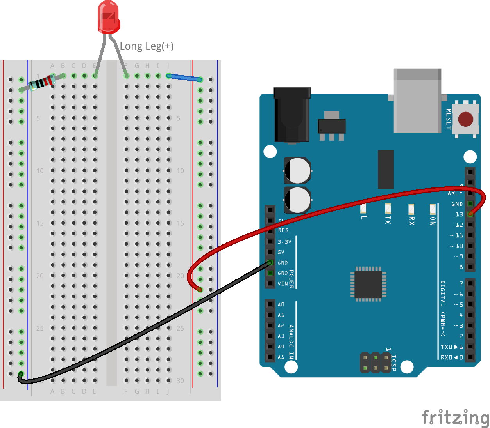
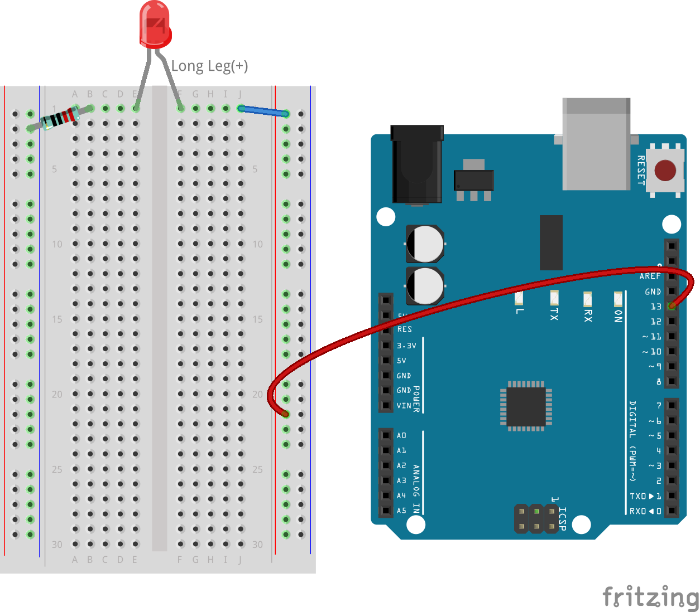
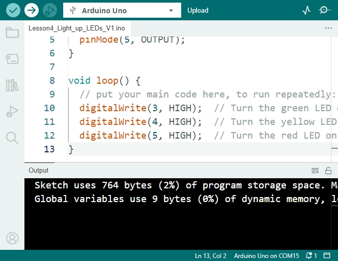
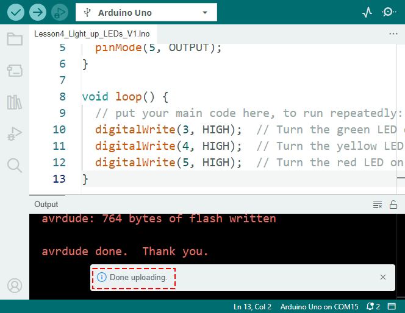
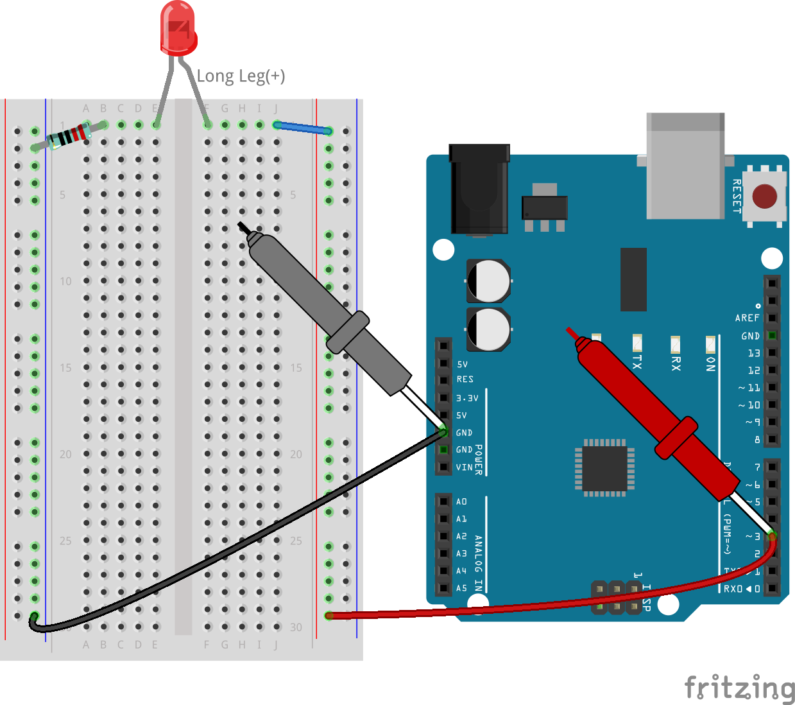

6. Blink LED
======================
Welcome to this lesson, you'll learn to manipulate the digital pins of the R3 board to programmatically control an LED—turning it on and off without manual intervention, a skill fundamental to both home and industrial electronics applications.

In this lesson, you will learn to:

* Create and save sketches using the Arduino IDE.
* Use ``pinMode()`` and ``digitalWrite()`` functions to control circuit elements.
* Upload sketches to the R3 board and understand their real-time effects.
* Implement ``delay()`` in sketches to manage circuit behaviors.

By the end of this lesson, you will be able to build a circuit that not only lights up an LED but also makes it blink at intervals you set, giving you a basic understanding of how software interacts with hardware.

Building the Circuit
--------------------------------

**Components Needed**

.. list-table:: 
   :widths: 25 25 25 25
   :header-rows: 0

   * - 1 * R3 Board
     - 1 * Red LEDs
     - 1 * 220Ω Resistor
     - Jumper Wires
   * - |compoents_uno_r3| 
     - |compoents_red_led| 
     - |compoents_220ohm| 
     - |compoents_wire| 
   * - 1 * USB Cable
     - 1 * Breadboard
     - 1 * Multimeter
     -   
   * - |compoents_usb_cable| 
     - |compoents_breadboard| 
     - |compoents_meter|
     - 

**Building Step-by-Step**

Take the circuit built in :ref:`2_first_circuit`, and switch the wire from the 5V to pin 3, as shown in the image below.

If you've dismantled the previous circuit, you can rebuild it following these steps:

1. Connect the 220 ohm resistor to the breadboard. One wire should be in the negative terminal, and the other wire should be in hole 1B.

.. image:: img/2_connect_resistor.png
    :width: 300
    :align: center

2. Add a red LED to the breadboard. The LED's anode (long leg) should be in hole 1F. The cathode (short leg) should be in hole 1E. Sometimes it's hard to distinguish the anode from the cathode by the length of the legs. Remember, the cathode side of the LED also has a flat edge on the colored lens, while the anode has a round edge.

.. image:: img/2_connect_led.png
    :width: 300
    :align: center

3. Use a short jumper wire to connect the LED and the power source. One end of the jumper wire should be in hole 1J. The other end should be in the positive terminal.

.. image:: img/2_connect_wire.png
    :width: 300
    :align: center

4. Connect the breadboard's positive terminal to pin 3 on the R3 board.

5. Connect the breadboard's negative terminal to one of the ground pins on the R3 board. The ground pins are marked as "GND".

Bringing LED to Life
-----------------------------

Alright, it's showtime for the LED! Instead of just diving into the Arduino's Blink example like before, we're going to start from scratch and create a brand new sketch. Let's jump right in!

**1. Creating and Saving a Sketch**

1. Fire up the Arduino IDE. Go to the “File” menu and hit “New Sketch” to start fresh. You can close any other sketch windows that might be open.

    .. image:: img/4_traffic_ide_new.png
        :align: center

2. Arrange the Arduino IDE window side by side with this online tutorial, so you can see both at once. Things might look a bit small, but it beats flipping back and forth between windows.

    .. image:: img/4_traffic_ide_tutorials.png

3. Time to save your sketch. Hit “Save” from the “File” menu or press ``Ctrl + S``. 

    .. image:: img/4_traffic_ide_save.png

4. You can save your sketch in the default location or another place. Name your sketch something meaningful, like ``Lesson6_Light_up_LED``, and click “Save”.

    * Naming your sketch after its function for easy later retrieval.
    * Arduino sketch filenames can't have spaces.
    * When saving significant changes, consider saving as a new version (e.g., V1) for backup.
    
    .. image:: img/4_traffic_ide_name.png

5. Your new sketch consists of two main parts, ``void setup()`` and ``void loop()``, which are functions used in all Arduino sketches.

    * ``void setup()`` runs once when the program starts, setting up initial conditions.
    * ``void loop()`` runs repeatedly, executing continuous actions.
    * Place commands for each function within its curly brackets ``{}``.
    * Any line starting with ``//`` is a comment. These are for your notes and won't affect the code execution.

    .. code-block:: Arduino

        void setup() {
        // Setup code here, to run once:

        }

        void loop() {
        // put your main code here, to run repeatedly:

        }

**2. Picking the Board and Port**

1. Connect your R3 board to the computer with a USB cable. You'll see the power light come on the Arduino.

    .. raw:: html

        <video width="600" loop autoplay muted>
            <source src="_static/video/connect_board.mp4" type="video/mp4">
            Your browser does not support the video tag.
        </video>

2. Let the IDE know we're using an **Arduino Uno**. Head to **Tools** -> **Board** -> **Arduino AVR Boards** -> **Arduino Uno**.

    .. image:: img/4_traffic_ide_board.png
        :width: 600
        :align: center

3. Next, in the Arduino IDE, choose the port that your Arduino is connected to.

    .. note::

        * Once a port is selected, the Arduino IDE should default to it every time the Arduino is plugged in via USB.
        * If a different Arduino Board is connected, you might need to choose a new port. 
        * Always check the port first if there's a connection issue.

    .. image:: img/4_traffic_ide_port.png
        :width: 600
        :align: center

**3. Writing the Code**

1. In our project, we utilize digital pin 3 on the board to control an LED. Each pin can function either as an output, sending out 5 volts, or as an input, reading the incoming voltage. To configure the LED, we set the pin as an output by using the ``pinMode(pin, mode)`` function.
    
Let's dive into the ``pinMode()`` syntax.

    * ``pinMode(pin, mode)``: Sets a specific pin to ``INPUT`` or ``OUTPUT``. 

    **Parameters**
        - ``pin``: the number of the pin you want to set the mode for.
        - ``mode``: ``INPUT``, ``OUTPUT``, or ``INPUT_PULLUP``.

    **Returns**
        Nothing
    
2. Now, it's time to add our first line of code in the ``void setup()`` function.
        
    .. note::

        - Arduino coding is case-sensitive. Make sure to write the functions exactly as they are.
        - Notice the command ends with a semicolon. In the Arduino IDE, every command must end with one.
        - Code comments are helpful for reminding yourself of what a line or section of code does.

    .. code-block:: Arduino
        :emphasize-lines: 3

        void setup() {
            // Setup code here, to run once:
            pinMode(3,OUTPUT); // set pin 3 as output
        }
    
        void loop() {
        // put your main code here, to run repeatedly:

        }

**4. Verifying the Code**

Before activating our traffic lights, we'll verify the code. This checks if the Arduino IDE can understand and compile your commands into machine language.

1. To verify your code, click the **checkmark** button in the upper-left corner of the window.

    .. image:: img/4_traffic_ide_verify.png
        :width: 600
        :align: center

2. If your code is machine-readable, a message at the bottom will indicate the code has been successfully compiled. This area also shows how much storage space your program uses.

    .. image:: img/4_traffic_ide_verify_done.png
        :width: 600
        :align: center

3. If there's an error in your code, you'll see an orange error message. The IDE often highlights where the issue might be, typically near the highlighted line. For example, a missing semicolon error will highlight the line right after the mistake.

    .. image:: img/4_traffic_ide_verify_error.png
        :width: 600
        :align: center

4. When you hit errors, it's time for debugging - finding and fixing mistakes in your code. Check for common issues like:

    - Is the ``M`` in ``pinMode`` uppercase?
    - Did you use all uppercase letters when typing ``OUTPUT``?
    - Do you have both an opening and closing parenthesis in your ``pinMode`` function?
    - Did you end your ``pinMode`` function with a semicolon?
    - Is all your spelling correct? If you find errors, correct them and verify your code again. Keep debugging until your sketch is error-free.

The Arduino IDE stops compiling at the first error, so you might have to verify multiple times for multiple errors. Regularly verifying your code is good practice.

Debugging is a big part of programming. Professional programmers often spend a lot more time debugging than writing new code. Errors are normal, so don't get discouraged. Becoming a good problem solver is key to being a great programmer.

**5. Continuing to Write the Sketch**

1. Now you're ready to start on the ``void loop()`` function. This is where the main action of your sketch or program happens. To light up the LED connected to the R3 board, we'll need to provide voltage to the circuit using ``digitalWrite()``.

    * ``digitalWrite(pin, value)``: Sends a ``HIGH`` (5V) or ``LOW`` (0V) signal to a digital pin, changing the operating state of the component.

    **Parameters**
        - ``pin``: the Arduino pin number.
        - ``value``: ``HIGH`` or ``LOW``.
    
    **Returns**
        Nothing

5. Below the comment in the ``void loop()`` function, write a command to turn on the LED connected to pin 3. Don't forget to end the command with a semicolon. Verify and debug your code if necessary.

    .. code-block:: Arduino
        :emphasize-lines: 8

        void setup() {
            // Setup code here, to run once:
            pinMode(3, OUTPUT);  // set pin 3 as output
        }

        void loop() {
            // put your main code here, to run repeatedly:
            digitalWrite(3, HIGH);
        }

6. After the ``digitalWrite()`` command, add a code comment explaining what this line does. For instance:

    .. code-block:: Arduino
        :emphasize-lines: 8

        void setup() {
            // Setup code here, to run once: 
            pinMode(3, OUTPUT);  // set pin 3 as output
        }

        void loop() {
            // put your main code here, to run repeatedly:
            digitalWrite(3, HIGH);  // Light up the LED on pin 3
        }

**6. Uploading the Code**

With your code error-free and verified, it's time to upload it to the R3 board and see your traffic light come to life.

1. In the IDE, click the “Upload” button. The computer will compile the code and then transfer it to the R3 board. During the transfer, you should see some lights blinking on the board, indicating communication with the computer.

2. A message of “Done Uploading” means your code has no issues and you've selected the correct board and port.

3. Once the transfer is complete, the code will run, and you should see all three LED on the breadboard light up.

**7. Measuring the Voltage Across the LED**

Let's use a multimeter to measure the voltage at pin 3 and understand what the ``HIGH`` state in the code actually means.

1. Adjust the multimeter to the 20 volts DC setting.

.. image:: img/multimeter_dc_20v.png
    :width: 300
    :align: center

2. Start by measuring the voltage at Pin 3. Touch the red test lead of the multimeter to Pin 3 and the black test lead to GND.

3. Record the measured voltage in the table for Pin 3 under the row labeled "HIGH".

.. list-table::
   :widths: 25 25
   :header-rows: 1

   * - State
     - Pin 3 Voltage
   * - HIGH
     - *≈4.95 volts*
   * - LOW
     - 

4. After measuring, remember to turn the multimeter off by setting it to the "OFF" position.

Our measurements reveal that the voltage at all three pins is close to 5V. This indicates that setting a pin to ``HIGH`` in the code means the output voltage at that pin is close to 5V.

The R3's pin voltage is 5V, so setting it to ``HIGH`` reaches near 5V. However, some boards operate at 3.3V, meaning their ``HIGH`` state would be close to 3.3V.

Make LED Blink
------------------------------
Now that your LED are on, it's time for them to blink.

1. Open the sketch you saved earlier, ``Lesson6_Light_up_LED``. Hit “Save As...” from the “File” menu, and rename it to ``Lesson6_Blink_LED``. Click "Save".

2. In the ``void loop()`` function of your sketch, copy the ``digitalWrite()`` commands and paste them after the originals. To make the LED blink, you previously turned it ON; now set its state to ``LOW`` to turn it OFF.

    .. note::
       * Copy and paste can be a coder's best friend. Replicate a clean section of code to a new position and adjust its parameters for quick and clean execution.
       * Remember to update comments to better match the action performed.
       * Use ``Ctrl+T`` to format your code neatly in one click, making it more readable and friendly.

    .. code-block:: Arduino
       :emphasize-lines: 8,9

       void setup() {
            // Setup code here, to run once:
            pinMode(3, OUTPUT);  // set pin 3 as output
       }

       void loop() {
            // put your main code here, to run repeatedly:
            digitalWrite(3, HIGH);  // Light up the LED on pin 3   
            digitalWrite(3, LOW);  // Switch off the LED on pin 3
       }

3. Press the “Upload” button to transfer the sketch to the R3 board. After the transfer, you might notice the LED don't blink, or they blink so fast it's imperceptible.

4. To visually observe the blinking, you can use the ``delay()`` command to make the R3 board wait for any duration you specify, in milliseconds.

    * ``delay(ms)``: Pauses the program for the amount of time (in milliseconds) specified as parameter. (There are 1000 milliseconds in a second.)

    **Parameters**
        - ``ms``: the number of milliseconds to pause. Allowed data types: unsigned long.

    **Returns**
        Nothing

5. Now, include the ``delay(time)`` command after each set of ON and OFF commands, setting the delay time to 3000 milliseconds (3 seconds). You may adjust this duration to make the LED blink faster or slower.

    .. note::

        During this delay, the R3 board can't perform any tasks or execute any other commands until the delay ends.
        
    .. code-block:: Arduino
       :emphasize-lines: 10,11

       void setup() {
            // Setup code here, to run once:
            pinMode(3, OUTPUT);  // set pin 3 as output
       }

       void loop() {
            // put your main code here, to run repeatedly:
            digitalWrite(3, HIGH);  // Light up the LED on pin 3
            delay(3000); // Wait for 3 seconds   
            digitalWrite(3, LOW);  // Switch off the LED on pin 3
            delay(3000); // Wait for 3 seconds
       }

6. Upload your sketch to the R3 board. After completion, your LED should blink at a 3 seconds interval.

7. Confirm everything is working as expected, then save your sketch.

8. Let's use a multimeter to measure the voltage at three pins and understand what the ``LOW`` state in the code actually means. Adjust the multimeter to the 20 volts DC setting.

.. image:: img/multimeter_dc_20v.png
    :width: 300
    :align: center

9. Start by measuring the voltage at Pin 3. Touch the red test lead of the multimeter to Pin 3 and the black test lead to GND.

10. With all three LED turned off, record the measured voltage for Pin 3 in the "LOW" row of your table.

.. list-table::
   :widths: 25 25 25 25
   :header-rows: 1

   * - State
     - Pin 3 Voltage
     - Pin 4 Voltage
     - Pin 5 Voltage 
   * - HIGH
     - *≈4.95 volts*
     -
     -
   * - LOW
     - *0.00 volts*
     -
     -

Through our measurements, we found that when the LED are off, the voltage at Pin 3 drops to 0V. This demonstrates that in our code, setting a pin to "LOW" effectively reduces the output voltage at that pin to 0V, turning off the connected LED. This principle allows us to control the on and off states of LED with precise timing, mimicking the operation of a traffic light.

**Summary**

Congratulations on completing this lesson, where you successfully programmed an LED to blink using the R3 board. This lesson served as an introduction to writing and uploading Arduino sketches, setting pin modes, and manipulating outputs to achieve desired electrical responses. Through building the circuit and programming the R3 board, you gained valuable insights into the interaction between software commands and physical hardware behaviors.

Your ability to control an LED is just the beginning—imagine what you can achieve as you expand on these basics!