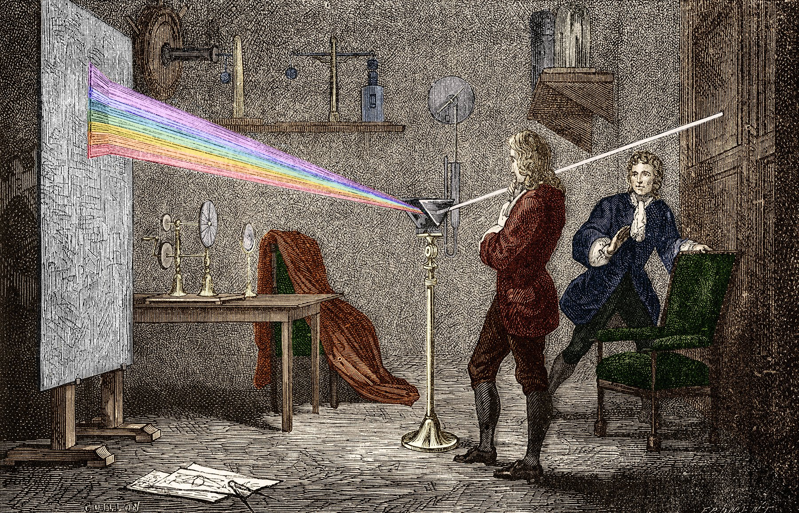
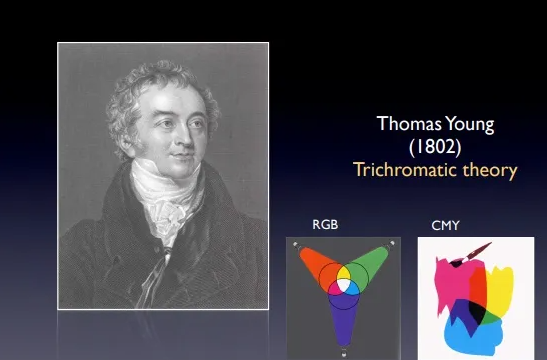

Color Mixing Lamp
======================

Colorful lighting enriches our modern lives, from vibrant Christmas lights and festive lanterns to dynamic night-time illuminations in parks, squares, bridges, and buildings. At concerts, theaters, and nightclubs, lights change color and brightness in sync with music and performances, creating stunning visual effects. All these are made possible by RGB LEDs.

An RGB LED combines red, green, and blue light-emitting diodes in one package, sharing a common cathode. Each LED's anode receives a separate electrical signal, allowing it to display its corresponding color. By adjusting the brightness of each color, you can mix almost any color imaginable.

**Discovery of the Three Primary Colors of Light**

The discovery of the three primary colors of light is a fascinating saga of scientific exploration that spans centuries, focusing on understanding the nature of light and the mechanisms of human color perception. This theory not only unraveled the mysteries of natural colors but also laid the groundwork for technologies like photography, television, and computer displays.

A pivotal figure in this story is Isaac Newton. In 1666, Newton dissected sunlight with a prism and observed a continuous spectrum of colors, from red to violet, systematically demonstrating that white light comprises various colors. This experiment had profound implications for later theories of color.

Another milestone in the development of the theory was the experimentation with additive color mixing. In the early 19th century, Thomas Young and James Clerk Maxwell deepened the understanding of color mixing. Maxwell demonstrated that almost any color could be produced by mixing red, green, and blue light sources, validating the theory that all visible colors can be generated by these three hues.

Later in the 19th century, Hermann von Helmholtz and Thomas Young expanded the three-color theory into the realm of human vision, proposing the trichromatic theory. According to this theory, the human eye contains three types of photoreceptors, each most sensitive to red, green, or blue light. This theory provided a physiological basis for explaining how humans perceive and distinguish colors, further confirming that a wide range of colors can be produced by mixing three primary colors.

**Learning Objectives**

- Explore the three primary colors of light.
- Understand the workings of an RGB LED.
- Build a circuit capable of color adjustment.
- Create and use functions in code to perform repetitive commands.
- Utilize random numbers in programming.

.. toctree::
    :maxdepth: 4

    6.1_mix_color_rgb_digital 
    6.2_mix_color_rgb_analog 
    6.3_mix_color_rgb_tone
    6.4_mix_color_rgb_random