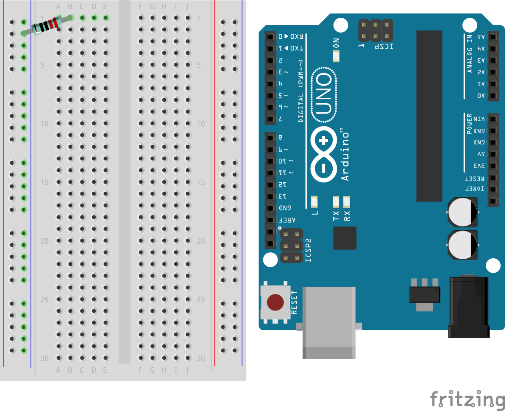
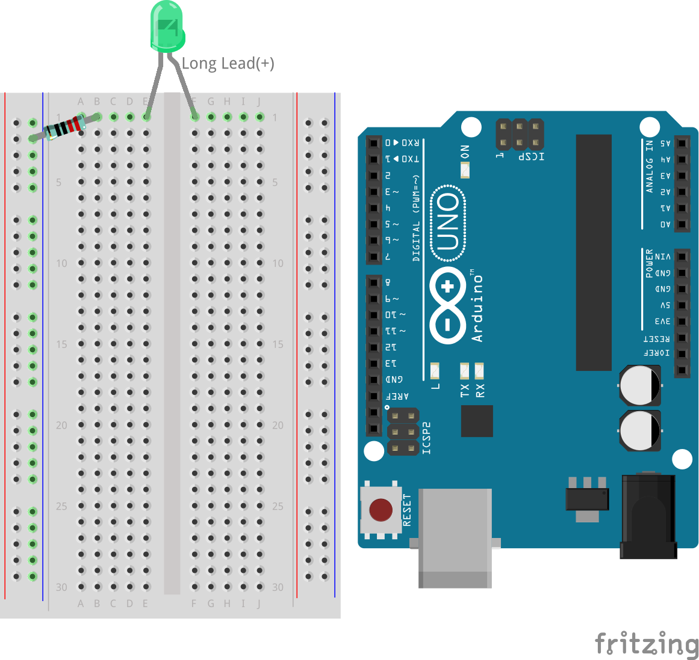
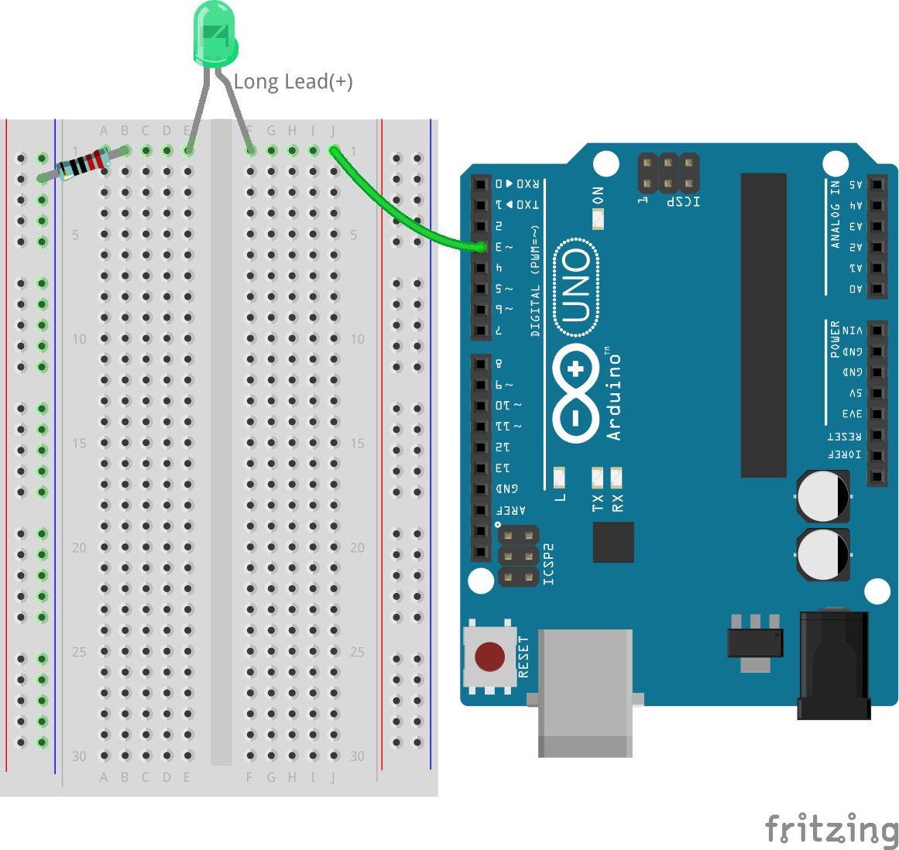
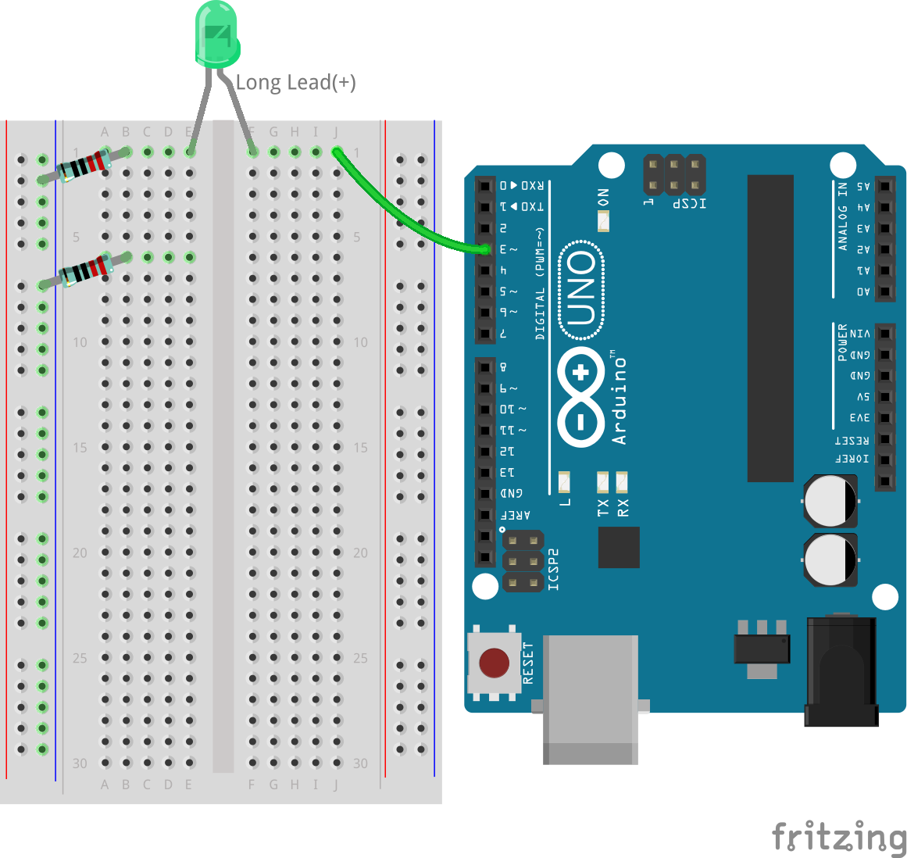
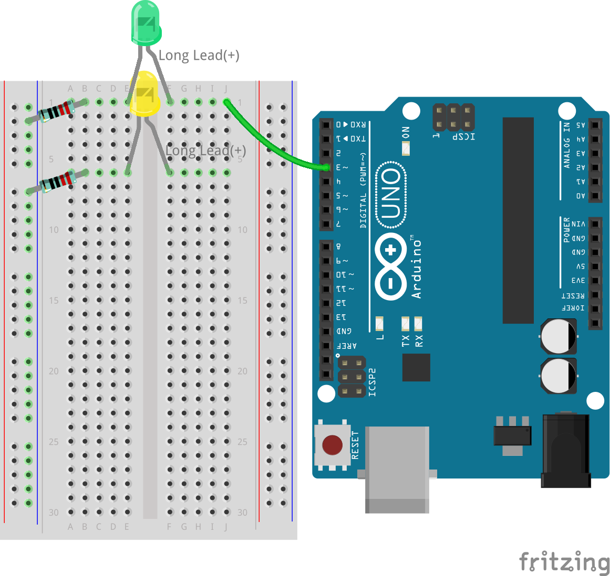
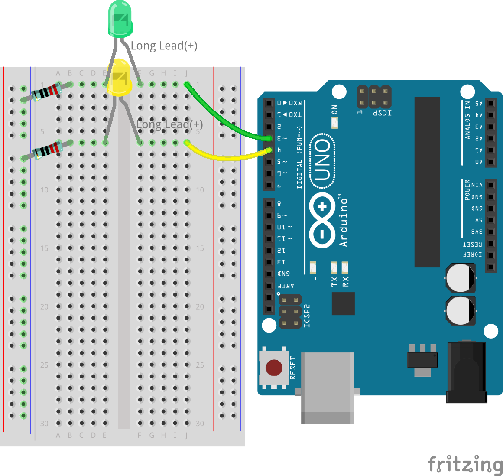
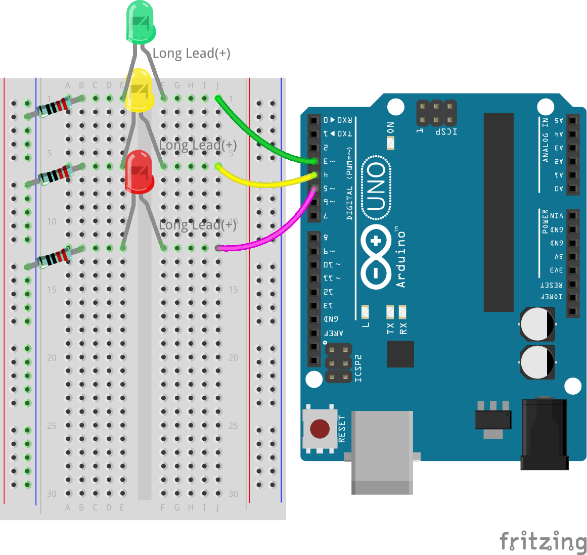

.. note::

    Ciao, benvenuto nella Community di Appassionati di SunFounder Raspberry Pi & Arduino & ESP32 su Facebook! Approfondisci l'uso di Raspberry Pi, Arduino ed ESP32 insieme ad altri appassionati.

    **Perché unirti a noi?**

    - **Supporto esperto**: Risolvi problemi post-vendita e sfide tecniche con l'aiuto della nostra community e del nostro team.
    - **Impara e condividi**: Scambia suggerimenti e tutorial per migliorare le tue competenze.
    - **Anteprime esclusive**: Ottieni accesso anticipato a nuovi annunci di prodotto e anticipazioni.
    - **Sconti speciali**: Godi di sconti esclusivi sui nostri nuovi prodotti.
    - **Promozioni festive e omaggi**: Partecipa a concorsi e promozioni festive.

    👉 Pronto a esplorare e creare con noi? Clicca [|link_sf_facebook|] e unisciti subito!

7. Creiamo il Semaforo!
==============================

.. .. immagine:: img/5_traffic_light_pic.png
..     :width: 400
..     :align: center

Benvenuto in questa lezione! Questa lezione coinvolgente colma il divario tra concetti teorici e applicazioni pratiche nell'elettronica e nella programmazione. Esploreremo il processo di conversione del pseudo-codice, una forma semplificata di linguaggio di programmazione, in sketch Arduino funzionali. Questo esercizio simulerà il funzionamento dei semafori, offrendoti un'esperienza pratica nella programmazione e progettazione di circuiti. Imparando a interpretare e implementare il pseudo-codice, acquisirai una comprensione più profonda della logica dietro il controllo dei dispositivi elettronici con il codice.

.. raw:: html

    <video muted controls style = "max-width:90%">
        <source src="_static/video/7_traffic_light.mp4" type="video/mp4">
        Your browser does not support the video tag.
    </video>

In questa lezione imparerai a:

* Scrivere e interpretare pseudo-codice per pianificare la funzionalità di un circuito elettronico.
* Convertire il pseudo-codice in sketch Arduino per controllare la simulazione di semafori.
* Costruire e programmare un sistema di semafori utilizzando LED e una scheda Arduino.

Padroneggiando queste abilità, sarai in grado di progettare, programmare e risolvere problemi in sistemi elettronici di base, aprendo la strada a progetti più complessi.

Prepariamo il Semaforo
------------------------------------------
Ciao! Sei pronto a creare il tuo semaforo personale con Arduino? Ecco cosa ci serve:

**Componenti necessari**

.. list-table:: 
   :widths: 25 25 25 25
   :header-rows: 0

   * - 1 * Arduino Uno R3
     - 1 * LED rosso
     - 1 * LED giallo
     - 1 * LED verde
   * - |list_uno_r3| 
     - |list_red_led| 
     - |list_yellow_led| 
     - |list_green_led| 
   * - 1 * Cavo USB
     - 1 * Breadboard
     - 3 * Resistenze da 220Ω
     - Cavi jumper
   * - |list_usb_cable| 
     - |list_breadboard| 
     - |list_220ohm| 
     - |list_wire| 

**Costruzione passo per passo**

Mettiamo tutto insieme, proprio come costruire un set di LEGO!

.. image:: img/7_traffic_light.png
    :width: 600
    :align: center

1. Collega una resistenza da 220Ω alla breadboard. Un'estremità dovrebbe essere nel terminale negativo e l'altra in buco 1B.

2. Aggiungi un LED verde alla breadboard. L'anodo (il terminale lungo) dell'LED dovrebbe essere nel buco 1F. Il catodo (gamba corta) dovrebbe essere nel buco 1E.

3. Collega il LED verde al pin 3 dell'Arduino Uno R3 con un filo. Inserisci un cavo jumper nel buco 1J e l'altra estremità del cavo jumper nel pin 3 dell'Arduino Uno R3.

4. Prendi un'altra resistenza da 220Ω, collega un'estremità al terminale negativo e l'altra nel buco 6B.

5. Prendi un LED giallo. L'anodo (gamba lunga) dovrebbe essere nel buco 6F. Il catodo (gamba corta) dovrebbe essere nel buco 6E.

6. Collega il LED giallo al pin 4 dell'Arduino Uno R3.

7. Collega il LED rosso allo stesso modo, il LED rosso è collegato al pin 5 dell'Arduino Uno R3.

8. Ops! Ci stavamo dimenticando di collegare la messa a terra del circuito. Collega il lato negativo della breadboard a un pin GND dell'Arduino Uno R3 con un cavo nero. Ora è tutto pronto!

.. image:: img/7_traffic_light.png
    :width: 600
    :align: center

.. note::

    Ci sono tre pin GND sull'Arduino Uno R3. Puoi utilizzare uno qualsiasi di essi; funzionano tutti allo stesso modo.

E proprio così, hai completato l'installazione del semaforo! Ogni luce colorata è controllata dal proprio interruttore sull'R3, pronta a indicare alle auto quando fermarsi, attendere o andare. Non è fantastico costruire qualcosa che funziona come un vero semaforo? Ottimo lavoro!

Scrivere Pseudo-codice per un Semaforo
-------------------------------------------

È ora di dare uno scopo ai tuoi LED. In questa attività, li programmerai per comportarsi come un semaforo, controllando il flusso del traffico in un incrocio trafficato.

I semafori richiedono un controllo preciso per passare da un colore all'altro in una sequenza rigorosa, rendendo questo progetto ideale per entrare nel mondo della programmazione con Arduino. Per perfezionare il nostro semaforo, dobbiamo dare istruzioni chiare all'Arduino su ciò che deve fare.

La comunicazione tra esseri umani avviene attraverso l'ascolto, il parlare, la lettura, la scrittura, i gesti o le espressioni facciali. Comunicare con i microcontrollori (come quello sulla tua scheda Arduino) significa scrivere codice.

Non possiamo semplicemente dire all'Arduino "crea un semaforo" in linguaggio naturale. Tuttavia, possiamo usare il linguaggio naturale per scrivere un "pseudo-codice" che ci aiuterà nello sviluppo del vero codice Arduino.

.. note::
    
    Non ci sono risposte giuste o sbagliate nella scrittura di pseudo-codice. Più dettagliato è il tuo pseudo-codice, più sarà facile tradurlo in un programma funzionante.

Pensa a cosa deve succedere affinché il tuo circuito si comporti come un semaforo. Nello spazio previsto nel tuo registro, scrivi lo pseudo-codice che descrive come funzionerà il tuo semaforo. Usa un linguaggio semplice.

Ecco alcune domande guida per il tuo pseudo-codice:

* Due o più luci devono essere accese contemporaneamente?
* Qual è l'ordine delle luci?
* Cosa succede alle altre luci quando una è accesa?
* Cosa succede dopo che la terza luce si spegne?
* Quanto tempo deve rimanere accesa ciascuna luce?

Ecco un paio di esempi di pseudo-codice:

.. code-block::

    1) Set all LED pins to output.
    2) Start main loop.
    a) Turn off all lights.
    b) Turn on green light for 10 seconds.
    c) Turn off all lights.
    d) Turn on yellow light for 3 seconds.
    e) Turn off all lights.
    f) Turn on red light for 10 seconds.
    3) Return to the start of the loop.

.. code-block::

    Setup:
        Define all LED pins as output
    Main Loop:
        Turn on green light
        Turn off red and yellow lights
        Wait 10 seconds
        Turn on yellow light
        Turn off red and green lights
        Wait 3 seconds
        Turn on red light
        Turn off green and yellow lights
        Wait 10 seconds

Lo pseudo-codice non ha un formato rigido, permettendoti di chiarire i tuoi pensieri e organizzarli in modo logico. Questo ordine logico è chiamato algoritmo.
Utilizzi algoritmi ogni giorno, forse senza rendertene conto. Pensa a un algoritmo come a una ricetta; nella programmazione, gli ingredienti sono le parole chiave e i comandi, e i passaggi di cottura sono l'algoritmo.
Un algoritmo è un insieme di passaggi o istruzioni. Quando un algoritmo viene tradotto dallo pseudo-codice nel linguaggio di programmazione Arduino, indica all'Arduino esattamente cosa fare e quando.

.. note::
    
    Usare note adesive o schede può essere utile quando scrivi pseudo-codice. Metti ogni passaggio del tuo algoritmo su una nota separata. In questo modo, puoi facilmente riorganizzare, inserire o rimuovere i passaggi dal tuo algoritmo.

Trasforma lo Pseudo-codice in uno Sketch Arduino
-------------------------------------------------------

È ora di affinare il codice che hai scritto e aggiungere i comandi ``digitalWrite()`` e ``delay()`` necessari. Ecco una guida su come strutturare il tuo codice: la tua funzione ``void loop()`` dovrebbe racchiudere segmenti separati per i LED verde, giallo e rosso, ognuno seguito da un periodo di ritardo unico. Non tutti i ritardi devono avere la stessa durata. Aggiorna i commenti nel codice per chiarire cosa fa ciascuna riga.

1. Apri lo sketch che hai salvato in precedenza, ``Lesson6_Blink_LED``. Seleziona “Salva con nome...” dal menu “File” e rinominalo in ``Lesson7_Traffic_Light``. Clicca "Salva".

2. Ora, secondo il nostro pseudo-codice, imposta tutti e tre i pin come output nel ``void setup()``. Copia il comando ``pinMode()`` due volte, incollalo sotto e modifica i numeri dei pin per ciascuno.

    .. code-block:: Arduino
        :emphasize-lines: 4,5

        void setup() {
            // Codice di configurazione, eseguito una volta:
            pinMode(3, OUTPUT); // imposta il pin 3 come output
            pinMode(4, OUTPUT); // imposta il pin 4 come output
            pinMode(5, OUTPUT); // imposta il pin 5 come output
        }

3. Nel ``void loop()``, accendi prima il LED verde e spegni gli altri due LED. Quindi, copia i comandi ``digitalWrite()`` due volte, modifica i numeri dei pin a 4 e 5, cambia ``HIGH`` in ``LOW`` per i LED che vuoi spegnere e aggiorna i commenti per riflettere lo scenario attuale. Il codice modificato è il seguente:

    .. code-block:: Arduino
        :emphasize-lines: 4,5

        void loop() {
            // Inserisci qui il codice principale, eseguito ripetutamente:
            digitalWrite(3, HIGH);  // Accendi il LED sul pin 3
            digitalWrite(4, LOW);   // Spegni il LED sul pin 4
            digitalWrite(5, LOW);   // Spegni il LED sul pin 5
            delay(3000);           // Attendi 3 secondi
        }

4. Potresti voler mantenere il LED verde acceso più a lungo. Nel nostro sistema di traffico, potrebbe essere circa un minuto, ma qui lo simuleremo con 10 secondi.

    .. code-block:: Arduino
        :emphasize-lines: 6

        void loop() {
            // Inserisci qui il codice principale, eseguito ripetutamente:
            digitalWrite(3, HIGH);  // Accendi il LED sul pin 3
            digitalWrite(4, LOW);   // Spegni il LED sul pin 4
            digitalWrite(5, LOW);   // Spegni il LED sul pin 5
            delay(10000);           // Attendi 10 secondi
        }

5. Ora fai accendere il LED giallo e spegni gli altri due LED. Ancora una volta, copia e incolla le 4 righe da ``void loop()``, impostando il pin 4 su HIGH e gli altri su LOW. Cambia il delay per il LED giallo a 3 secondi.

    .. code-block:: Arduino
        :emphasize-lines: 7-10

        void loop() {
            // Inserisci qui il codice principale, eseguito ripetutamente:
            digitalWrite(3, HIGH);  // Accendi il LED sul pin 3
            digitalWrite(4, LOW);   // Spegni il LED sul pin 4
            digitalWrite(5, LOW);   // Spegni il LED sul pin 5
            delay(10000);           // Attendi 10 secondi
            digitalWrite(3, LOW);   // Spegni il LED sul pin 3
            digitalWrite(4, HIGH);  // Accendi il LED sul pin 4
            digitalWrite(5, LOW);   // Spegni il LED sul pin 5
            delay(3000);            // Attendi 3 secondi
        }

6. Infine, fai accendere il LED rosso per 10 secondi, spegnendo gli altri due LED. Il tuo codice completo è il seguente:

    .. code-block:: Arduino

        void setup() {
            // Codice di configurazione, eseguito una volta:
            pinMode(3, OUTPUT); // imposta il pin 3 come output
            pinMode(4, OUTPUT); // imposta il pin 4 come output
            pinMode(5, OUTPUT); // imposta il pin 5 come output
        }
        
        void loop() {
            // Inserisci qui il codice principale, eseguito ripetutamente:
            digitalWrite(3, HIGH);  // Accendi il LED sul pin 3
            digitalWrite(4, LOW);   // Spegni il LED sul pin 4
            digitalWrite(5, LOW);   // Spegni il LED sul pin 5
            delay(10000);           // Attendi 10 secondi
            digitalWrite(3, LOW);   // Spegni il LED sul pin 3
            digitalWrite(4, HIGH);  // Accendi il LED sul pin 4
            digitalWrite(5, LOW);   // Spegni il LED sul pin 5
            delay(3000);            // Attendi 3 secondi
            digitalWrite(3, LOW);   // Spegni il LED sul pin 3
            digitalWrite(4, LOW);   // Spegni il LED sul pin 4
            digitalWrite(5, HIGH);  // Accendi il LED sul pin 5
            delay(10000);           // Attendi 10 secondi
        }

**Domanda**

Dai un'occhiata agli incroci intorno a casa tua. Quanti semafori ci sono di solito? Come si coordinano tra loro?

**Riepilogo**

Congratulazioni per aver completato la Lezione 7! Sei riuscito a tradurre lo pseudo-codice in un sistema di semafori completamente funzionante controllato da Arduino. Ecco un breve riepilogo di ciò che hai raggiunto:

* Padroneggiamento dello pseudo-codice: Hai imparato a usare lo pseudo-codice per delineare le operazioni di un sistema elettronico, migliorando le tue capacità di pensiero logico e di pianificazione.
* Dallo pseudo-codice al codice reale: Hai sperimentato come un approccio strutturato nello pseudo-codice porti a una programmazione Arduino efficace e precisa.
* Applicazione pratica: Assemblando e programmando un sistema di semafori, hai dimostrato l'applicazione pratica delle tue conoscenze, mostrando come il software controlla direttamente l'hardware.

Questa lezione ha affinato sia le tue abilità tecniche che il pensiero analitico, preparandoti per progetti più complessi in elettronica e programmazione. Continua a sviluppare queste competenze per sbloccare ulteriori possibilità nell'integrazione tecnologica!

