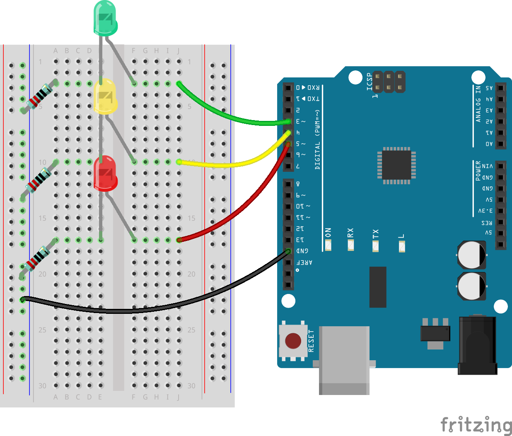
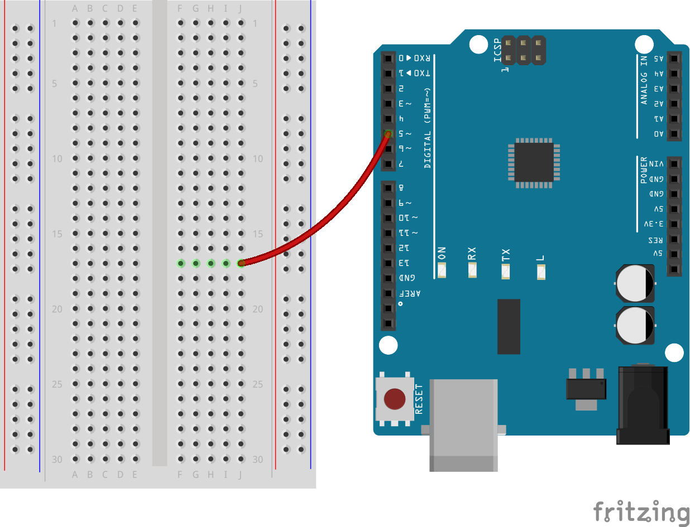
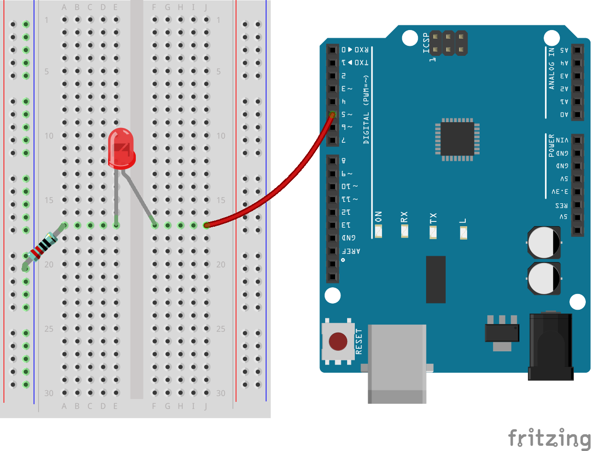
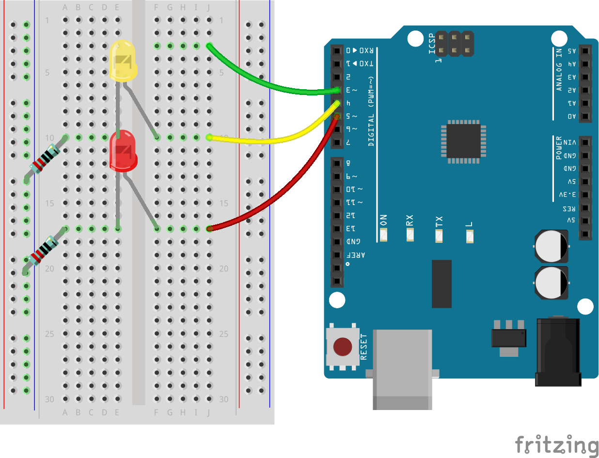
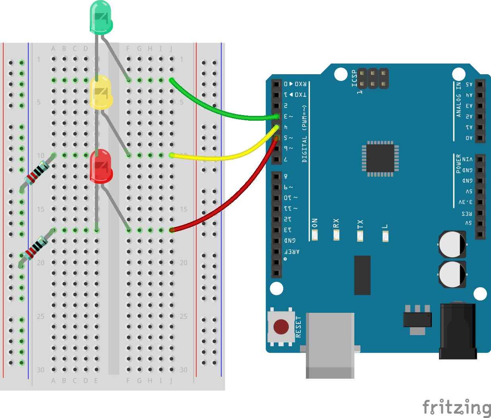
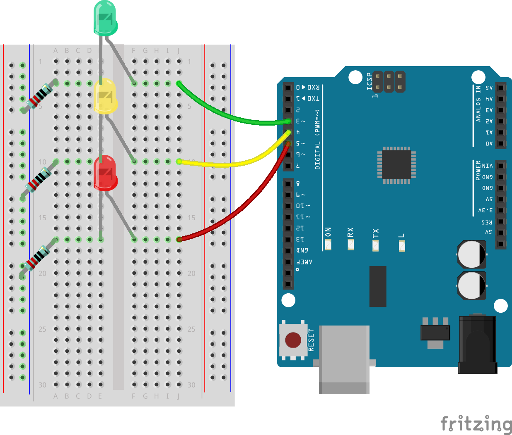

7. Let's Make Traffic Lights!
==============================
Welcome to our journey through the lights and codes! In this lesson, we will dive into the fascinating world of electronics and programming with a project that's as practical as it is educational. Together, we'll transform a set of LEDs and resistors on an Arduino board into a miniature version of traffic lights. By the end of this lesson, you'll learn how to control LEDs with code, creating patterns that mimic the operation of real-world traffic signals. So buckle up and get ready to light up your programming skills!

Getting Traffic Lights Ready
------------------------------------------
Hey there! Ready to create your very own traffic light with an Arduino? Here's what we need:

**Components Needed**

* 1 * R3 Board
* 3 * 220 Ohm Resistors
* 1 * Red LED
* 1 * Yellow LED
* 1 * Green LED
* Several Jumper Wires
* 1 * USB Cable
* 1 * Breadboard
* 1 * Multimeter with Test Leads

**Building Step-by-Step**

Let's put everything together, just like building a LEGO set!

1. Grab a jumper wire and connect pin 5 on the Arduino to hole 17J on the breadboard. This is where the red light will live.

2. Pop the red LED into holes 17F and 17E. Make sure the longer leg (that's the anode) goes into 17F.

3. Place a 220 Ohm resistor with one end in hole 17A and the other end going to the negative side. This keeps the red light safe from too much electricity.

4. Use another wire to connect pin 4 on the Arduino to hole 10J for the yellow light.

5. Get the yellow LED in place with its longer leg in 10F and the shorter one in 10E.

6. Attach another 220 Ohm resistor from hole 10A to the negative side, just like we did with red.

7. Connect digital pin 3 to hole 3J with a jumper wire. Green light is getting ready!

8. Place the green LED, anode to 3F, cathode to 3E. Green means go!

9. Connect the green LED to ground with its own 220 Ohm resistor from hole 3A to the negative terminal.

10. Oops! We almost forgot to ground the circuit. Connect the breadboard's negative side to a GND pin on the R3 Board with a black wire. Now, it's all set!

.. note::

    There are three GND pins on the R3 Board. You can use any of them; they all work the same way.

And just like that, you've got a complete traffic light setup! Each colored light is controlled by its own switch on the R3, ready to tell cars when to stop, wait, or go. Isn't it awesome to build something that works like real traffic lights? Great job!

Writing Pseudo-code for a Traffic Light
-------------------------------------------

It's time to give your LEDs a purpose. In this activity, you will program them to act as a traffic light, controlling the flow of traffic at a busy intersection.

Traffic lights require precise control to switch between three colors in a strict sequence, making it an ideal project for diving into Arduino programming. To perfect our traffic light, we must clearly instruct the Arduino on its tasks.

Communication between humans involves listening, speaking, reading, writing, gesturing, or making facial expressions. Communicating with microcontrollers (like the one on your Arduino board) involves writing code.

We can't simply tell the Arduino to "make a traffic light" in natural language. However, we can use natural language to write a "pseudo-code" to aid in the actual Arduino code development.

.. note::
    
    There are no right or wrong answers in pseudo-code writing. The more detailed your pseudo-code, the easier it will be to translate it into a functional program.

Think about what needs to happen for your circuit to act like a traffic light. In the space provided in your log, write down the pseudo-code describing how your traffic light will function. Use plain English.

Here are some guiding questions for your pseudo-code:

* Should two or more lights be on at the same time?
* What's the order of the lights?
* What happens to the other lights when one is on?
* What happens after the third light turns off?
* How long should each light stay on?

Here are a couple of pseudo-code examples:

.. code-block::

    1) Set all LED pins to output.
    2) Start main loop.
    a) Turn off all lights.
    b) Turn on green light for 10 seconds.
    c) Turn off all lights.
    d) Turn on yellow light for 3 seconds.
    e) Turn off all lights.
    f) Turn on red light for 10 seconds.
    3) Return to the start of the loop.

.. code-block::

    Setup:
        Define all LED pins as output
    Main Loop:
        Turn on green light
        Turn off red and yellow lights
        Wait 10 seconds
        Turn on yellow light
        Turn off red and green lights
        Wait 3 seconds
        Turn on red light
        Turn off green and yellow lights
        Wait 10 seconds

Pseudo-code doesn’t have a strict format, allowing you to clarify your thoughts and organize them logically. This logical order is called an algorithm.
You use algorithms every day, perhaps without realizing it. Think of an algorithm like a recipe; in programming, the ingredients are keywords and commands, and the cooking steps are the algorithm.
An algorithm is a set of steps or instructions. When an algorithm is translated from pseudo-code into Arduino programming language, it precisely instructs the Arduino board on what to do and when.

.. note::
    
    Using sticky notes or index cards can be helpful when writing pseudo-code. Place each step of your algorithm on a separate note. This way, you can easily rearrange, insert, or remove steps from your algorithm.

Transform Pseudo-code into an Arduino Sketch
----------------------------------------------

It's time to refine the code you've written and add additional ``digitalWrite()`` and ``delay()`` commands as needed. Here's a guide to structuring your code: Your ``void loop()`` function should encapsulate separate segments for the green, yellow, and red LEDs, each followed by a unique delay period. Not all delays need to be of equal duration. Update your code comments for clarity on what each line achieves.

1. Open the sketch you saved earlier, ``Lesson6_Blink_LED``. Hit “Save As...” from the “File” menu, and rename it to ``Lesson7_Traffic_Light``. Click "Save".

2. Now, according to our pseudo-code, set all three pins to output in the ``void setup()``. Copy the ``pinMode()`` command twice, paste it below, and adjust the pin numbers for each.

    .. code-block:: Arduino
        :emphasize-lines: 4,5

        void setup() {
            // Setup code here, to run once:
            pinMode(3, OUTPUT); // set pin 3 as output
            pinMode(4, OUTPUT); // set pin 4 as output
            pinMode(5, OUTPUT); // set pin 5 as output
        }

3. In ``void loop()``, first turn on the green LED and turn off the other two LEDs. So, copy the ``digitalWrite()`` commands twice and modify the pin numbers to 4 and 5, changing ``HIGH`` to ``LOW`` for the LEDs you want to turn off, and update the comments to suit the current scenario. Modified code is as follows:

    .. code-block:: Arduino
        :emphasize-lines: 4,5

        void loop() {
            // put your main code here, to run repeatedly:
            digitalWrite(3, HIGH);  // Light up the LED on pin 3
            digitalWrite(4, LOW);   // Switch off the LED on pin 4
            digitalWrite(5, LOW);   // Switch off the LED on pin 5
            delay(3000);           // Wait for 3 seconds
        }

4. You might want the green LED to be on longer. In our traffic system, it might be about a minute, but here we'll simulate it with 10 seconds.

    .. code-block:: Arduino
        :emphasize-lines: 4,5

        void loop() {
            // put your main code here, to run repeatedly:
            digitalWrite(3, HIGH);  // Light up the LED on pin 3
            digitalWrite(4, LOW);   // Switch off the LED on pin 4
            digitalWrite(5, LOW);   // Switch off the LED on pin 5
            delay(10000);           // Wait for 10 seconds
        }

5. Now let the yellow LED light up, and turn off the other two LEDs. Again, copy and paste the 4 lines from ``void loop()``, setting pin 4 to HIGH and the others to LOW. Change the delay for the yellow LED to 3 seconds.

    .. code-block:: Arduino
        :emphasize-lines: 7-10

        void loop() {
            // put your main code here, to run repeatedly:
            digitalWrite(3, HIGH);  // Light up the LED on pin 3
            digitalWrite(4, LOW);   // Switch off the LED on pin 4
            digitalWrite(5, LOW);   // Switch off the LED on pin 5
            delay(10000);           // Wait for 10 seconds
            digitalWrite(3, LOW);   // Switch off the LED on pin 3
            digitalWrite(4, HIGH);  // Light up the LED on pin 4
            digitalWrite(5, LOW);   // Switch off the LED on pin 5
            delay(3000);            // Wait for 3 seconds
        }

6. Finally, let the red LED light up for 10 seconds, turning the other two LEDs off. Your complete code is as follows:

    .. code-block:: Arduino

        void setup() {
            // Setup code here, to run once:
            pinMode(3, OUTPUT); // set pin 3 as output
            pinMode(4, OUTPUT); // set pin 4 as output
            pinMode(5, OUTPUT); // set pin 5 as output
        }
        
        void loop() {
            // put your main code here, to run repeatedly:
            digitalWrite(3, HIGH);  // Light up the LED on pin 3
            digitalWrite(4, LOW);   // Switch off the LED on pin 4
            digitalWrite(5, LOW);   // Switch off the LED on pin 5
            delay(10000);           // Wait for 10 seconds      
            digitalWrite(3

**Summary**

In this lesson, we ventured into the intersection of programming and electronics, turning LEDs and resistors into a miniature traffic light with an Arduino. We started with assembling the circuit, learning to control LEDs through programming, from lighting them up to making them blink in sequence like real traffic lights.

This lesson took us through creating and debugging Arduino sketches, we also explored measuring voltage to connect the dots between code and its physical effects in the circuit.

By the end of the lesson, we had not only built a functional traffic light but also deepened our understanding of how software can manipulate hardware to perform specific tasks. It was a concise journey through the basics of electronics and programming, highlighting the creativity and problem-solving skills essential in technology.
