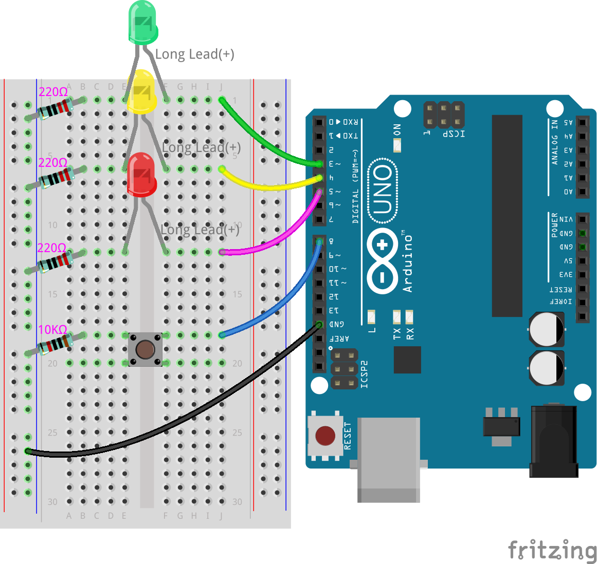

.. note::

    ¡Hola! Bienvenido a la comunidad de entusiastas de SunFounder Raspberry Pi & Arduino & ESP32 en Facebook. Sumérgete en el mundo de Raspberry Pi, Arduino y ESP32 junto con otros apasionados.

    **¿Por qué unirte?**

    - **Soporte experto**: Soluciona problemas post-venta y desafíos técnicos con la ayuda de nuestra comunidad y equipo.
    - **Aprende y comparte**: Intercambia consejos y tutoriales para mejorar tus habilidades.
    - **Previsualizaciones exclusivas**: Accede a los anuncios de nuevos productos y adelantos exclusivos.
    - **Descuentos especiales**: Disfruta de descuentos exclusivos en nuestros productos más recientes.
    - **Promociones y sorteos festivos**: Participa en sorteos y promociones de temporada.

    👉 ¿Listo para explorar y crear con nosotros? Haz clic en [|link_sf_facebook|] y únete hoy mismo.

8. Semáforo con botón para peatones
===============================================

Bienvenido a la siguiente fase de nuestro recorrido con Arduino. En la lección anterior, construimos un sistema básico de semáforo, un componente esencial en nuestras carreteras, controlando el flujo con luces rojas, amarillas y verdes. Ahora, agregaremos un elemento de interacción que refleja la complejidad del mundo real: un botón para peatones. Esta función introduce un componente humano en nuestro cruce electrónico, permitiendo una interacción dinámica entre los peatones y los vehículos en nuestras concurridas intersecciones.

.. raw:: html

    <video muted controls style = "max-width:90%">
        <source src="_static/video/8_traffic_light_button.mp4" type="video/mp4">
        Your browser does not support the video tag.
    </video>

En esta lección, aprenderás a:

* Comprender cómo funcionan los botones y su papel en los circuitos.
* Usar ``digitalRead()`` para detectar niveles de entrada en los pines.
* Implementar declaraciones ``if`` para crear comportamientos condicionales en sistemas de semáforos.

A medida que avanzamos en este proyecto, exploraremos no solo la configuración técnica, sino también la lógica y programación que hacen que estos sistemas sean posibles y eficientes en la gestión del tráfico peatonal y vehicular.

Construyendo el circuito
-----------------------------

**Componentes necesarios**

.. list-table:: 
   :widths: 25 25 25 25
   :header-rows: 0

   * - 1 * Arduino Uno R3
     - 1 * LED Rojo
     - 1 * LED Amarillo
     - 1 * LED Verde
   * - |list_uno_r3| 
     - |list_red_led| 
     - |list_yellow_led| 
     - |list_green_led| 
   * - 1 * Botón pulsador
     - 1 * Protoboard
     - 3 * Resistencias de 220Ω
     - 1 * Resistencia de 10KΩ
   * - |list_button| 
     - |list_breadboard| 
     - |list_220ohm| 
     - |list_10kohm| 
   * - 1 * Cable USB
     - Cables puente
     - 1 * Multímetro
     - 
   * - |list_usb_cable| 
     - |list_wire| 
     - |list_meter| 
     - 

**Paso a paso para construir**

Sigue el diagrama de cableado o los pasos a continuación para construir tu circuito.

.. image:: img/8_traffic_light_button.png
    :width: 600
    :align: center  

1. Comienza con el circuito del semáforo de la lección anterior.

.. image:: img/7_traffic_light.png
    :width: 600
    :align: center

2. Encuentra un botón pulsador.

.. image:: img/8_traffic_button.png
    :width: 500
    :align: center

Los botones son componentes omnipresentes en la electrónica, actuando como interruptores para abrir o cerrar circuitos. A continuación, se muestra la estructura interna de un botón y su símbolo común utilizado en diagramas de circuitos.

.. image:: img/8_traffic_button_symbol.png
    :width: 500
    :align: center

Aunque los botones tienen cuatro pines, los pines 1 y 2 están conectados entre sí, al igual que los pines 3 y 4. Al presionar el botón, se conectan los cuatro pines, cerrando el circuito.

3. Inserta el botón en el protoboard a través de la ranura central, con los pines en los agujeros 18e, 18f, 20e y 20f.

.. note::

    Si no estás seguro de cómo insertar el botón, prueba ambas orientaciones. En una dirección, el espaciado de los pines será ligeramente estrecho para encajar.

.. image:: img/8_traffic_light_button_button.png
    :width: 600
    :align: center

4. Conecta el pin superior derecho del botón al pin digital 8 del Arduino Uno R3 con un cable puente largo, insertando un extremo en el agujero 18j y el otro extremo en el pin 8.

.. image:: img/8_traffic_light_button_pin8.png
    :width: 600
    :align: center

5. Coloca una resistencia de 10KΩ entre el pin superior izquierdo del botón y tierra, conectando un extremo al agujero 18a y el otro al riel negativo del protoboard. Esta resistencia conecta el pin 8 a tierra, estabilizándolo en LOW cuando el botón no está presionado.

El pin 8 sirve como entrada para leer el estado del botón. Las placas Arduino leen voltajes entre 0 y aproximadamente 5 voltios en los pines de entrada, interpretándolos como LOW o HIGH según un umbral de voltaje. Para que un pin se lea como HIGH, debe tener más de 3 voltios. Para que se lea como LOW, debe tener menos de 1.5 voltios.

Sin la resistencia de 10KΩ, el pin 8 solo estaría conectado al botón, flotando entre 0 y 5V, lo que haría que su estado fluctúe aleatoriamente entre HIGH y LOW.

La resistencia de 10KΩ conectada del pin 8 a tierra reduce el voltaje del pin al nivel de tierra, asegurando que se lea como LOW cuando el botón no está presionado.

6. Por último, alimenta el botón conectando el riel positivo del protoboard al pin de 5V del Arduino Uno R3 con un cable de alimentación rojo.

.. image:: img/8_traffic_light_button.png
    :width: 600
    :align: center

**Pregunta:**

Tu semáforo es una mezcla de circuitos en serie y paralelo. Discute qué partes de tu circuito están en serie y por qué. Luego, explica qué partes están en paralelo y por qué.

Creación del código
-----------------------

**Inicialización de pines**

Hasta ahora, has programado el semáforo para que las luces LED verde, amarilla y roja se enciendan secuencialmente. En esta lección, programarás el botón de peatones para que, cuando se presione, las luces LED roja y amarilla se apaguen mientras la luz verde parpadea, indicando que es seguro para los peatones cruzar.

1. Abre el sketch que guardaste anteriormente, ``Lesson7_Traffic_Light``. Haz clic en "Guardar como..." en el menú "Archivo" y renómbralo como ``Lesson8_Traffic_Light_Button``. Haz clic en "Guardar".

2. En la función ``void setup()``, añade otro comando ``pinMode()`` para declarar el pin 8 como entrada (``INPUT``). Luego, agrega un comentario en el código para explicar tu nuevo comando.

.. code-block:: Arduino
    :emphasize-lines: 6

    void setup() {
        // Configuración del código, ejecutado una vez:
        pinMode(3, OUTPUT); // Configurar pin 3 como salida
        pinMode(4, OUTPUT); // Configurar pin 4 como salida
        pinMode(5, OUTPUT); // Configurar pin 5 como salida
        pinMode(8, INPUT);  // Declarar pin 8 (botón) como entrada
    }
    
    void loop() {
        // Código principal, ejecutado repetidamente:
        digitalWrite(3, HIGH);  // Encender el LED en el pin 3
        digitalWrite(4, LOW);   // Apagar el LED en el pin 4
        digitalWrite(5, LOW);   // Apagar el LED en el pin 5
        delay(10000);           // Esperar 10 segundos
        digitalWrite(3, LOW);   // Apagar el LED en el pin 3
        digitalWrite(4, HIGH);  // Encender el LED en el pin 4
        digitalWrite(5, LOW);   // Apagar el LED en el pin 5
        delay(3000);            // Esperar 3 segundos
        digitalWrite(3, LOW);   // Apagar el LED en el pin 3
        digitalWrite(4, LOW);   // Apagar el LED en el pin 4
        digitalWrite(5, HIGH);  // Encender el LED en el pin 5
        delay(10000);           // Esperar 10 segundos
    }

3. Después de codificar, verifica tu sketch y sube el código al Arduino Uno R3.

**Midiendo el voltaje en el pin 8**

Ya sabemos cómo funciona la sección de LEDs de nuestro circuito a partir de la lección anterior. Cada LED, actuando como salida, es controlado por diferentes pines en el Arduino Uno R3.

Sin embargo, el botón conectado al pin 8 de la placa es diferente. Es un dispositivo de entrada. El pin 8 leerá el voltaje entrante en lugar de enviar voltaje.

Usemos un multímetro para probar el voltaje en el pin 8 cuando el botón esté presionado y cuando no lo esté. Puede que necesites la ayuda de un amigo para presionar el botón mientras realizas la medición.

1. Ajusta el multímetro a la configuración de 20 voltios DC.

.. image:: img/multimeter_dc_20v.png
    :width: 300
    :align: center

2. Cuando el botón no esté presionado, mide el voltaje en el pin 8. Toca el terminal de prueba rojo del multímetro en el pin 8 y el terminal negro en GND.

.. image:: img/8_traffic_voltage.png
    :width: 600
    :align: center

3. Registra el voltaje medido en la tabla.

.. list-table::
   :widths: 25 25 25
   :header-rows: 1

   * - Estado del botón
     - Voltaje en pin 8
     - Estado
   * - No presionado
     - *0.00 voltios*
     - 
   * - Presionado
     - 
     - 

4. Pide a tu amigo que te ayude presionando el botón, luego continúa midiendo el voltaje en el pin 8.

.. image:: img/8_traffic_voltage.png
    :width: 600
    :align: center

5. Cuando el botón esté presionado, registra el voltaje en el pin 8 en la tabla.

.. list-table::
   :widths: 25 25 25
   :header-rows: 1

   * - Estado del botón
     - Voltaje en pin 8
     - Estado
   * - No presionado
     - *0.00 voltios*
     - 
   * - Presionado
     - *≈4.97 voltios*
     - 

6. Las placas Arduino leen voltajes entre 0 y aproximadamente 5 voltios en los pines de entrada, interpretándolos como ``LOW`` o ``HIGH`` según un voltaje umbral. Para que un pin se lea como ``HIGH``, debe tener más de 3 voltios. Para que se lea como ``LOW``, debe tener menos de 1.5 voltios.

   Basado en el voltaje medido, completa el estado del pin 8.

.. list-table::
   :widths: 25 25 25
   :header-rows: 1

   * - Estado del botón
     - Voltaje en el pin 8
     - Estado del pin 8
   * - No presionado
     - *0.00 voltios*
     - *LOW*
   * - Presionado
     - *≈4.97 voltios*
     - *HIGH*

**Condicionales**

El semáforo debe mostrar dos comportamientos diferentes dependiendo de si el botón está presionado o no:

* Cuando el botón está presionado, el código del cruce de peatones debe ejecutarse y el LED verde debe parpadear.
* Cuando el botón no está presionado, el semáforo debe operar normalmente como lo has programado.

Para programar estos comportamientos, utilizarás una nueva función de codificación conocida como condicionales.

Las sentencias condicionales a veces se llaman declaraciones ``if-then`` o, 
simplemente, una declaración ``if``. Estas sentencias permiten ejecutar ciertas 
líneas de código cuando una condición específica es verdadera.

.. image:: img/if.png
    :width: 300
    :align: center

.. note::

    Utilizamos declaraciones condicionales en la vida cotidiana para tomar decisiones, por ejemplo:

    .. code-block:: Arduino

        start;
        if cold;
        then wear a coat;
        end;

En el IDE de Arduino, una declaración condicional se ve así:

    .. code-block:: Arduino

        if (condition) {
            commands to run when the condition is true 
        }

La ``condición`` está entre paréntesis y utiliza operadores de comparación para comparar dos o más valores. Estos valores pueden ser números, variables o entradas que lleguen al Arduino Uno R3.

Aquí tienes una lista de operadores de comparación y cómo se utilizan en la parte de la condición de una sentencia if:

.. list-table::
    :widths: 20 20 60
    :header-rows: 1

    *   - Comparison Operator
        - Meaning
        - Example
    *   - ==
        - Equals
        - if (digitalRead(8) == HIGH) {do something}
    *   - !=
        - Not equal
        - if (digitalRead(5) != LOW) {do something}
    *   - <
        - Less than
        - if (distance < 100) {do something}
    *   - >
        - Greater than
        - if (count > 5) {do something}
    *   - <=
        - Less than or equal to
        - if (number <= minValue) {do something}
    *   - >=
        - Greater than or equal to
        - if (number >= maxValue) {do something}

.. note::

    La comparación de igualdad utiliza dos signos de igual (``==``). Un solo signo de igual (``=``) se utiliza para asignar un valor a una variable (lo explicaremos más adelante), mientras que el doble igual se usa para comparar dos valores.

Al comparar dos valores en una condición, el resultado puede ser ``True`` o ``False``. Si la condición es ``True``, los comandos dentro de las llaves se ejecutan. Si la condición es ``False``, se omiten los comandos.

En programación, las sentencias condicionales pueden ser simples o involucrar argumentos lógicos complejos con múltiples condiciones y escenarios. A continuación, utilizarás la forma básica de las sentencias ``if``.

**Botón no presionado**

Basándonos en nuestra comprensión de las sentencias condicionales, apliquemos este concepto para mejorar nuestro sketch del semáforo. Dado que la pulsación de un botón altera el flujo del tráfico, incorporaremos una condición para monitorear el estado del botón.

1. De nuestras mediciones anteriores del voltaje del pin 8, sabemos que cuando el botón no está presionado, el pin 8 está en ``LOW``. Entonces, si el estado leído del pin 8 es ``LOW``, significa que no está presionado. Ahora, al inicio de la función ``void loop()`` en tu código anterior, ingresa la siguiente declaración:

    .. code-block:: Arduino
        :emphasize-lines: 11,13

        void setup() {
            // Configuración del código, ejecutado una vez:
            pinMode(3, OUTPUT); // Configurar pin 3 como salida
            pinMode(4, OUTPUT); // Configurar pin 4 como salida
            pinMode(5, OUTPUT); // Configurar pin 5 como salida
            pinMode(8, INPUT);  // Declarar pin 8 (botón) como entrada
        }

        void loop() {
            // Código principal, ejecutado repetidamente:
            if (digitalRead(8) == LOW) {
                
            }

            digitalWrite(3, HIGH);  // Encender el LED en el pin 3
            digitalWrite(4, LOW);   // Apagar el LED en el pin 4
            digitalWrite(5, LOW);   // Apagar el LED en el pin 5

            ...

Al igual que el comando ``digitalWrite()`` se utiliza para los pines de salida, el comando ``digitalRead()`` se usa para los pines de entrada. ``digitalRead(pin)`` es el comando para leer si un pin digital está en estado ``HIGH`` o ``LOW``.

Aquí está su sintaxis:

    * ``digitalRead(pin)``: Lee el valor de un pin digital especificado, ya sea ``HIGH`` o ``LOW``.

        **Parámetros**
            - ``pin``: el número del pin de Arduino que deseas leer
        
        **Devuelve**
            ``HIGH`` or ``LOW``

2. A continuación, agrega los comandos que se ejecutarán cuando el botón no esté presionado. Estos comandos son los que ya has creado para que el semáforo funcione de manera normal.

    * Puedes cortar y pegar estos comandos dentro de las llaves de la sentencia ``if``.
    * O bien, puedes mover la llave de cierre de la sentencia ``if`` hasta después del último ``delay``.
    * Usa el método que prefieras. Después de hacerlo, tu función ``void loop()`` debería verse algo así:

.. code-block:: Arduino
    :emphasize-lines: 11,24

    void setup() {
        // Código de configuración, ejecutado una vez:
        pinMode(3, OUTPUT); // Configurar pin 3 como salida
        pinMode(4, OUTPUT); // Configurar pin 4 como salida
        pinMode(5, OUTPUT); // Configurar pin 5 como salida
        pinMode(8, INPUT);  // Declarar pin 8 (botón) como entrada
    }

    void loop() {
        // Código principal, ejecutado repetidamente:
        if (digitalRead(8) == LOW) {
            digitalWrite(3, HIGH);  // Encender el LED en el pin 3
            digitalWrite(4, LOW);   // Apagar el LED en el pin 4
            digitalWrite(5, LOW);   // Apagar el LED en el pin 5
            delay(10000);           // Esperar 10 segundos
            digitalWrite(3, LOW);   // Apagar el LED en el pin 3
            digitalWrite(4, HIGH);  // Encender el LED en el pin 4
            digitalWrite(5, LOW);   // Apagar el LED en el pin 5
            delay(3000);            // Esperar 3 segundos
            digitalWrite(3, LOW);   // Apagar el LED en el pin 3
            digitalWrite(4, LOW);   // Apagar el LED en el pin 4
            digitalWrite(5, HIGH);  // Encender el LED en el pin 5
            delay(10000);           // Esperar 10 segundos
        }
    }

Observa cómo los comandos dentro de la sentencia ``if`` están indentados. Usar indentación ayuda a mantener tu código ordenado y a clarificar los comandos que se ejecutan dentro de una función. Aunque pueda llevar unos segundos extra, utilizar indentación, saltos de línea y comentarios en el código ayudará a mantener la estética de tu código, lo cual será beneficioso a largo plazo.

Un error común de sintaxis es olvidar el número correcto de llaves. A veces falta una llave de cierre en una función o se agregan demasiadas llaves de cierre. En tu sketch, cada llave de apertura necesita una llave de cierre. La indentación adecuada también te ayuda a identificar y solucionar desajustes en las llaves.

**Cuando el botón está presionado**

Ahora es momento de escribir el código que permite que los peatones crucen la calle cuando se presiona el botón.

Esto requerirá una segunda sentencia condicional. Sin embargo, esta vez necesitarás comparar el valor de ``digitalRead()`` del pin 8 con ``HIGH`` en lugar de ``LOW``.

Cuando se presiona el botón, el semáforo debe detener todos los vehículos y señalar que es seguro para los peatones cruzar. Para lograr esto, apagarás los LEDs rojo y amarillo y harás que el LED verde parpadee. Dentro de las llaves de tu segunda sentencia condicional, agrega tres comandos ``digitalWrite()``:

* Encender el LED verde conectado al pin 3.
* Apagar el LED amarillo conectado al pin 4.
* Apagar el LED rojo conectado al pin 5.

Luego, haz que el LED verde parpadee. Recuerda, la frecuencia del parpadeo está determinada por tus sentencias ``delay()``.

Tu sketch debería verse algo así:

.. code-block:: Arduino
    :emphasize-lines: 24-31

    void setup() {
        pinMode(3, OUTPUT);  // declarar el pin 3 (LED verde) como salida
        pinMode(4, OUTPUT);  // declarar el pin 4 (LED amarillo) como salida
        pinMode(5, OUTPUT);  // declarar el pin 5 (LED rojo) como salida
        pinMode(8, INPUT);   // declarar el pin 8 (botón) como entrada
    }

    void loop() {
        // Código principal, ejecutado repetidamente:
        if (digitalRead(8) == LOW) {
            digitalWrite(3, HIGH);  // Encender el LED en el pin 3
            digitalWrite(4, LOW);   // Apagar el LED en el pin 4
            digitalWrite(5, LOW);   // Apagar el LED en el pin 5
            delay(10000);           // Esperar 10 segundos
            digitalWrite(3, LOW);   // Apagar el LED en el pin 3
            digitalWrite(4, HIGH);  // Encender el LED en el pin 4
            digitalWrite(5, LOW);   // Apagar el LED en el pin 5
            delay(3000);            // Esperar 3 segundos
            digitalWrite(3, LOW);   // Apagar el LED en el pin 3
            digitalWrite(4, LOW);   // Apagar el LED en el pin 4
            digitalWrite(5, HIGH);  // Encender el LED en el pin 5
            delay(10000);           // Esperar 10 segundos
        }
        if (digitalRead(8) == HIGH) {  //si el botón está presionado:
            digitalWrite(3, HIGH);       // Encender el LED en el pin 3
            digitalWrite(4, LOW);        // Apagar el LED en el pin 4
            digitalWrite(5, LOW);        // Apagar el LED en el pin 5
            delay(500);                  // Esperar medio segundo
            digitalWrite(3, LOW);        // Apagar el LED en el pin 3
            delay(500);                  // Esperar medio segundo
        }
    }

Sube tu código al Arduino Uno R3. Una vez que el sketch se haya transferido por completo, el código se ejecutará.

Observa el comportamiento de tu semáforo. Presiona el botón y espera a que el semáforo complete su ciclo. ¿Parpadea el LED verde para los peatones? ¿Vuelve el semáforo a su modo de operación normal cuando se suelta el botón? Si no es así, ajusta tu sketch y vuelve a subirlo al R3.

Una vez completado, guarda tu sketch.

**Pregunta**

Durante la prueba, puedes notar que el LED verde solo parpadea mientras se mantiene presionado el botón de peatón, pero los peatones no pueden cruzar la calle mientras mantienen presionado el botón continuamente. ¿Cómo podrías modificar el código para asegurar que, una vez que el botón de peatón se presione, el LED verde permanezca encendido el tiempo suficiente para un cruce seguro sin necesidad de mantener el botón presionado? Por favor, escribe la solución en pseudocódigo en tu cuaderno.

**Resumen**

En esta lección, hemos integrado un botón de peatón en un sistema de semáforo, simulando un escenario real que equilibra el flujo de tráfico vehicular y peatonal. Exploramos el funcionamiento de un botón en un circuito electrónico y utilizamos la función ``digitalRead()`` para monitorear la entrada del botón. Al implementar sentencias condicionales con estructuras ``if``, programamos los semáforos para que respondan dinámicamente a la entrada de los peatones, mejorando nuestra comprensión de los sistemas interactivos. Esta lección no solo reforzó nuestras habilidades en programación con Arduino, sino que también destacó la aplicación práctica de estas tecnologías en la gestión eficiente de situaciones cotidianas.
