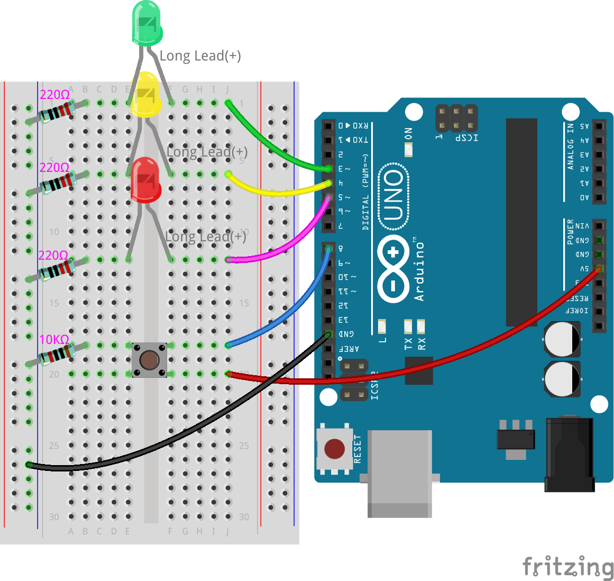
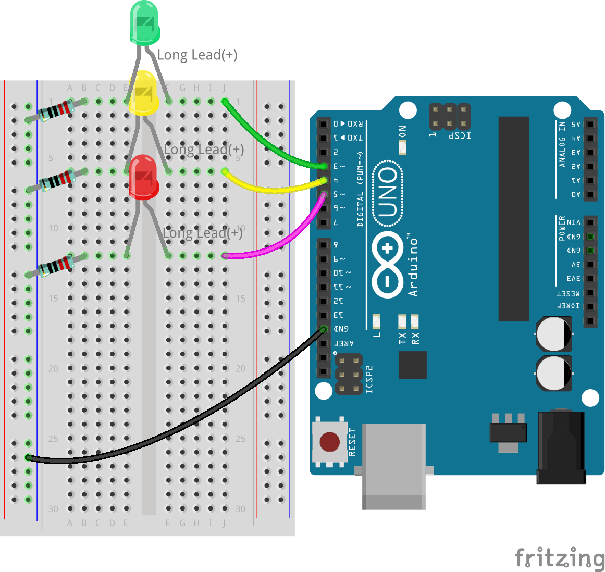
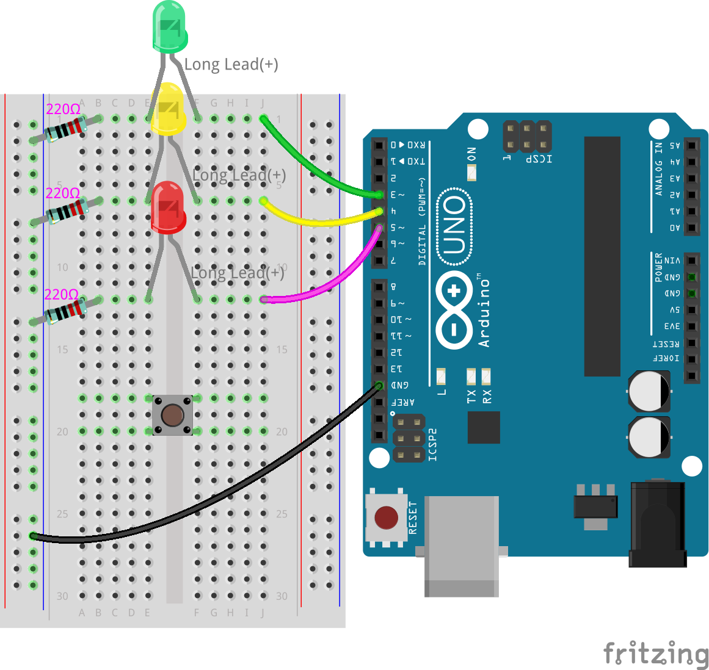
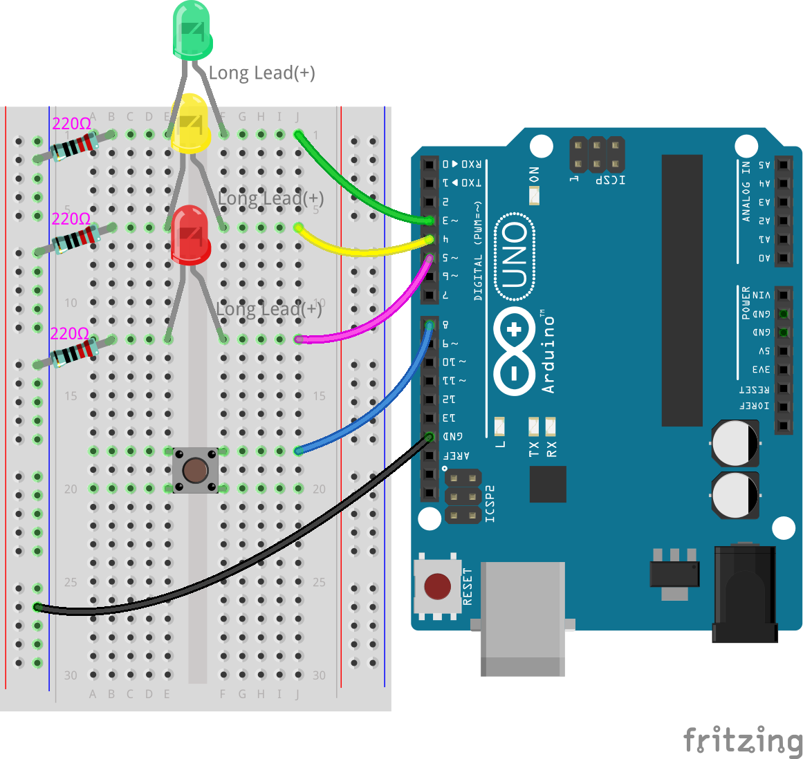
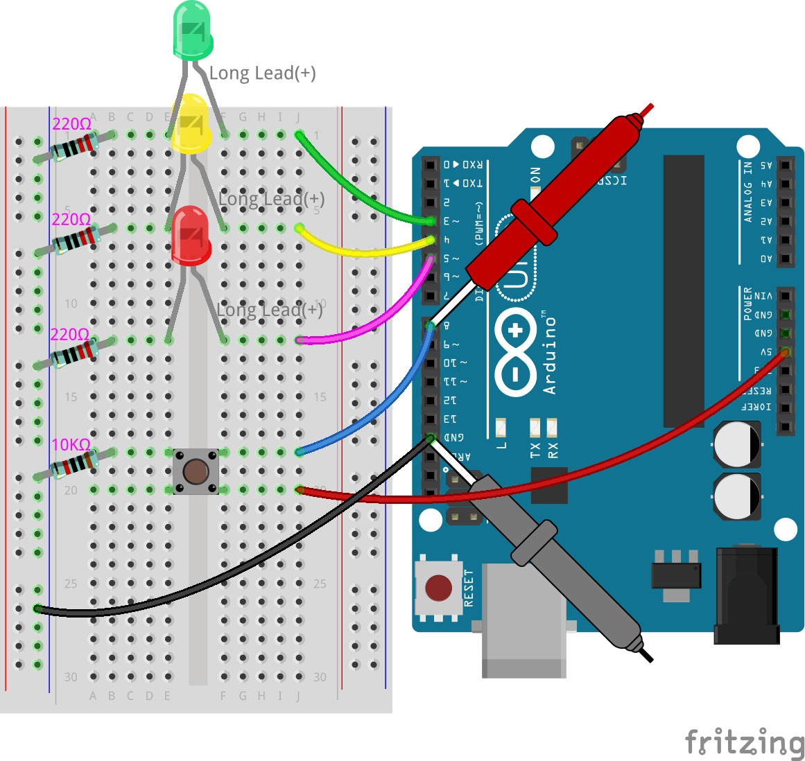
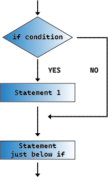

.. note::

    こんにちは、SunFounder Raspberry Pi & Arduino & ESP32 愛好者コミュニティへようこそ！FacebookでRaspberry Pi、Arduino、ESP32についてさらに深く学びましょう。

    **参加する理由**

    - **専門家のサポート**: コミュニティとチームの助けを借りて、販売後の問題や技術的な課題を解決します。
    - **学びと共有**: スキルを向上させるためのヒントやチュートリアルを交換します。
    - **限定プレビュー**: 新製品の発表や先行情報に早期にアクセスできます。
    - **特別割引**: 最新製品に対する限定割引を享受できます。
    - **フェスティバルプロモーションとプレゼント**: プレゼントや休日のプロモーションに参加できます。

    👉 私たちと一緒に探索と創造を始めましょう！クリックして今日参加してください [|link_sf_facebook|]！

8. 歩行者ボタン付き信号機
==============================

Arduinoの旅の次の段階へようこそ。前のレッスンでは、道路の主役である基本的な信号機システムを構築しましたが、今回は歩行者ボタンというリアルな複雑さを追加します。この機能により、忙しい交差点での歩行者と車道のダイナミックな相互作用を再現します。

.. raw:: html

    <video muted controls style = "max-width:90%">
        <source src="_static/video/8_traffic_light_button.mp4" type="video/mp4">
        Your browser does not support the video tag.
    </video>

このレッスンで学ぶこと:

* ボタンの動作と回路における役割を理解する
* ``digitalRead()`` を使用してピンの入力レベルを検出する方法を学ぶ
* ``if`` 文を使用して信号機システムに条件付きの動作を作成する

このプロジェクトを進める中で、技術的なセットアップだけでなく、歩行者と車両の交通を効率的に管理するロジックとプログラミングについても探求します。

回路の構築
-----------------------------

**必要なコンポーネント**

.. list-table:: 
   :widths: 25 25 25 25
   :header-rows: 0

   * - 1 * Arduino Uno R3
     - 1 * 赤色LED
     - 1 * 黄色LED
     - 1 * 緑色LED
   * - |list_uno_r3| 
     - |list_red_led| 
     - |list_yellow_led| 
     - |list_green_led| 
   * - 1 * 押しボタン
     - 1 * ブレッドボード
     - 3 * 220Ω 抵抗器
     - 1 * 10KΩ 抵抗器
   * - |list_button| 
     - |list_breadboard| 
     - |list_220ohm| 
     - |list_10kohm| 
   * - 1 * USBケーブル
     - ジャンパーワイヤー
     - 1 * マルチメーター
     - 
   * - |list_usb_cable| 
     - |list_wire| 
     - |list_meter|
     - 

**ステップバイステップの構築**

配線図、または以下のステップに従って回路を構築してください。

1. 前のレッスンの信号機回路を用意します。

2. 押しボタンを見つけます。

.. image:: img/8_traffic_button.png
    :width: 500
    :align: center

ボタンは電子機器の中で一般的なコンポーネントで、回路を作ったり壊したりするスイッチとして機能します。以下は、回路図で使用されるボタンの内部構造と一般的なシンボルです。

.. image:: img/8_traffic_button_symbol.png
    :width: 500
    :align: center

ボタンには4つのピンがありますが、ピン1と2は接続されており、ピン3と4も接続されています。ボタンを押すと4つのピンがすべて接続され、回路が閉じます。

3. ボタンをブレッドボードの中央のギャップに挿入します。ピンを18e、18f、20e、20fの穴に挿します。

.. note::

    ボタンの挿入方法がわからない場合は、両方の方向で試してみてください。片方の向きではピンの間隔が狭すぎてうまく挿入できません。

4. ボタンの右上のピンを長いジャンパーワイヤーでArduino Uno R3のデジタルピン8に接続します。一方の端を18jに挿し、もう一方の端をピン8に挿します。

5. 10KΩの抵抗器をボタンの左上のピンとグランドの間に接続します。一方の端を18aに、もう一方の端をブレッドボードの負のレールに接続します。この抵抗器はピン8をグランドに引き下げ、ボタンが押されていないときにLOWの状態に安定させます。

    .. image:: img/8_traffic_light_button_10k.png
        :width: 600
        :align: center

ピン8はボタンの状態を読み取る入力として機能します。Arduinoボードは入力ピンで0から約5ボルトの電圧を読み取り、それを基にLOWまたはHIGHと解釈します。ピンがHIGHと読み取るには、3ボルト以上である必要があります。LOWと読み取るには、1.5ボルト未満である必要があります。

もし10KΩの抵抗器がなければ、ピン8はボタンにのみ接続され、0から5Vの間で浮動し、状態がランダムにHIGHとLOWの間で変動します。

ピン8からグランドに接続された10KΩの抵抗器は、ピンの電圧をグランドレベルに引き下げ、ボタンが押されていないときにLOWと読み取ることを確実にします。

6. 最後に、赤色の電源ワイヤーでブレッドボードの正のレールをArduino Uno R3の5Vピンに接続してボタンに電力を供給します。

**質問**

信号機は直列回路と並列回路の組み合わせです。回路のどの部分が直列になっているのか、その理由を説明してください。その後、どの部分が並列になっているのか、その理由を説明してください。

コードの作成
----------------

**ピンの初期化**

これまで、信号機が緑、黄色、赤のLEDを順番に点滅させるようにプログラムしました。このレッスンでは、歩行者ボタンをプログラムし、ボタンが押されたときに赤と黄色のLEDを消灯し、緑のLEDが点滅して歩行者が渡れるようにします。

1. 以前に保存したスケッチ「Lesson7_Traffic_Light」を開きます。「ファイル」メニューから「名前を付けて保存」を選択し、「Lesson8_Traffic_Light_Button」に名前を変更して保存します。

2. ``void setup()`` 関数内で、さらに ``pinMode()`` コマンドを追加してピン8を入力（ ``INPUT`` ）として宣言します。その後、新しいコマンドを説明するコードコメントを追加します。

.. code-block:: Arduino
    :emphasize-lines: 6

    void setup() {
        // Setup code here, to run once:
        pinMode(3, OUTPUT); // Set pin 3 as output
        pinMode(4, OUTPUT); // Set pin 4 as output
        pinMode(5, OUTPUT); // Set pin 5 as output
        pinMode(8, INPUT);  // Declare pin 8 (button) as input
    }
    
    void loop() {
        // put your main code here, to run repeatedly:
        digitalWrite(3, HIGH);  // Light up the LED on pin 3
        digitalWrite(4, LOW);   // Switch off the LED on pin 4
        digitalWrite(5, LOW);   // Switch off the LED on pin 5
        delay(10000);           // Wait for 10 seconds
        digitalWrite(3, LOW);   // Switch off the LED on pin 3
        digitalWrite(4, HIGH);  // Light up the LED on pin 4
        digitalWrite(5, LOW);   // Switch off LED on pin 5
        delay(3000);            // Wait for 3 seconds
        digitalWrite(3, LOW);   // Switch off the LED on pin 3
        digitalWrite(4, LOW);   // Switch off the LED on pin 4
        digitalWrite(5, HIGH);  // Light up LED on pin 5
        delay(10000);           // Wait for 10 seconds
    }

3. コードを書いた後、スケッチを検証し、Arduino Uno R3にコードをアップロードします。

**電圧測定（ピン8）**

前のレッスンで、回路のLEDセクションがどのように機能するかを学びました。各LEDは出力として機能し、Arduino Uno R3の異なるピンによって制御されます。

しかし、ボードのピン8に接続されているボタンは異なります。これは入力デバイスです。ピン8は電圧を出力するのではなく、電圧を読み取ります。

ボタンが押されているときと押されていないときのピン8の電圧をテストするために、マルチメーターを使用しましょう。この測定には、ボタンを押すために友人の助けが必要かもしれません。

1. マルチメーターを20ボルトDC設定に調整します。

.. image:: img/multimeter_dc_20v.png
    :width: 300
    :align: center

2. ボタンが押されていないときにピン8の電圧を測定します。マルチメーターの赤いテストリードをピン8に、黒いテストリードをGNDに接触させます。

3. 測定した電圧を表に記録します。

.. list-table::
   :widths: 25 25 25
   :header-rows: 1

   * - ボタン状態
     - ピン8電圧
     - 状態
   * - 離す
     - *0.00 volts*
     - 
   * - 押す
     -
     - 

4. 友人にボタンを押してもらい、ピン8の電圧を測定し続けます。

5. ボタンが押されているときにピン8の電圧を記録します。

.. list-table::
   :widths: 25 25 25
   :header-rows: 1

   * - ボタン状態
     - ピン8電圧
     - 状態
   * - 離す
     - *0.00 volts*
     - 
   * - 押す
     - *≈4.97 volts*
     - 

6. Arduinoボードは入力ピンで0から約5ボルトの電圧を読み取り、閾値電圧に基づいてそれを ``LOW`` または ``HIGH`` と解釈します。ピンが ``HIGH`` と読み取るには、3ボルト以上である必要があります。 ``LOW`` と読み取るには、1.5ボルト未満である必要があります。

   測定した電圧に基づいて、ピン8の状態を記入します。

.. list-table::
   :widths: 25 25 25
   :header-rows: 1

   * - ボタン状態
     - ピン8電圧
     - ピン8状態
   * - 離す
     - *0.00 volts*
     - *LOW*
   * - 押す
     - *≈4.97 volts*
     - *HIGH*

**条件文**

信号機はボタンが押されているかどうかによって2つの異なる動作を表示する必要があります：

* ボタンが押されているとき、歩行者横断用のコードを実行し、緑色のLEDが点滅します。
* ボタンが押されていないとき、信号機は通常通りに動作します。

これらの動作をプログラムするために、条件文という新しいコーディング関数を使用します。

条件文は、 ``if-then`` 文とも呼ばれ、単に ``if`` 文とも言います。
条件文を使用すると、特定の条件やシナリオが真であるときに特定のコード行を実行できます。

.. note::

    日常生活の中で意思決定を行うときに、条件文をよく使用します。例えば：

    .. code-block:: Arduino

        start;
        if cold;
        then wear a coat;
        end;
        
Arduino IDEでは、条件文は次のように見えます：

    .. code-block:: Arduino

        if (condition) {
            commands to run when the condition is true 
        }

``condition`` は丸括弧内にあり、比較演算子を使用して2つ以上の値を比較します。これらの値は数値、変数、またはArduino Uno R3に入ってくる入力値である場合があります。

ここでは、if文の条件部分で使用される比較演算子のリストとその使用方法を示します：

.. list-table::
    :widths: 20 20 60
    :header-rows: 1

    *   - Comparison Operator
        - Meaning
        - Example
    *   - ==
        - Equals
        - if (digitalRead(8) == HIGH) {do something}
    *   - !=
        - Not equal
        - if (digitalRead(5) != LOW) {do something}
    *   - <
        - Less than
        - if (distance < 100) {do something}
    *   - >
        - Greater than
        - if (count > 5) {do something}
    *   - <=
        - Less than or equal to
        - if (number <= minValue) {do something}
    *   - >=
        - Greater than or equal to
        - if (number >= maxValue) {do something}

.. note::

    等価比較には二重の等号（ ``==`` ）を使用します。単一の等号（ ``=`` ）は変数に値を割り当てるために使用され（二重等号は後のセクションで説明します）、二重等号は二つの値を比較するために使用されます。

条件で二つの値を比較する際、結果は ``True`` または ``False`` になります。条件が ``True`` の場合、中括弧内のコマンドが実行されます。条件が ``False`` の場合、中括弧内のコマンドはスキップされます。

コーディングにおいて、条件文はシンプルなものから複数の条件やシナリオを含む複雑な論理式まで様々です。次に、基本的な形の ``if`` 文を使用します。

**ボタンが押されていない場合**

条件文の理解を基にして、信号機のスケッチを強化しましょう。ボタンの押下が交通の流れを変えることを考慮し、ボタンの状態を監視する条件を追加します。

1. 以前の測定によると、ボタンが押されていないとき、ピン8は ``LOW`` です。したがって、ピン8の状態が ``LOW`` と読み取られた場合、それはボタンが押されていないことを意味します。先ほどのコードの ``void loop()`` 関数の先頭に次の文を追加します：

    .. code-block:: Arduino
        :emphasize-lines: 11,13

        void setup() {
            // Setup code here, to run once:
            pinMode(3, OUTPUT); // Set pin 3 as output
            pinMode(4, OUTPUT); // Set pin 4 as output
            pinMode(5, OUTPUT); // Set pin 5 as output
            pinMode(8, INPUT);  // Declare pin 8 (button) as input
        }

        void loop() {
            // put your main code here, to run repeatedly:
            if (digitalRead(8) == LOW) {
                
            }

            digitalWrite(3, HIGH);  // Light up the LED on pin 3
            digitalWrite(4, LOW);   // Switch off the LED on pin 4
            digitalWrite(5, LOW);   // Switch off the LED on pin 5

            ...

``digitalWrite()``コマンドが出力ピンに使用されるように、 ``digitalRead()`` コマンドは入力ピンに使用されます。 ``digitalRead(pin)`` は、デジタルピンが ``HIGH`` か ``LOW`` かを読み取るコマンドです。

その構文は次のとおりです：

    * ``digitalRead(pin)``: 指定されたデジタルピンからの値を読み取ります。 ``HIGH`` または ``LOW`` のいずれか。

        **パラメータ**
            - ``pin``: 読み取りたいArduinoピンの番号
        
        **戻り値**
            ``HIGH``または ``LOW`` 

2. 次に、ボタンが押されていないときに実行するコマンドを追加します。これらのコマンドは、通常の信号機を実行するために既に作成したものです。

    * これらのコマンドを中括弧内に切り取って貼り付けることができます。
    * または、 ``if`` 文の右中括弧を最後の遅延の後に移動することもできます。
    * どちらの方法でも構いません。そうすると、 ``void loop()`` 関数は次のようになります：

.. code-block:: Arduino
    :emphasize-lines: 11,24

    void setup() {
        // Setup code here, to run once:
        pinMode(3, OUTPUT); // Set pin 3 as output
        pinMode(4, OUTPUT); // Set pin 4 as output
        pinMode(5, OUTPUT); // Set pin 5 as output
        pinMode(8, INPUT);  // Declare pin 8 (button) as input
    }

    void loop() {
        // put your main code here, to run repeatedly:
        if (digitalRead(8) == LOW) {
            digitalWrite(3, HIGH);  // Light up the LED on pin 3
            digitalWrite(4, LOW);   // Switch off the LED on pin 4
            digitalWrite(5, LOW);   // Switch off the LED on pin 5
            delay(10000);           // Wait for 10 seconds
            digitalWrite(3, LOW);   // Switch off the LED on pin 3
            digitalWrite(4, HIGH);  // Light up the LED on pin 4
            digitalWrite(5, LOW);   // Switch off LED on pin 5
            delay(3000);            // Wait for 3 seconds
            digitalWrite(3, LOW);   // Switch off the LED on pin 3
            digitalWrite(4, LOW);   // Switch off the LED on pin 4
            digitalWrite(5, HIGH);  // Light up LED on pin 5
            delay(10000);           // Wait for 10 seconds
        }
    }

``if`` 文内のコマンドがインデントされていることに注意してください。インデントを使用することで、コードを整然と保ち、関数内で実行されるコマンドを明確にするのに役立ちます。数秒余計にかかるかもしれませんが、インデント、改行、コードコメントを使用することで、コードの美しさを維持し、長期的には有益です。

一般的な構文エラーは、必要な数の中括弧を忘れることです。時々、関数内の右括弧が見逃されたり、右括弧が多すぎたりします。スケッチ内では、すべての左括弧に対応する右括弧が必要です。適切なインデントは、不一致の括弧をトラブルシューティングするのにも役立ちます。

**ボタンが押されたとき**

次は、ボタンが押されたときに歩行者が道路を横断できるようにするコードを書きます。

これには、2つ目の条件文が必要です。ただし、今回は ``digitalRead()`` 値を ``LOW`` ではなく ``HIGH`` と比較します。

ボタンが押されたとき、信号機はすべての車両を停止させ、歩行者が横断できるように信号を点滅させる必要があります。これを実現するために、赤と黄のLEDを消灯し、緑のLEDを点滅させます。2つ目の条件文の中括弧内に3つの ``digitalWrite()`` コマンドを追加します：

* ピン3に接続された緑色のLEDを点灯します。
* ピン4に接続された黄色のLEDを消灯します。
* ピン5に接続された赤色のLEDを消灯します。

次に、緑色のLEDを点滅させます。点滅の頻度は ``delay()`` 文によって決定されます。

スケッチは次のようになります：

.. code-block:: Arduino
    :emphasize-lines: 24-31

    void setup() {
        pinMode(3, OUTPUT);  // declare pin 3 (green LED) as output
        pinMode(4, OUTPUT);  // declare pin 4 (yellow LED) as output
        pinMode(5, OUTPUT);  // declare pin 5 (red LED) as output
        pinMode(8, INPUT);   // declare pin 8 (button) as input
    }

    void loop() {
        // Main code to run repeatedly:
        if (digitalRead(8) == LOW) {
            digitalWrite(3, HIGH);  // Light up the LED on pin 3
            digitalWrite(4, LOW);   // Switch off the LED on pin 4
            digitalWrite(5, LOW);   // Switch off the LED on pin 5
            delay(10000);           // Wait for 10 seconds
            digitalWrite(3, LOW);   // Switch off the LED on pin 3
            digitalWrite(4, HIGH);  // Light up the LED on pin 4
            digitalWrite(5, LOW);   // Switch off LED on pin 5
            delay(3000);            // Wait for 3 seconds
            digitalWrite(3, LOW);   // Switch off the LED on pin 3
            digitalWrite(4, LOW);   // Switch off the LED on pin 4
            digitalWrite(5, HIGH);  // Light up LED on pin 5
            delay(10000);           // Wait for 10 seconds
        }
        if (digitalRead(8) == HIGH) {  //if the button is pressed:
            digitalWrite(3, HIGH);       // Light up the LED on pin 3
            digitalWrite(4, LOW);        // Switch off the LED on pin 4
            digitalWrite(5, LOW);        // Switch off the LED on pin 5
            delay(500);                  // Wait half a second
            digitalWrite(3, LOW);        // Switch off the LED on pin 3
            delay(500);                  // Wait half a second
        }
    }

コードをArduino Uno R3にアップロードします。スケッチが完全に転送されたら、コードが実行されます。

信号機の動作を観察します。ボタンを押して信号機がサイクルを完了するのを待ちます。歩行者用の緑色の信号が点滅しますか？ボタンを離すと、信号機は通常の動作モードに戻りますか？そうでない場合は、スケッチを調整して再アップロードします。

完了したら、スケッチを保存します。

**質問**

テスト中に、緑色のLEDが歩行者ボタンを押している間だけ点滅し、歩行者がボタンを押し続けながら道路を横断できないことに気付くかもしれません。ボタンを押し続けることなく、一度押すだけで安全に横断できるようにするには、コードをどのように変更すればよいでしょうか？その擬似コードの解決策をハンドブックに書いてください。

**まとめ**
 
このレッスンでは、信号機システムに歩行者ボタンを統合し、歩行者と車両の交通の流れをバランスさせる現実世界のシナリオをシミュレートしました。電子回路でのボタンの動作を探り、 ``digitalRead()`` 関数を使用してボタンからの入力を監視しました。 ``if`` 構造を持つ条件文を実装することで、歩行者の入力に応じて信号機を動的に応答させ、インタラクティブなシステムの理解を深めました。このレッスンは、Arduinoプログラミングのスキルを強化するだけでなく、これらの技術の実際の応用を効率的に管理する日常の状況においても強調しました。
