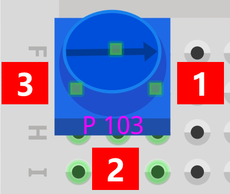
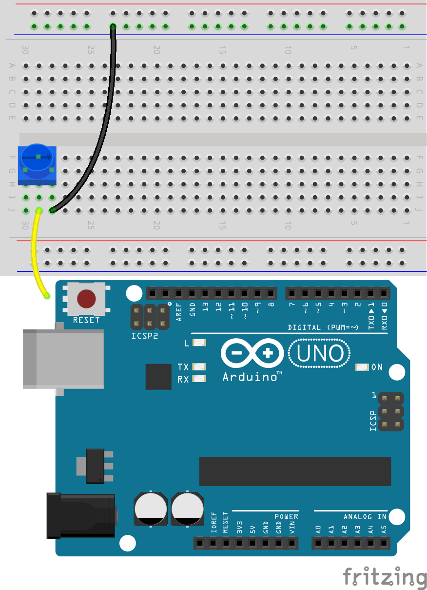
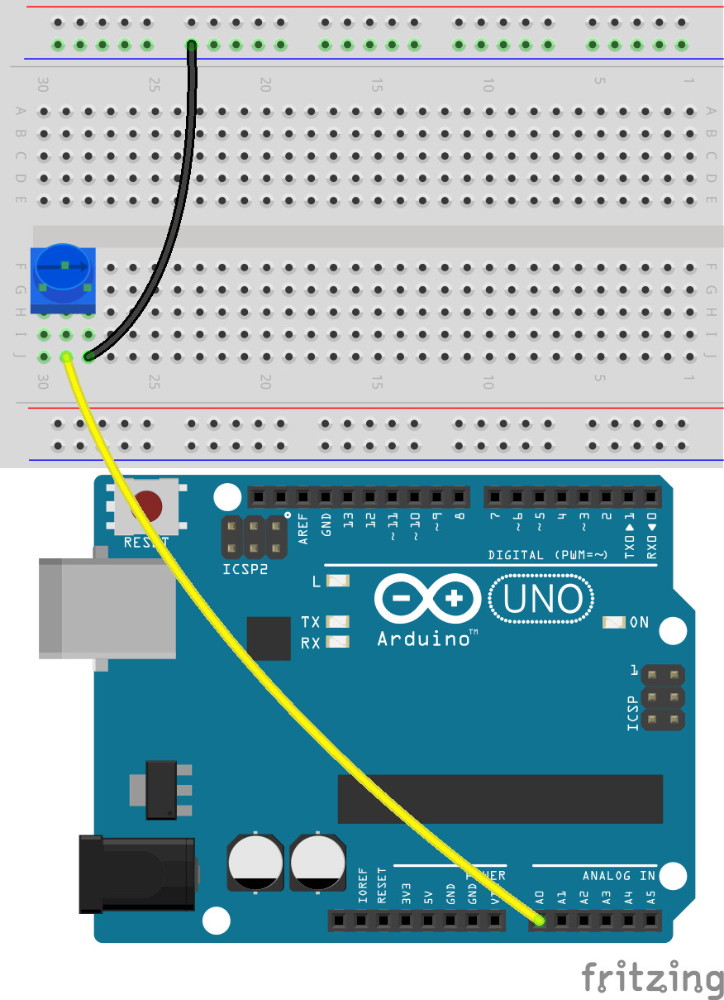
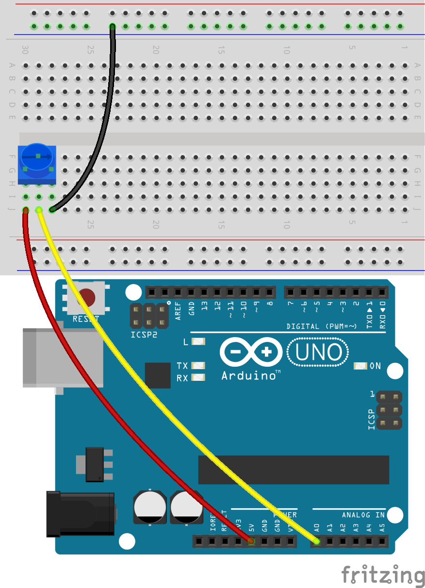
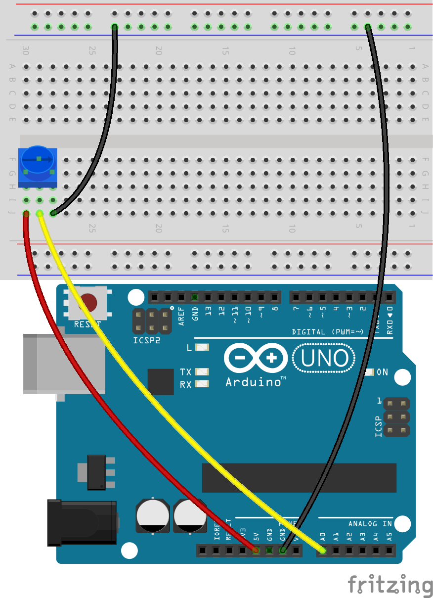
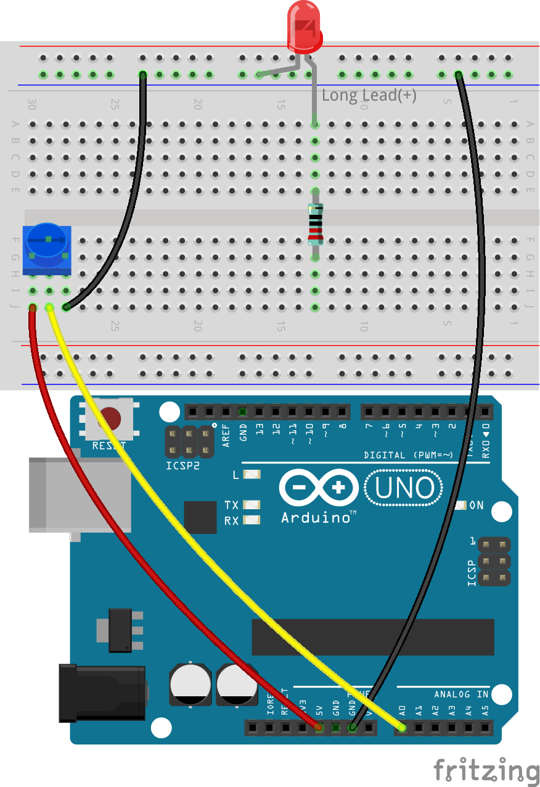
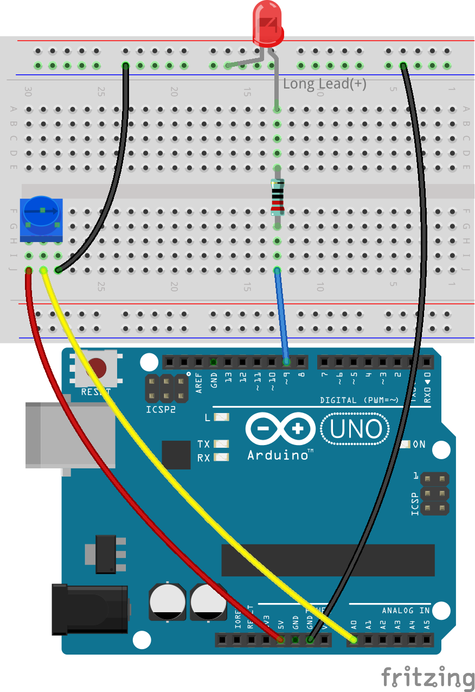
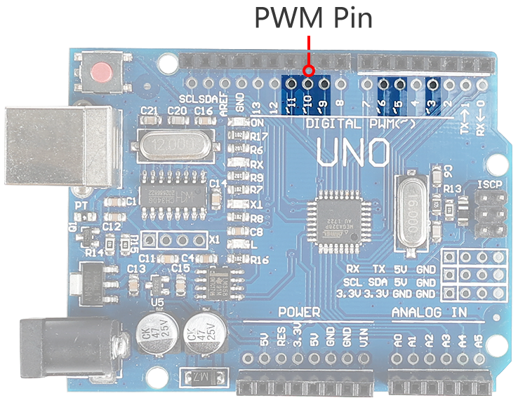
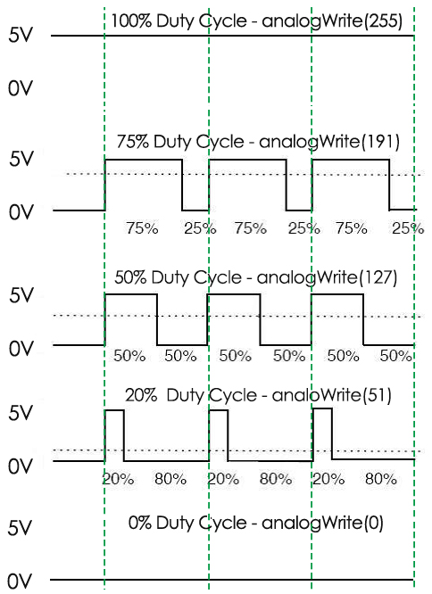

.. note::

    Bonjour et bienvenue dans la communauté SunFounder Raspberry Pi & Arduino & ESP32 Enthusiasts sur Facebook ! Explorez plus en profondeur le Raspberry Pi, Arduino et ESP32 avec d'autres passionnés.

    **Pourquoi nous rejoindre ?**

    - **Soutien Expert** : Résolvez les problèmes post-vente et les défis techniques avec l'aide de notre communauté et de notre équipe.
    - **Apprenez & Partagez** : Échangez des astuces et des tutoriels pour améliorer vos compétences.
    - **Avant-premières Exclusives** : Accédez en avant-première aux nouvelles annonces de produits et aux aperçus.
    - **Réductions Spéciales** : Bénéficiez de réductions exclusives sur nos derniers produits.
    - **Promotions Festives et Concours** : Participez à des concours et à des promotions saisonnières.

    👉 Prêt à explorer et créer avec nous ? Cliquez sur [|link_sf_facebook|] et rejoignez-nous dès aujourd'hui !

9. Lampe de Bureau Dimmable
=============================================

Imaginez chaque lampe de bureau chez vous, diffusant doucement de la lumière sur vos lectures du soir ou vos projets nocturnes. Vous êtes-vous déjà demandé comment ces lampes ajustent leur luminosité si facilement ? Dans cette leçon, nous allons explorer les mécanismes et l'électronique d'une lampe de bureau, transformant la curiosité en connaissance en construisant une de A à Z avec Arduino.

.. .. image:: img/9_desk_lamp_pot.jpg
..     :width: 500
..     :align: center
    
.. raw:: html

    <video muted controls style = "max-width:90%">
        <source src="_static/video/9_dimmble_led.mp4" type="video/mp4">
        Your browser does not support the video tag.
    </video>

Préparez-vous à :

* Décoder le rôle des variables dans le stockage et la manipulation des données au sein des sketches Arduino.
* Maîtriser la lecture des signaux analogiques avec ``analogRead()``.
* Explorer la modulation de largeur d'impulsion (PWM) à travers ``analogWrite()`` pour affiner la luminosité des LEDs.

À la fin de cette leçon, non seulement vous aurez créé une lampe de bureau électronique pleinement fonctionnelle, mais vous aurez également approfondi votre compréhension de la manière dont le logiciel interagit avec le matériel pour donner vie aux objets du quotidien. Éclairons nos connaissances en construisant une lampe de bureau qui répond à votre toucher.

Construire le Circuit
------------------------------------

**Composants Nécessaires**

.. list-table:: 
   :widths: 25 25 25 25
   :header-rows: 0

   * - 1 * Arduino Uno R3
     - 1 * LED Rouge
     - 1 * Résistance de 220Ω
     - 1 * Potentiomètre
   * - |list_uno_r3| 
     - |list_red_led| 
     - |list_220ohm| 
     - |list_potentiometer| 
   * - 1 * Câble USB
     - 1 * Breadboard
     - Fils de Connexion
     - 1 * Multimètre
   * - |list_usb_cable| 
     - |list_breadboard| 
     - |list_wire| 
     - |list_meter| 

**Étapes de Construction**

1. Trouvez un potentiomètre.

Un potentiomètre, souvent appelé pot, fonctionne comme une résistance variable, ce qui signifie qu'il peut ajuster sa résistance de presque zéro à sa valeur maximale. La plupart des potentiomètres sont marqués avec leur plage. Celui inclus dans votre kit est désigné comme un potentiomètre 103 (10K), ce qui équivaut à 10 kilo-ohms ou 10 000 ohms.

.. image:: img/9_dimmer_pot.png
    :width: 200
    :align: center

À l'intérieur du potentiomètre se trouve une bande de matériau résistant avec un curseur qui se déplace le long de celle-ci. Chaque extrémité du matériau résistant est connectée à une borne ou une pin, montrées ci-dessous comme les pins A et B. La résistance entre les pins A et B est fixe et représente la résistance maximale que le potentiomètre peut offrir. Pour ceux de votre kit, la résistance maximale est de 10 kilo-ohms.

.. image:: img/9_dimmer_pot_2.png
    :width: 400
    :align: center

* **A** : Connecté à l'alimentation
* **B** : Connecté à la masse
* **C** : Connecté à la pin analogique
* **D** : Curseur
* **E** : Bande résistante

La Pin C est connectée au curseur. La résistance à travers le curseur, ou Pin C, dépend de la position du curseur le long du matériau résistant.

.. image:: img/9_dimmer_pot_3.png
    :width: 400
    :align: center

Dans les schémas électriques, le symbole pour un potentiomètre ressemble généralement à une résistance avec une flèche au milieu.

.. image:: img/9_dimmer_pot_4.png
    :width: 200
    :align: center

Explorons maintenant comment le potentiomètre ajuste la résistance dans un circuit.

2. Connectez un potentiomètre à la breadboard. Insérez ses trois broches dans les trous 30G, 29F, 28G.

.. note::
    Le potentiomètre est étiqueté "P 103", indiquant sa plage de résistance. Veuillez insérer le potentiomètre dans la breadboard comme indiqué, avec le côté étiqueté face à vous.

.. image:: img/9_dimmer_test_pot.png
    :width: 500
    :align: center

3. Pour mesurer la résistance du potentiomètre, vous devez insérer un fil dans 29J et le toucher avec la sonde de test rouge, puis insérer un autre fil dans 28J et le toucher avec la sonde noire.

.. image:: img/9_dimmer_test_wore.png
    :width: 500
    :align: center

4. Réglez le multimètre pour mesurer la résistance dans la plage de 20 kilo-ohms (20K).

.. image:: img/multimeter_20k.png
    :width: 300
    :align: center

5. Tournez le potentiomètre à la position "1" indiquée dans le diagramme.

6. Notez les valeurs de résistance mesurées dans le tableau.

.. note::
    Les valeurs du tableau sont mes mesures ; vos résultats peuvent varier. Remplissez-les en fonction de vos résultats réels.

.. list-table::
   :widths: 20 20
   :header-rows: 1

   * - Point de Mesure
     - Résistance (kilo-ohm)
   * - 1
     - *1.52*
   * - 2
     - 
   * - 3
     - 

7. Tournez le potentiomètre dans le sens des aiguilles d'une montre aux positions 2 et 3 pour mesurer la résistance à chaque point, et notez les résultats dans le tableau.

.. list-table::
   :widths: 20 20
   :header-rows: 1

   * - Point de Mesure
     - Résistance (kilo-ohm)
   * - 1
     - *1.52*
   * - 2
     - *5.48*
   * - 3
     - *9.01*

À partir des résultats de mesure :

* En tournant le potentiomètre **dans le sens des aiguilles d'une montre** de la position 1 à 3, la résistance entre les positions 2 et 1 augmente.
* Inversement, en tournant **dans le sens inverse des aiguilles d'une montre** de la position 3 à 1, la résistance entre les positions 2 et 1 diminue.

8. Insérez l'autre extrémité du fil de connexion de 28J dans la borne négative de la breadboard.

9. Ensuite, insérez l'autre extrémité du fil de connexion de 29J dans la pin A0 de l'Arduino Uno R3.

10. Enfin, connectez le potentiomètre au 5V en insérant un fil de connexion entre le trou 30J de la breadboard et la pin 5V de l'Arduino Uno R3.

11. Connectez la pin GND de l'Arduino Uno R3 à la borne négative de la breadboard à l'aide d'un long fil de connexion.

12. Prenez une LED. Insérez son anode (broche la plus longue) dans le trou 13A, et son cathode (broche la plus courte) dans la borne négative de la breadboard.

13. Placez une résistance de 220 ohms entre les trous 13E et 13G.

14. Connectez le trou 13J de la breadboard à la pin 9 de l'Arduino Uno R3 avec un fil.

**Question** :

Comment pensez-vous que la tension sur A0 changerait lorsque le potentiomètre est tourné dans le sens des aiguilles d'une montre et dans le sens inverse des aiguilles d'une montre ?

Création du Code
-------------------------------------

Dans cette leçon, notre objectif est d'ajuster la luminosité de la LED en fonction de la rotation du potentiomètre.

Voici à quoi pourrait ressembler le pseudocode :

.. code-block::

    Create variable to store input information.
    Set a pin as output.
    Begin main loop:
        Store the potentiometer value in a variable.
        Set the LED brightness based on the potentiometer variable.
    End main loop.

**Initialisation des Pins**

1. Ouvrez l'IDE Arduino et démarrez un nouveau projet en sélectionnant « Nouveau Sketch » dans le menu « Fichier ».
2. Enregistrez votre sketch sous le nom ``Lesson9_Desk_Lamp`` en utilisant ``Ctrl + S`` ou en cliquant sur « Enregistrer ».

3. La LED dans votre circuit est connectée à une pin numérique sur l'Arduino Uno R3, définie comme sortie. N'oubliez pas d'ajouter un commentaire.

.. note::

    Le potentiomètre est un dispositif d'entrée analogique connecté à la pin analogique A0. Tous les pins analogiques sur Arduino sont des pins d'entrée, ce qui signifie qu'ils n'ont pas besoin d'être déclarés comme INPUT comme les pins numériques.

.. code-block:: Arduino
    :emphasize-lines: 3

    void setup() {
        // Mettez votre code de configuration ici, à exécuter une fois :
        pinMode(9, OUTPUT);  // Définir la pin 9 comme sortie
    }

    void loop() {
        // Mettez votre code principal ici, à exécuter en boucle :
    }

**Déclaration des Variables**

Pour contrôler la variation de l'intensité de la LED à l'aide d'un potentiomètre, vous avez besoin d'une **variable** pour stocker la valeur du potentiomètre.

Plongeons dans le concept des variables en programmation. Une variable agit comme un conteneur dans votre programme, permettant de stocker et de récupérer ultérieurement des informations.

Avant d'utiliser une variable, elle doit être déclarée, ce qui est connu sous le nom de déclaration de variable.

Pour déclarer une variable, vous devez définir son type et son nom. Il n'est pas nécessaire d'assigner une valeur à la variable au moment de la déclaration ; vous pouvez l'assigner plus tard dans votre sketch. Voici comment déclarer une variable :

.. code-block:: Arduino

    int var;

Ici, ``int`` est le type de données utilisé pour les entiers, capable de stocker des valeurs allant de -32768 à 32767. Les variables peuvent stocker divers types de données, y compris ``float``, ``byte``, ``boolean``, ``char`` et ``string``.

Les noms de variables peuvent être ceux que vous choisissez, comme ``i``, ``pomme``, ``Bruce``, ``R2D2`` ou ``Sectumsempra``. Cependant, il y a des règles pour les noms :

* Les noms peuvent inclure des lettres, des chiffres et des underscores, mais pas d'espaces ni de caractères spéciaux comme !, #, %, etc.

  .. image:: img/9_variable_name1.png
    :width: 400
    :align: center

* Les noms doivent commencer par une lettre ou un underscore (_). Ils ne peuvent pas commencer par un chiffre.

  .. image:: img/9_variable_name2.png
    :width: 400
    :align: center

* Les noms sont sensibles à la casse. ``monChat`` et ``monchat`` seraient considérés comme des variables différentes.

* Évitez d'utiliser des mots-clés que l'IDE Arduino reconnaît et met en surbrillance, comme ``int``, qui est coloré pour indiquer une signification spéciale. Si le nom devient d'une couleur comme l'orange ou le bleu, c'est un mot-clé et il ne doit pas être utilisé comme nom de variable.

La portée d'une variable détermine où elle peut être utilisée dans votre sketch, en fonction de l'endroit où elle est déclarée.

* Une variable déclarée en dehors de toutes les fonctions (c'est-à-dire en dehors des accolades) est une variable globale et peut être utilisée partout dans votre sketch.
* Une variable déclarée à l'intérieur d'une fonction (dans un ensemble d'accolades) est une variable locale et ne peut être utilisée que dans cette fonction.

.. code-block:: Arduino
    :emphasize-lines: 1,4,9

    int variable_globale = 0; // Ceci est une variable globale

    void setup() {
        int variable = 0; // Ceci est une variable locale
    }

    void loop() {
        int variable = 0; // Ceci est une autre variable locale
    }

.. note::

    Les variables locales ne peuvent être utilisées que dans les fonctions où elles sont déclarées, ce qui signifie que vous pouvez déclarer des variables avec le même nom dans différentes fonctions sans problème. Cependant, évitez d'utiliser le même nom pour les variables locales et globales afin d'éviter toute confusion.

Typiquement, un sketch Arduino doit suivre un schéma cohérent : déclarer d'abord les variables globales, puis définir la fonction ``void setup()`` et enfin, la fonction ``void loop()``.

4. Allez au tout début de votre sketch, avant la fonction ``void setup()``. Ici, vous déclarerez votre variable pour stocker la valeur du potentiomètre.

.. code-block:: Arduino
    :emphasize-lines: 1

    int potValue = 0;

    void setup() {
        // Mettez votre code de configuration ici, à exécuter une fois :
        pinMode(9, OUTPUT);  // Définir la pin 9 comme sortie
    }

    void loop() {
        // Mettez votre code principal ici, à exécuter en boucle :
    }

Vous venez de déclarer une variable entière nommée ``valeurPotentiometre`` et de l'initialiser à zéro. Cette variable sera utilisée plus tard dans votre sketch pour stocker la sortie du potentiomètre.

**Lecture des Valeurs Analogiques**

Vous êtes maintenant prêt à entrer dans la boucle principale du programme. La première chose que vous ferez dans la fonction ``void loop()`` est de déterminer la valeur du potentiomètre.

Le potentiomètre est connecté à une pin d'alimentation de 5 volts, ce qui permet à la tension à la pin A0 de varier de 0 à 5 volts. Cette tension est ensuite convertie par le microprocesseur de l'Arduino Uno R3 en une valeur analogique allant de 0 à 1023, grâce à la résolution de 10 bits du microprocesseur.

Une fois converties, ces valeurs analogiques peuvent être utilisées dans votre programme.

Pour obtenir la valeur analogique du potentiomètre, utilisez la commande ``analogRead(pin)``. Cette commande lit la tension entrant dans une pin analogique et la mappe à une valeur entre 0 et 1023 :

- S'il n'y a pas de tension, la valeur analogique est 0.
- Si la tension est de 5 volts complets, la valeur analogique sera 1023.

Voici comment l'utiliser :

    * ``analogRead(pin)`` : Lit la valeur de la pin analogique spécifiée.

    **Paramètres**
        - ``pin`` : le nom de la pin d'entrée analogique à lire.

    **Retourne**
        La lecture analogique sur la pin. Bien qu'elle soit limitée par la résolution du convertisseur analogique-numérique (0-1023 pour 10 bits ou 0-4095 pour 12 bits). Type de données : int.

5. Placez la commande suivante à l'intérieur de la fonction ``void loop()`` pour stocker la valeur analogique du potentiomètre dans la variable ``potValue`` déclarée en haut de votre sketch :

.. code-block:: Arduino
    :emphasize-lines: 10

    int potValue = 0;

    void setup() {
        // Mettez votre code de configuration ici, à exécuter une fois :
        pinMode(9, OUTPUT);  // Définir la pin 9 comme sortie
    }

    void loop() {
        // Mettez votre code principal ici, à exécuter en boucle :
        potValue = analogRead(A0);        // Lire la valeur du potentiomètre
    }

Assurez-vous de sauvegarder et de vérifier votre code pour corriger toute erreur.

**Écriture des Valeurs Analogiques**

Les pins numériques sur l'Arduino Uno R3 peuvent être soit en état ON, soit en état OFF, ce qui signifie qu'elles ne peuvent pas émettre de véritables valeurs analogiques. Pour simuler un comportement analogique, comme le contrôle de la luminosité d'une LED, nous utilisons une technique appelée Modulation de Largeur d'Impulsion (PWM). Les pins PWM, marquées d'un tilde (~) sur la carte, peuvent varier la sortie perçue en ajustant le cycle de service du signal.

Pour contrôler la luminosité d'une LED, nous utilisons la commande ``analogWrite(pin, value)``. Cela ajuste la luminosité de la LED en modifiant le cycle de service du signal PWM envoyé à la pin.

    * ``analogWrite(pin, value)`` : Écrit une valeur analogique (onde PWM) sur une pin. Peut être utilisé pour éclairer une LED à des niveaux de luminosité variables ou pour faire fonctionner un moteur à différentes vitesses.

    **Paramètres**
        - ``pin`` : la pin Arduino à laquelle écrire. Types de données autorisés : int.
        - ``value`` : le cycle de service : entre 0 (toujours éteint) et 255 (toujours allumé). Types de données autorisés : int.
    
    **Retourne**
        Rien

Considérez le cycle de service comme le schéma d'ouverture et de fermeture d'un robinet contrôlant le débit d'eau dans un seau, représentant la luminosité de la LED. Voici une explication simple :

* ``analogWrite(255)`` signifie que le robinet est complètement ouvert tout le temps, remplissant le seau et rendant la LED au maximum de sa luminosité.
* ``analogWrite(191)`` signifie que le robinet est ouvert 75 % du temps, rendant le seau moins plein et la LED moins lumineuse.
* ``analogWrite(0)`` signifie que le robinet est complètement fermé, laissant le seau vide et la LED éteinte.

6. Ajoutez une commande ``analogWrite()`` dans la fonction ``void loop()`` et commentez chaque ligne pour plus de clarté :

.. note::

    * Étant donné que la plage d'entrée du potentiomètre est de 0 à 1023, mais que la plage de sortie pour les LEDs est de 0 à 255. Pour combler cet écart, vous pouvez réduire la valeur du potentiomètre en la divisant par 4 :

    * Bien que le résultat de la division ne soit pas toujours un entier, seule la partie entière est stockée car les variables sont déclarées comme entiers (int).

.. code-block:: Arduino
    :emphasize-lines: 11

    int potValue = 0;

    void setup() {
        // Mettez votre code de configuration ici, à exécuter une fois :
        pinMode(9, OUTPUT);  // Définir la pin 9 comme sortie
    }

    void loop() {
        // Mettez votre code principal ici, à exécuter en boucle :
        potValue = analogRead(A0);        // Lire la valeur du potentiomètre
        analogWrite(9, potValue / 4);       // Appliquer la luminosité à la LED sur la pin 9
    }

7. Une fois le code téléchargé sur l'Arduino Uno R3, tourner le potentiomètre changera la luminosité des LEDs. Selon notre configuration, tourner le potentiomètre dans le sens des aiguilles d'une montre devrait augmenter la luminosité, tandis que dans le sens inverse devrait la diminuer.

.. note::

    Le débogage nécessite souvent de vérifier à la fois le code et le circuit pour détecter des erreurs. Si le code se compile correctement ou semble correct mais que la LED ne change pas comme prévu, le problème peut être lié au circuit. Vérifiez toutes les connexions et composants sur la breadboard pour vous assurer qu'ils sont bien en contact.

8. Enfin, n'oubliez pas de sauvegarder votre code et de ranger votre espace de travail.

**Question**

Si vous connectez la LED à une pin différente, comme la pin 8, et que vous tournez le potentiomètre, la luminosité de la LED changera-t-elle toujours ? Pourquoi ou pourquoi pas ?

**Résumé**

Dans cette leçon, nous avons exploré comment travailler avec des signaux analogiques dans les projets Arduino. Nous avons appris à lire des valeurs analogiques à partir d'un potentiomètre, à traiter ces valeurs dans le sketch Arduino et à contrôler la luminosité d'une LED en utilisant la Modulation de Largeur d'Impulsion (PWM). Nous avons également approfondi l'utilisation des variables pour stocker et manipuler des données dans nos sketches. En intégrant ces éléments, nous avons démontré le contrôle dynamique des composants électroniques, reliant la sortie numérique simple à un contrôle plus nuancé du matériel via les lectures d'entrée analogiques.
