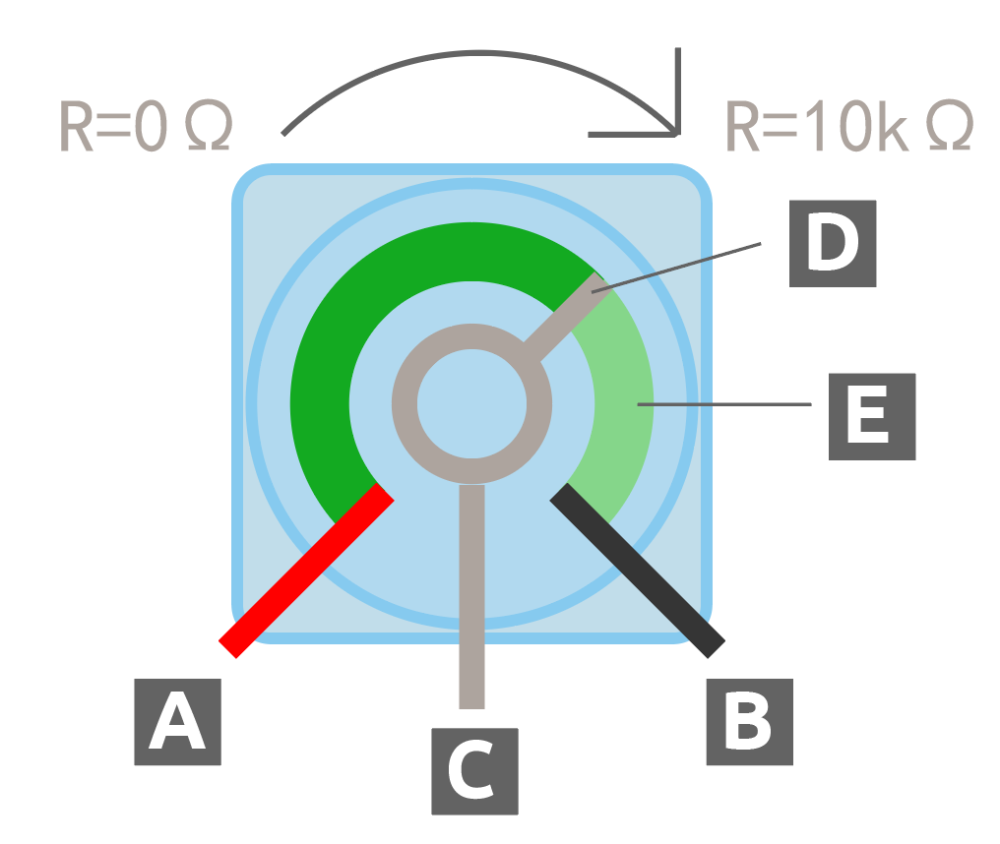

.. note::

    Hallo, willkommen in der SunFounder Raspberry Pi & Arduino & ESP32 Enthusiasten-Community auf Facebook! Tauche gemeinsam mit anderen Enthusiasten tiefer in die Welt von Raspberry Pi, Arduino und ESP32 ein.

    **Warum solltest du beitreten?**

    - **Expertenunterstützung**: Löse nach dem Kauf auftretende Probleme und technische Herausforderungen mit Hilfe unserer Community und unseres Teams.
    - **Lernen & Teilen**: Tausche Tipps und Tutorials aus, um deine Fähigkeiten zu verbessern.
    - **Exklusive Vorschauen**: Erhalte frühzeitig Einblicke in neue Produktankündigungen und Sneak Peeks.
    - **Sonderrabatte**: Profitiere von exklusiven Rabatten auf unsere neuesten Produkte.
    - **Festliche Aktionen und Verlosungen**: Nimm an Verlosungen und saisonalen Aktionen teil.

    👉 Bereit, mit uns zu entdecken und zu kreieren? Klicke auf [|link_sf_facebook|] und trete noch heute bei!

9. Dimmbarer Schreibtischlampe
=============================================

Stell dir jede Schreibtischlampe zu Hause vor, die sanft Licht über deine Abendlektüren oder nächtlichen Projekte wirft. Hast du dich jemals gefragt, wie diese Lampen es schaffen, ihre Helligkeit so nahtlos anzupassen? In dieser Lektion tauchen wir in die Mechanik und Elektronik einer Schreibtischlampe ein und verwandeln Neugier in Wissen, indem wir eine solche Lampe von Grund auf mit Arduino bauen.

.. .. image:: img/9_desk_lamp_pot.jpg
..     :width: 500
..     :align: center
    
.. raw:: html

    <video muted controls style = "max-width:90%">
        <source src="_static/video/9_dimmble_led.mp4" type="video/mp4">
        Your browser does not support the video tag.
    </video>

Mach dich bereit, um:

* Die Rolle von Variablen zu entschlüsseln, die Daten in Arduino-Skizzen speichern und manipulieren.
* Das Lesen analoger Signale mit ``analogRead()`` zu meistern.
* PWM (Pulsweitenmodulation) durch ``analogWrite()`` zu erkunden, um die Helligkeit von LEDs fein zu justieren.

Am Ende dieser Lektion wirst du nicht nur eine voll funktionsfähige elektronische Schreibtischlampe gebaut haben, sondern auch dein Verständnis dafür vertieft haben, wie Software mit Hardware interagiert, um alltägliche Objekte zum Leben zu erwecken. Lass uns unser Wissen erhellen, indem wir eine Lampe bauen, die auf deine Berührung reagiert.

Den Schaltkreis aufbauen
------------------------------------

**Benötigte Komponenten**

.. list-table:: 
   :widths: 25 25 25 25
   :header-rows: 0

   * - 1 * Arduino Uno R3
     - 1 * Rote LED
     - 1 * 220Ω Widerstand
     - 1 * Potentiometer
   * - |list_uno_r3| 
     - |list_red_led| 
     - |list_220ohm| 
     - |list_potentiometer| 
   * - 1 * USB-Kabel
     - 1 * Breadboard
     - Jumper-Kabel
     - 1 * Multimeter
   * - |list_usb_cable| 
     - |list_breadboard| 
     - |list_wire| 
     - |list_meter|

**Schritte zum Aufbau**

1. Finde ein Potentiometer.

Ein Potentiometer, oft einfach „Poti“ genannt, dient als variabler Widerstand. Das bedeutet, dass es seinen Widerstand von nahezu null bis zu seinem Maximalwert anpassen kann. Die meisten Potentiometer sind mit ihrem Bereich gekennzeichnet. Das Potentiometer in deinem Kit ist als 103 (10K) Potentiometer bezeichnet, was 10 Kiloohm oder 10.000 Ohm entspricht.

.. image:: img/9_dimmer_pot.png
    :width: 200
    :align: center

Im Inneren des Potentiometers befindet sich ein Streifen aus Widerstandsmaterial mit einem Schieberegler, der sich entlang dieses Streifens bewegt. Jeder Endpunkt des Widerstandsmaterials ist mit einem Anschluss oder Pin verbunden, hier als Pins A und B dargestellt. Der Widerstand zwischen den Pins A und B ist fest und stellt den maximalen Widerstand dar, den das Potentiometer bieten kann. Bei den in deinem Kit enthaltenen beträgt dieser maximale Widerstand 10 Kiloohm.

.. image:: img/9_dimmer_pot_2.png
    :width: 400
    :align: center

* **A**: Mit Strom verbinden
* **B**: Mit Masse verbinden
* **C**: Mit Analogpin verbinden
* **D**: Schieberegler
* **E**: Widerstandsstreifen

Pin C ist mit dem Schieberegler verbunden. Der Widerstand durch den Schieberegler oder Pin C hängt von der Position des Schiebers auf dem Widerstandsmaterial ab.

In Schaltplänen sieht das Symbol für ein Potentiometer typischerweise aus wie ein Widerstand mit einem Pfeil durch die Mitte.

.. image:: img/9_dimmer_pot_4.png
    :width: 200
    :align: center

Nun wollen wir sehen, wie das Potentiometer den Widerstand in einem Stromkreis einstellt.

2. Schließe das Potentiometer an das Breadboard an. Stecke seine drei Pins in die Löcher 30G, 29F und 28G.

.. note::
    Das Potentiometer trägt die Aufschrift "P 103", was auf seinen Widerstandsbereich hinweist. Setze das Potentiometer wie gezeigt in das Breadboard ein, wobei die beschriftete Seite zu dir zeigt.

.. image:: img/9_dimmer_test_pot.png
    :width: 500
    :align: center

3. Um den Widerstand des Potentiometers zu messen, steckst du ein Kabel in 29J und berührst es mit der roten Prüfspitze, und ein weiteres Kabel in 28J, das du mit der schwarzen Prüfspitze berührst.

.. image:: img/9_dimmer_test_wore.png
    :width: 500
    :align: center

4. Stelle das Multimeter auf den Widerstandsmessbereich von 20 Kiloohm (20K) ein.

.. image:: img/multimeter_20k.png
    :width: 300
    :align: center

5. Drehe das Potentiometer auf die "1"-Position, wie im Diagramm angegeben.

.. image:: img/9_pot_direction.png
    :width: 300
    :align: center
    
6. Trage die gemessenen Widerstandswerte in die Tabelle ein.

.. note::
    Die Werte in der Tabelle sind meine Messungen; deine Ergebnisse können variieren. Trage sie entsprechend deinen tatsächlichen Messungen ein.

.. list-table::
   :widths: 20 20
   :header-rows: 1

   * - Messpunkt
     - Widerstand (Kiloohm)
   * - 1
     - *1,52*
   * - 2
     -
   * - 3
     -

7. Drehe das Potentiometer im Uhrzeigersinn auf die Positionen 2 und 3, um den Widerstand an jedem Punkt zu messen, und trage die Ergebnisse in die Tabelle ein.

.. list-table::
   :widths: 20 20
   :header-rows: 1

   * - Messpunkt
     - Widerstand (Kiloohm)
   * - 1
     - *1,52*
   * - 2
     - *5,48*
   * - 3
     - *9,01*

Aus den Messergebnissen:

* Wenn du das Potentiometer **im Uhrzeigersinn** von Position 1 zu Position 3 drehst, erhöht sich der Widerstand zwischen Position 2 und Position 1.
* Umgekehrt verringert sich der Widerstand zwischen Position 2 und Position 1, wenn du das Potentiometer **gegen den Uhrzeigersinn** von Position 3 zu Position 1 drehst.

8. Stecke das andere Ende des Jumperkabels von 28J in den negativen Anschluss des Breadboards.

.. image:: img/9_dimmer_led1_pot_gnd.png
    :width: 500
    :align: center

9. Stecke dann das andere Ende des Jumperkabels von 29J in den A0-Pin des Arduino Uno R3.

10. Verbinde schließlich das Potentiometer mit 5V, indem du ein Jumperkabel zwischen Loch 30J des Breadboards und den 5V-Pin des Arduino Uno R3 einfügst.

.. image:: img/9_dimmer_led1_pot_5v.png
    :width: 500
    :align: center

11. Verbinde den GND-Pin des Arduino Uno R3 mit dem negativen Anschluss des Breadboards, indem du ein langes Jumperkabel verwendest.

.. image:: img/9_dimmer_led1_gnd.png
    :width: 500
    :align: center

12. Nimm eine LED heraus. Stecke ihre Anode (langer Pin) in Loch 13A und ihre Kathode (kurzer Pin) in den negativen Anschluss des Breadboards.

.. image:: img/9_dimmer_led1_led.png
    :width: 500
    :align: center

13. Platziere einen 220-Ohm-Widerstand zwischen den Löchern 13E und 13G.

.. image:: img/9_dimmer_led1_resistor.png
    :width: 500
    :align: center

14. Verbinde das Loch 13J des Breadboards mit Pin 9 des Arduino Uno R3 mithilfe eines Kabels.

.. image:: img/9_dimmer_led1_pin9.png
    :width: 500
    :align: center

**Frage**:

Wie denkst du, würde sich die Spannung an A0 ändern, wenn das Potentiometer im Uhrzeigersinn bzw. gegen den Uhrzeigersinn gedreht wird?

Codeerstellung
-------------------------------------

In dieser Lektion wollen wir die Helligkeit der LED basierend auf der Drehung des Potentiometers anpassen.

So könnte der Pseudocode aussehen:

.. code-block::

    Erstelle eine Variable, um die Eingabewerte zu speichern.
    Setze einen Pin als Ausgang fest.
    Beginne die Hauptschleife:
        Speichere den Wert des Potentiometers in einer Variable.
        Setze die LED-Helligkeit basierend auf der Potentiometer-Variable.
    Beende die Hauptschleife.

**Pin-Initialisierung**

1. Öffne die Arduino IDE und starte ein neues Projekt, indem du im Menü „Datei“ die Option „Neue Skizze“ auswählst.
2. Speichere deine Skizze unter dem Namen ``Lesson9_Desk_Lamp`` mit ``Strg + S`` oder durch Klicken auf „Speichern“.

3. Die LED in deinem Schaltkreis ist an einen digitalen Pin des Arduino Uno R3 angeschlossen, der als Ausgang definiert werden muss. Vergiss nicht, einen Kommentar hinzuzufügen.

.. note::

    Das Potentiometer ist ein analoges Eingabegerät, das mit dem analogen Pin A0 verbunden ist. Alle analogen Pins am Arduino sind Eingänge und müssen daher nicht wie digitale Pins als INPUT deklariert werden.
    
.. code-block:: Arduino
    :emphasize-lines: 3

    void setup() {
        // Setup-Code, der einmal ausgeführt wird:
        pinMode(9, OUTPUT);  // Setze Pin 9 als Ausgang
    }

    void loop() {
        // Hauptcode, der wiederholt ausgeführt wird:
    }

**Variablendeklaration**

Um die LED mit einem Potentiometer zu steuern, benötigst du eine **Variable**, um den Wert des Potentiometers zu speichern.

Tauchen wir in das Konzept der Variablen in der Programmierung ein. Eine Variable funktioniert wie ein Behälter in deinem Programm und erlaubt es dir, Informationen zu speichern und später abzurufen.

.. image:: img/9_variable_define.png
    :width: 400
    :align: center

Bevor du eine Variable verwendest, muss sie deklariert werden, was als Variablendeklaration bezeichnet wird.

Um eine Variable zu deklarieren, musst du ihren Typ und ihren Namen definieren. Es ist nicht notwendig, der Variablen sofort einen Wert zuzuweisen – dies kann später im Sketch erfolgen. So kannst du eine Variable deklarieren:

.. code-block:: Arduino

    int var;

Hier ist ``int`` der Datentyp für ganze Zahlen, der Werte von -32768 bis 32767 speichern kann. Variablen können verschiedene Datentypen speichern, darunter ``float``, ``byte``, ``boolean``, ``char`` und ``string``.

Variablennamen können beliebig sein, zum Beispiel ``i``, ``apple``, ``Bruce``, ``R2D2`` oder ``Sectumsempra``. Es gibt jedoch Regeln für die Namensgebung:

* Namen dürfen Buchstaben, Ziffern und Unterstriche enthalten, aber keine Leerzeichen oder Sonderzeichen wie !, #, % usw.

  .. image:: img/9_variable_name1.png
    :width: 400
    :align: center

* Namen müssen mit einem Buchstaben oder einem Unterstrich (_) beginnen. Sie dürfen nicht mit einer Zahl beginnen.

  .. image:: img/9_variable_name2.png
    :width: 400
    :align: center

* Namen sind case-sensitive. ``myCat`` und ``mycat`` würden als unterschiedliche Variablen betrachtet werden.

* Vermeide die Verwendung von Schlüsselwörtern, die von der Arduino IDE erkannt und hervorgehoben werden, wie ``int``, das farblich hervorgehoben wird, um seine besondere Bedeutung zu zeigen. Wenn der Name eine Farbe wie Orange oder Blau annimmt, ist es ein Schlüsselwort und sollte nicht als Variablenname verwendet werden.

Der Geltungsbereich einer Variable bestimmt, wo sie in deinem Sketch verwendet werden kann, abhängig davon, wo sie deklariert wird.

* Eine außerhalb aller Funktionen (d.h. außerhalb von geschweiften Klammern) deklarierte Variable ist eine globale Variable und kann überall im Sketch verwendet werden.
* Eine innerhalb einer Funktion (innerhalb von geschweiften Klammern) deklarierte Variable ist eine lokale Variable und kann nur innerhalb dieser Funktion verwendet werden.

.. code-block:: Arduino
    :emphasize-lines: 1,4,9

    int global_variable = 0; // Dies ist eine globale Variable

    void setup() {
        int variable = 0; // Dies ist eine lokale Variable
    }

    void loop() {
        int variable = 0; // Dies ist eine weitere lokale Variable
    }

.. note::

    Lokale Variablen können nur innerhalb der Funktionen verwendet werden, in denen sie deklariert wurden. Das bedeutet, dass du Variablen mit dem gleichen Namen in verschiedenen Funktionen ohne Probleme deklarieren kannst. Vermeide jedoch die Verwendung desselben Namens für lokale und globale Variablen, um Verwirrung zu vermeiden.

In der Regel sollte ein Arduino-Sketch einem konsistenten Muster folgen: Zuerst werden globale Variablen deklariert, dann die ``void setup()``-Funktion definiert und schließlich die ``void loop()``-Funktion.

4. Gehe ganz an den Anfang deines Sketches, vor die ``void setup()``-Funktion. Hier deklarierst du die Variable, um den Wert vom Potentiometer zu speichern.

.. code-block:: Arduino
    :emphasize-lines: 1

    int potValue = 0;

    void setup() {
        // Setup-Code, der einmal ausgeführt wird:
        pinMode(9, OUTPUT);  // Setze Pin 9 als Ausgang
    }

    void loop() {
        // Hauptcode, der wiederholt ausgeführt wird:
    }

Du hast gerade eine Integer-Variable namens ``potValue`` deklariert und auf Null gesetzt. Diese Variable wird später im Sketch verwendet, um den Ausgangswert des Potentiometers zu speichern.

**Analogwerte lesen**

Nun bist du bereit, die Hauptschleife des Programms zu betreten. Das Erste, was du in der ``void loop()``-Funktion tun wirst, ist den Wert des Potentiometers zu ermitteln.

Das Potentiometer ist an einen 5-Volt-Pin angeschlossen, wodurch die Spannung am Pin A0 zwischen 0 und 5 Volt variieren kann. Diese Spannung wird vom Mikroprozessor des Arduino Uno R3 in einen Analogwert von 0 bis 1023 umgewandelt, dank der 10-Bit-Auflösung des Mikroprozessors.

Einmal umgewandelt, können diese Analogwerte im Programm verwendet werden.

Um den Analogwert des Potentiometers abzurufen, verwende den Befehl ``analogRead(pin)``. Dieser liest die an einem analogen Pin anliegende Spannung und ordnet sie einem Wert zwischen 0 und 1023 zu:

- Liegt keine Spannung an, ist der Analogwert 0.
- Bei voller 5-Volt-Spannung beträgt der Analogwert 1023.

So verwendest du den Befehl:

    * ``analogRead(pin)``: Liest den Wert vom angegebenen analogen Pin.

    **Parameter**
        - ``pin``: der Name des analogen Eingangs-Pins, von dem gelesen wird.

    **Rückgabewert**
        Der analoge Wert auf dem Pin, begrenzt auf die Auflösung des Analog-Digital-Wandlers (0-1023 für 10 Bit oder 0-4095 für 12 Bit). Datentyp: int.

5. Platziere den folgenden Befehl in der ``void loop()``-Funktion, um den Analogwert des Potentiometers in der oben deklarierten Variable ``potValue`` zu speichern:

.. code-block:: Arduino
    :emphasize-lines: 10

    int potValue = 0;

    void setup() {
        // Setup-Code, der einmal ausgeführt wird:
        pinMode(9, OUTPUT);  // Setze Pin 9 als Ausgang
    }

    void loop() {
        // Hauptcode, der wiederholt ausgeführt wird:
        potValue = analogRead(A0);        // Lese den Wert vom Potentiometer
    }

Speichere und überprüfe deinen Code, um eventuelle Fehler zu korrigieren.

**Analogwerte schreiben**

Die digitalen Pins des Arduino Uno R3 können nur EIN- oder AUS-Zustände annehmen, was bedeutet, dass sie keine echten Analogwerte ausgeben können. Um ein analoges Verhalten wie die Steuerung der Helligkeit einer LED zu simulieren, verwenden wir eine Technik namens Pulsweitenmodulation (PWM). PWM-Pins, die auf der Platine mit einer Tilde (~) markiert sind, können den wahrgenommenen Ausgangswert durch Anpassung des Tastverhältnisses des Signals variieren.

.. image:: img/9_dimmer_pwm_pin.png
    :width: 500
    :align: center

Um die Helligkeit einer LED zu steuern, verwenden wir den Befehl ``analogWrite(pin, value)``. Dieser passt die Helligkeit der LED an, indem das Tastverhältnis des PWM-Signals, das an den Pin gesendet wird, verändert wird.

    * ``analogWrite(pin, value)``: Schreibt einen analogen Wert (PWM-Signal) an einen Pin. Kann verwendet werden, um eine LED in unterschiedlicher Helligkeit zu betreiben oder einen Motor mit verschiedenen Geschwindigkeiten anzutreiben.

    **Parameter**
        - ``pin``: Der Arduino-Pin, auf den geschrieben wird. Erlaubte Datentypen: int.
        - ``value``: Das Tastverhältnis: zwischen 0 (immer aus) und 255 (immer an). Erlaubte Datentypen: int.
    
    **Rückgabewert**
        Nichts

Betrachte das Tastverhältnis wie ein Wasserhahn, der den Wasserfluss (LED-Helligkeit) in einen Eimer regelt. Hier ist eine einfache Übersicht:

* ``analogWrite(255)`` bedeutet, dass der Wasserhahn die ganze Zeit vollständig offen ist, wodurch der Eimer voll und die LED am hellsten ist.
* ``analogWrite(191)`` bedeutet, dass der Wasserhahn 75 % der Zeit offen ist, wodurch der Eimer weniger voll und die LED dunkler ist.
* ``analogWrite(0)`` bedeutet, dass der Wasserhahn vollständig geschlossen ist, der Eimer leer bleibt und die LED aus ist.

.. image:: img/9_pwm_signal.png
    :width: 400
    :align: center

6. Füge einen ``analogWrite()``-Befehl in die ``void loop()``-Funktion ein und kommentiere jede Zeile für eine bessere Übersichtlichkeit:

.. note::

    * Da der Eingangsbereich des Potentiometers von 0 bis 1023 reicht, der Ausgangsbereich für die LEDs jedoch von 0 bis 255, kannst du den Wert des Potentiometers durch 4 teilen, um diese Lücke zu überbrücken:

    * Obwohl das Ergebnis der Division möglicherweise kein ganzzahliger Wert ist, wird nur der Ganzzahlanteil gespeichert, da die Variablen als Integer (int) deklariert sind.

.. code-block:: Arduino
    :emphasize-lines: 11

    int potValue = 0;

    void setup() {
        // Setup-Code, der einmal ausgeführt wird:
        pinMode(9, OUTPUT);  // Setze Pin 9 als Ausgang
    }

    void loop() {
        // Hauptcode, der wiederholt ausgeführt wird:
        potValue = analogRead(A0);        // Lese den Wert vom Potentiometer
        analogWrite(9, potValue / 4);     // Wende die Helligkeit auf die LED an Pin 9 an
    }

7. Sobald der Code auf das Arduino Uno R3 hochgeladen ist, verändert das Drehen des Potentiometers die Helligkeit der LEDs. Gemäß unserem Aufbau sollte das Drehen des Potentiometers im Uhrzeigersinn die Helligkeit erhöhen, während das Drehen gegen den Uhrzeigersinn sie verringert.

.. note::

    Debugging erfordert oft die Überprüfung sowohl des Codes als auch der Schaltung auf Fehler. Wenn der Code korrekt kompiliert oder korrekt erscheint, die LED jedoch nicht wie erwartet reagiert, könnte das Problem in der Schaltung liegen. Überprüfe alle Verbindungen und Komponenten auf dem Breadboard auf guten Kontakt.

8. Speichere abschließend deinen Code und räume deinen Arbeitsplatz auf.

**Frage**

Wenn du die LED an einen anderen Pin anschließt, z. B. Pin 8, und das Potentiometer drehst, wird die Helligkeit der LED weiterhin geändert? Warum oder warum nicht?

**Zusammenfassung**

In dieser Lektion haben wir gelernt, wie man mit analogen Signalen in Arduino-Projekten arbeitet. Wir haben verstanden, wie man Analogwerte von einem Potentiometer liest, diese Werte im Arduino-Sketch verarbeitet und die Helligkeit einer LED mithilfe von Pulsweitenmodulation (PWM) steuert. Darüber hinaus haben wir den Einsatz von Variablen zur Speicherung und Manipulation von Daten in unseren Sketchen erlernt. Durch die Integration dieser Elemente haben wir eine dynamische Steuerung elektronischer Komponenten demonstriert und den Übergang von einfachen digitalen Ausgängen zu einer feineren Steuerung von Hardware über analoge Eingaben vollzogen.
