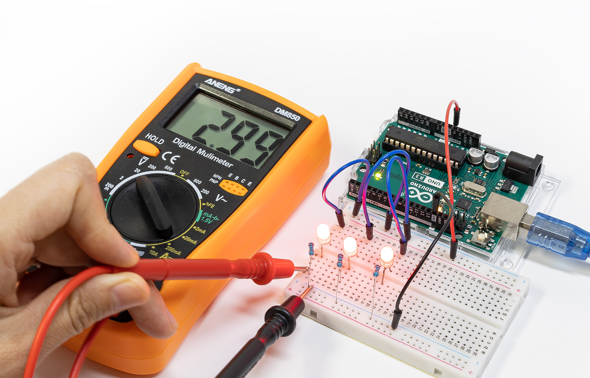

.. note::

    Hello, welcome to the SunFounder Raspberry Pi & Arduino & ESP32 Enthusiasts Community on Facebook! Dive deeper into Raspberry Pi, Arduino, and ESP32 with fellow enthusiasts.

    **Why Join?**

    - **Expert Support**: Solve post-sale issues and technical challenges with help from our community and team.
    - **Learn & Share**: Exchange tips and tutorials to enhance your skills.
    - **Exclusive Previews**: Get early access to new product announcements and sneak peeks.
    - **Special Discounts**: Enjoy exclusive discounts on our newest products.
    - **Festive Promotions and Giveaways**: Take part in giveaways and holiday promotions.

    👉 Ready to explore and create with us? Click [|link_sf_facebook|] and join today!

|link_beginner_lab_kit| with Original Arduino Uno R3
=================================================

Thank You for Choosing the |link_beginner_lab_kit|

* :download:`Beginner's Lab Kit Handbook with the Answers </_static/pdf/Beginner's Lab Kit Handbook with the Answers.pdf>`

.. note::
    This document is available in the following languages.

        * |link_jp_tutorials|
        * |link_en_tutorials|
    
    Please click on the respective links to access the document in your preferred language.

Welcome to the |link_beginner_lab_kit|, a comprehensive starter pack designed 
specifically for newcomers to the world of electronics and programming. 
This kit includes an array of essential components such as LEDs, resistors, 
a buzzer, potentiometers, photoresistors, thermistors, push buttons, digital tubes, 
and an ultrasonic module. One of the standout features of this kit is the inclusion of a multimeter, 
an invaluable tool that allows you to measure current, voltage, and resistance within your circuits. 
This addition is particularly useful for deepening your understanding of how each component functions.

The course sequence provided with this kit is structured around the Arduino programming syntax, 
ensuring a logical and educational progression. 
This structure allows you to build circuits step-by-step while learning how to write the programs that control them. 
Throughout the course, you will encounter troubleshooting challenges that enhance your understanding of the material.

For any inquiries or support, please reach out to us at service@sunfounder.com. 
Dive into your learning journey with the Beginner's Lab Kit and start building, coding, and exploring the exciting world of electronics!

.. toctree::
    :maxdepth: 1

    About this Kit <self>
    1_get_started
    2_first_circuit
    3_multimeter
    4_ohm's_law
    5_parallel_series_circuit
    6_blink_led
    7_traffic_light_auto 
    8_traffic_light_button 
    9_desk_lamp 
    10_desk_lamp_button 
    11_conditional_led_control 
    12_rainbow_color
    13_human_perception_color
    14_random_color 
    15_cool_warm_color 
    16_thermistor 
    17_morse_code 
    18_photoresistor 
    19_reversing_alarm 
    20_beep_timer 
    21_siren 
    22_little_star
    23_cyber_dice
    24_flowing_light
    25_show_number

**Copyright Notice**

All contents including but not limited to texts, images, and code in this manual are owned by the SunFounder Company. You should only use it for personal study,investigation, enjoyment, or other non-commercial or nonprofit purposes, under therelated regulations and copyrights laws, without infringing the legal rights of the author and relevant right holders. For any individual or organization that uses these for commercial profit without permission, the Company reserves the right to take legal action.

